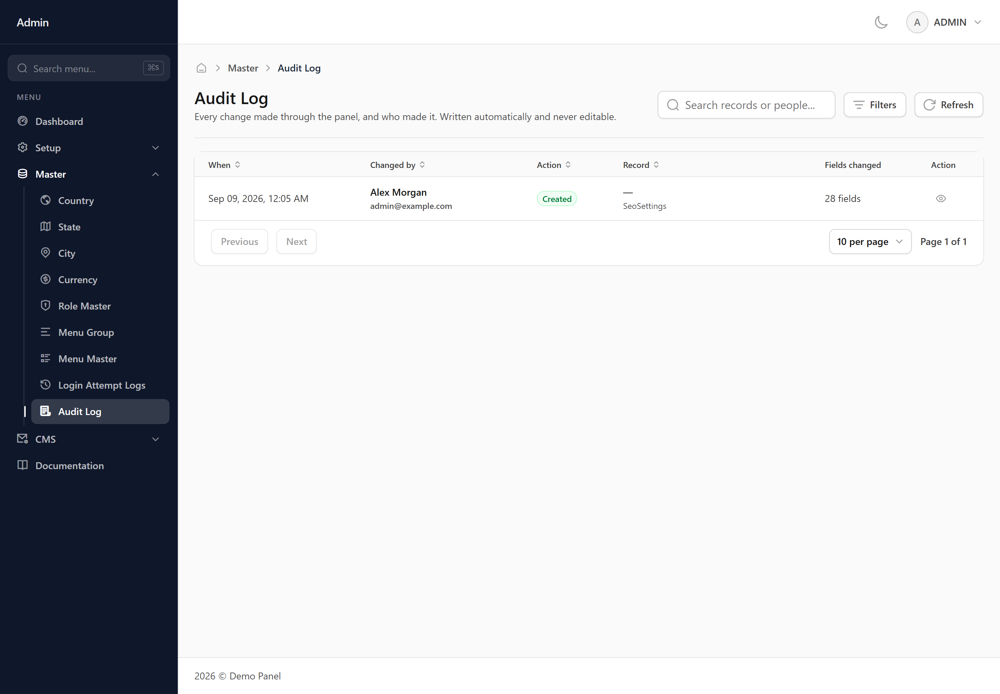
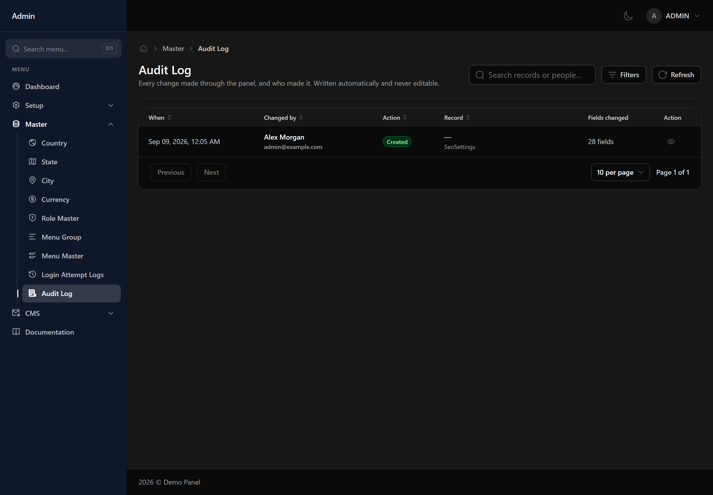

# Audit Log

A record of every change made in the panel — who changed what, when, and what the value was before.

## What is recorded

Creating, editing and deleting a record are all logged, along with the person who did it. Opening a screen or running a search is not — this is a record of changes, not of activity.

## Seeing what actually changed

Opening an entry shows a field-by-field comparison: what each value was before and what it became. Only fields that actually changed are listed.

## Passwords are never shown

Sensitive fields appear as 'hidden'. The log records that a password changed, never what it changed to.

## Nothing here can be edited or removed

The log is read-only by design, for everyone including administrators. There is no delete button because a deletable audit trail is not an audit trail.
