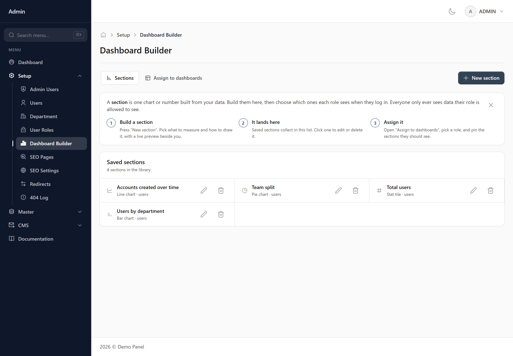
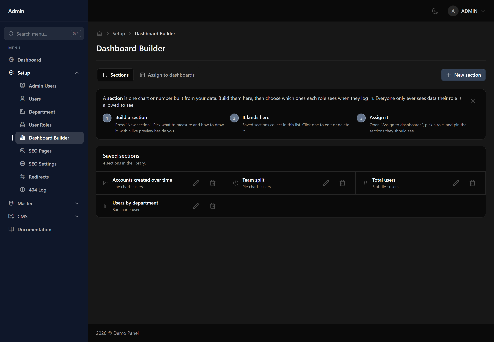

# Dashboard Builder

Build the cards that appear on dashboards, then choose which roles see which ones.

## Building a card

Pick what you are measuring, then how to show it. A single figure is a stat tile; a split by category is a bar or pie chart; a change over time is a line chart. A preview updates as you go, so you can see what you are making before saving it.

## Grouping and filtering

Grouping splits one figure into several — users by department, for instance. Filters narrow which records count at all, using the same conditions as the filter panel on any list screen.

## Write the explanation

A stat tile has a description field. It is worth filling in: 'average failed attempts' could mean per user, per day or per session, and only you know which. What you write appears behind the information icon on the finished card.

## Putting cards on a dashboard

A saved card does nothing until it is pinned to a role's dashboard. Cards can be dragged into position and resized, and each role gets its own arrangement.
