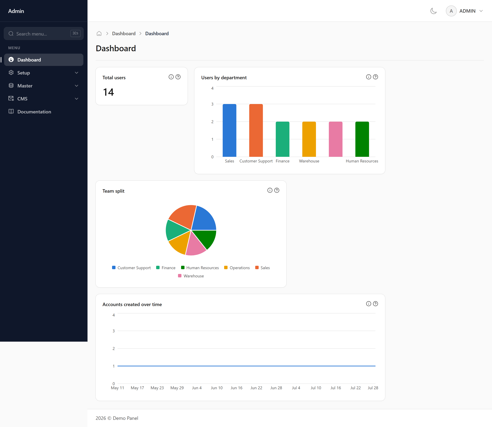
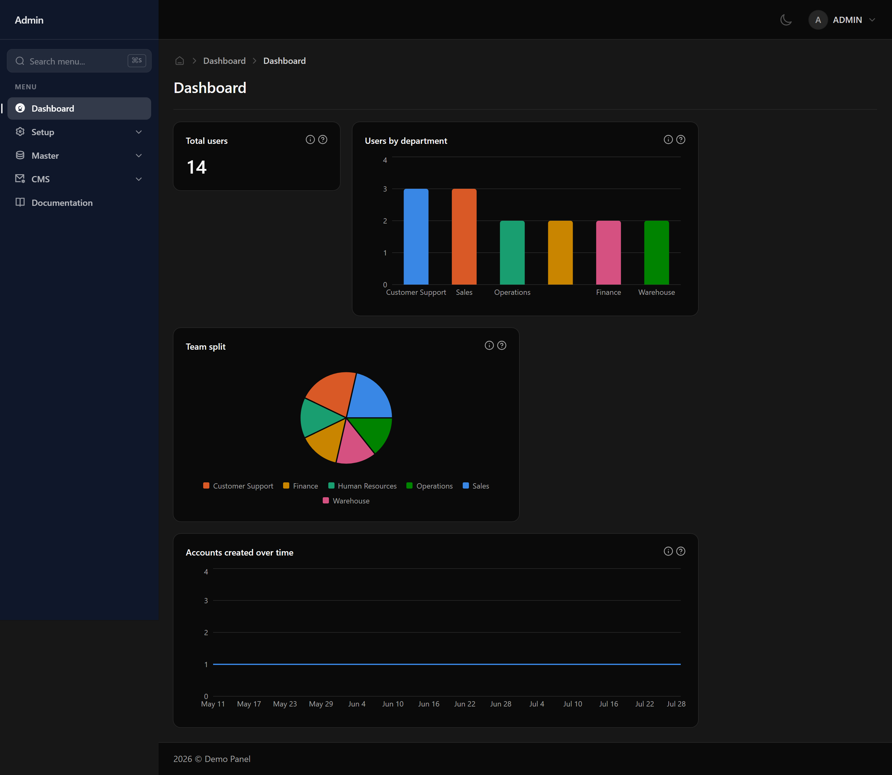

# Dashboard

The first screen after signing in. It shows the charts and figures chosen for your role.

## What you are looking at

Each card is one measure — a total, a breakdown by category, or a trend over time. Which cards appear depends on your role, so two people signing in may see different dashboards.

## The numbers only cover what you can see

If your role is limited to your own department, every figure here counts only your department's records. Two people looking at the same card can legitimately see different totals.

## Finding out what a figure means

A card with an information icon has an explanation behind it, written by whoever built it, plus a breakdown of how the total splits up. If a number surprises you, check there first.
