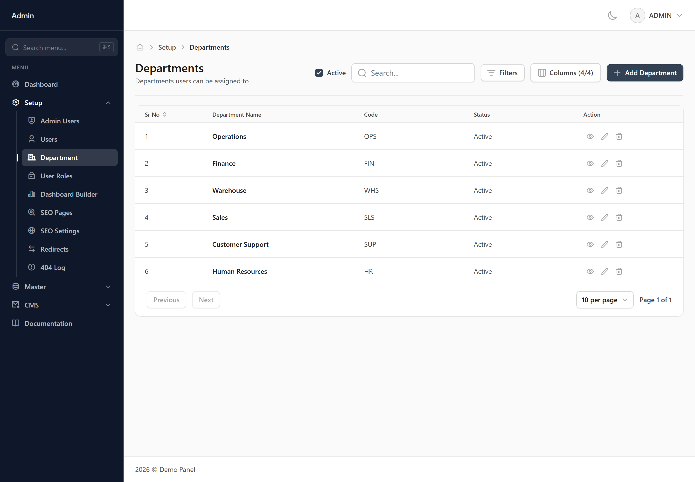
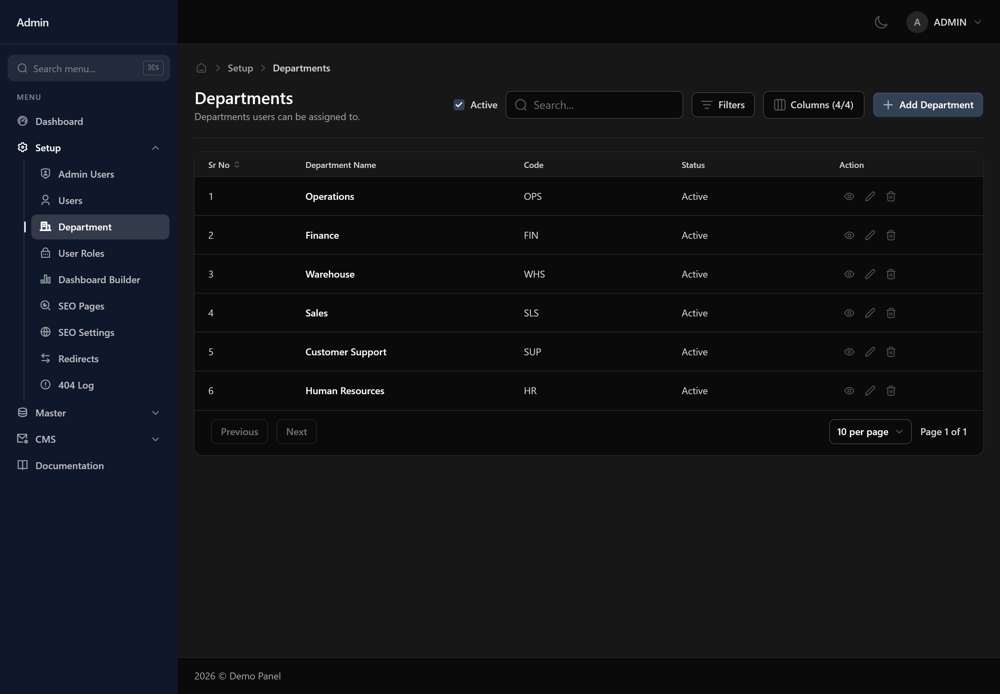
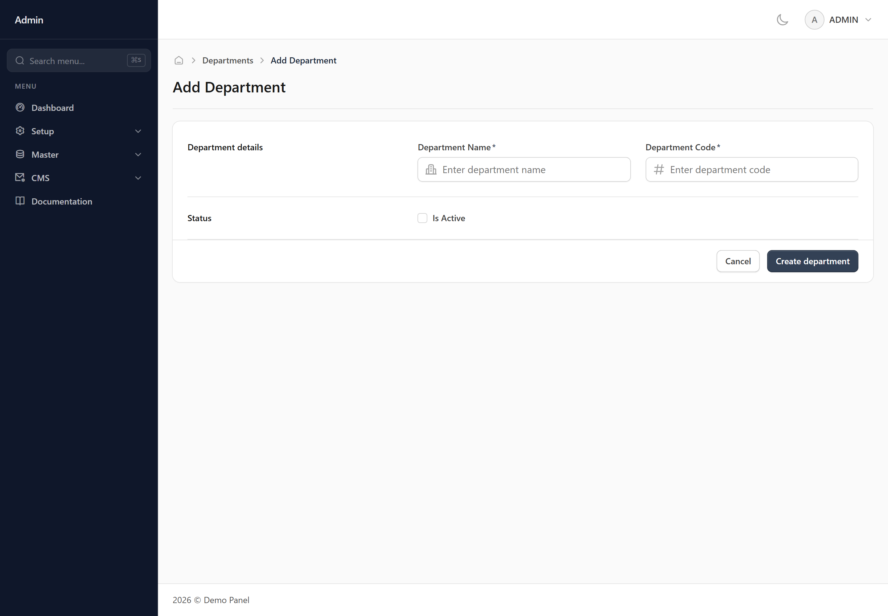
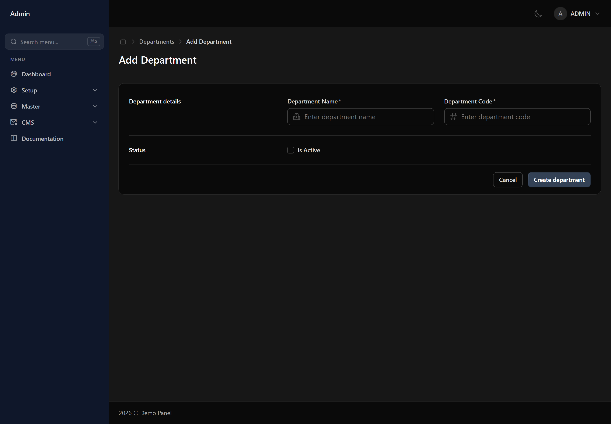
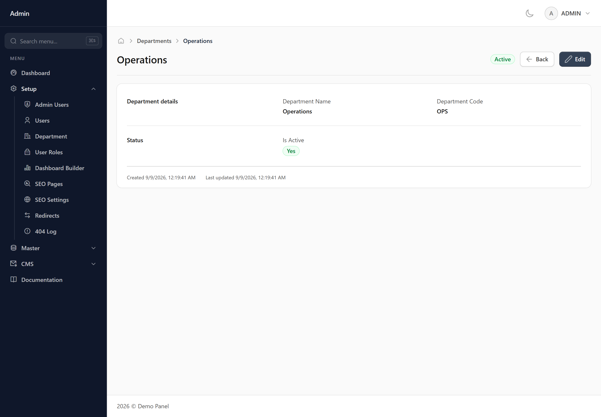
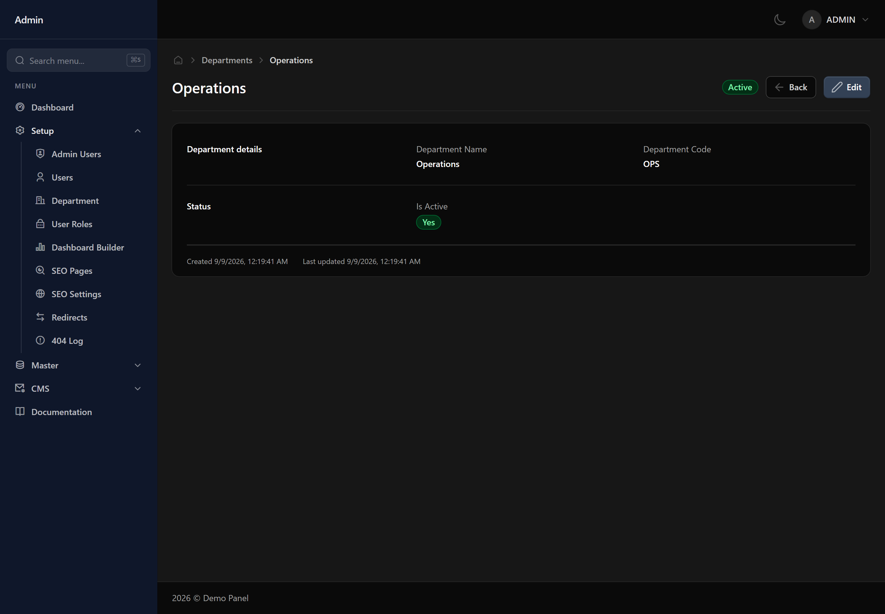
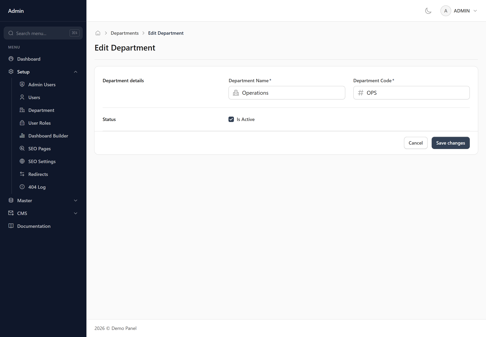
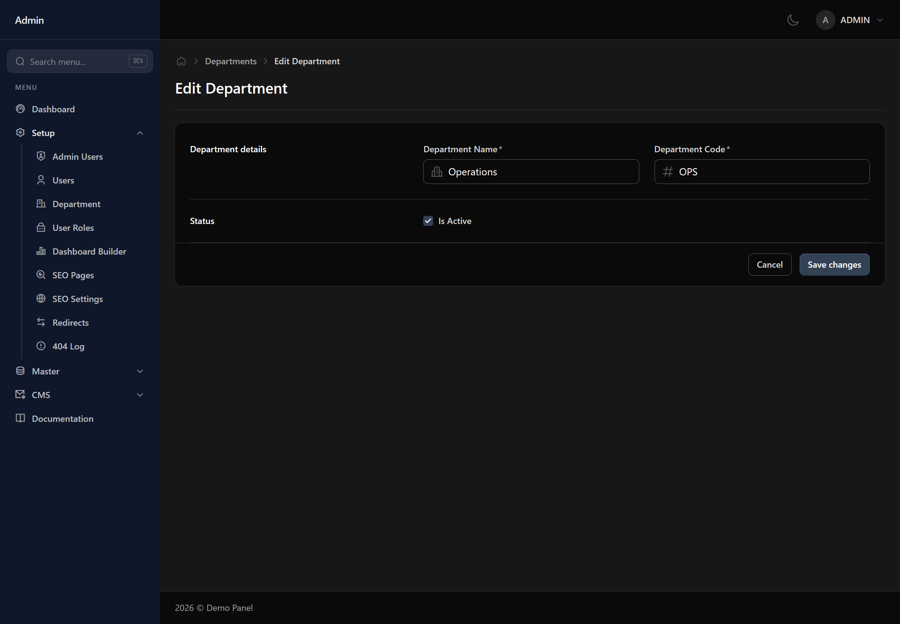

# Departments

Departments are the teams people belong to — Sales, Finance, Warehouse. Every user is assigned to exactly one, and that assignment does more than label them: it decides who can see their records. Every department now also belongs to a company — see Company below.

## When you would use this

Add a department when a new team is formed. Mark one inactive when a team is wound down — that keeps its history intact while removing it from the dropdowns on other screens.

## What you fill in

### Department details

- **Company** *(required, chosen from a list)*
- **Department Name** *(required)*
- **Department Code**
- **Parent Department** *(chosen from a list)* — Used to resolve a Leave/Expense/Shift Request approver when the employee's own department has none set.

### Status

- **Is Active** *(a yes/no tick box)* — Inactive records stay in the system and keep their history, but stop being offered in dropdowns on other screens.

## Finding a record

Use the search box for a quick look-up, or open the filter panel to narrow the list by:

- Department Name
- Department Code
- Company
- Active
- Created

Your filters and column layout are remembered, so the list looks the same next time you open it.

## Adding a Department

Press **Add Department** at the top right of the list. That opens a blank form.

1. Fill in the fields described above. Required ones are marked with an asterisk.
2. Press **Create department** at the bottom of the form.

Anything missing or invalid is flagged underneath the field it belongs to, and nothing is saved until every one of those is cleared. Once it saves you are returned to the list with the new record in it.

**Cancel** leaves without saving. Nothing is kept, so a half-filled form is not waiting for you when you come back.

*Needs the **write** permission — without it the button is not shown.*

## Viewing a Department

Press the view icon on a row to open the record on its own screen. It shows the same fields in the same order as the form, but read-only, with related records shown by name rather than as a reference.

At the bottom you get when the record was created and when it was last changed, and a badge at the top shows whether it is active. **Edit** takes you straight into changing it.

**Back** returns to the list. Passwords are never shown here, on any record.

*Needs the **read** permission — without it the button is not shown.*

## Editing a Department

Press the edit icon on a row, or **Edit** while viewing a record. The form opens with the current values already in it.

Change what you need and press **Save changes**. The same checks as adding apply, and you are returned to the list once it saves.

Every change is recorded — who made it, when, and what each value was before. You can read that back on the **Audit Log** screen.

*Needs the **edit** permission — without it the button is not shown.*

## Deleting a Department

Press the delete icon on a row. You are asked to confirm first, and nothing is removed until you do.

If something else in the system still refers to this department, the deletion is refused and you are told what is using it. Clear or reassign those first, then try again.

Deleting hides the record rather than destroying it, so history and past reports stay intact. If you only want it out of the dropdowns on other screens, untick **Is Active** instead — that keeps it available to look up.

*Needs the **delete** permission — without it the button is not shown.*

## Things worth knowing

> [!WARNING] Worth knowing
> You cannot delete a department while users are still assigned to it. The panel will tell you how many, so move those people first.

> [!WARNING] Worth knowing
> Department codes are optional and short — used in reports and exports where you have one. Keep them stable once set; changing one changes how older reports read.

> [!WARNING] Worth knowing
> Department names only have to be unique within the same company — two companies can each have their own "Finance" department.

## What your role controls

Each of these is granted separately for this screen on the **User Roles** screen:

- **read** — see this screen at all
- **write** — add new records
- **delete** — remove records
- **edit** — change existing records
- **print** — print or export
- **mail** — send email from this screen

> [!NOTE] Missing a button?
> A button you cannot see is a permission your role has not been granted. Ask whoever manages roles to grant it on the User Roles screen.

> [!INFO] What you can see
> If your role is limited to your own department, this screen shows only your department rather than the full list.
