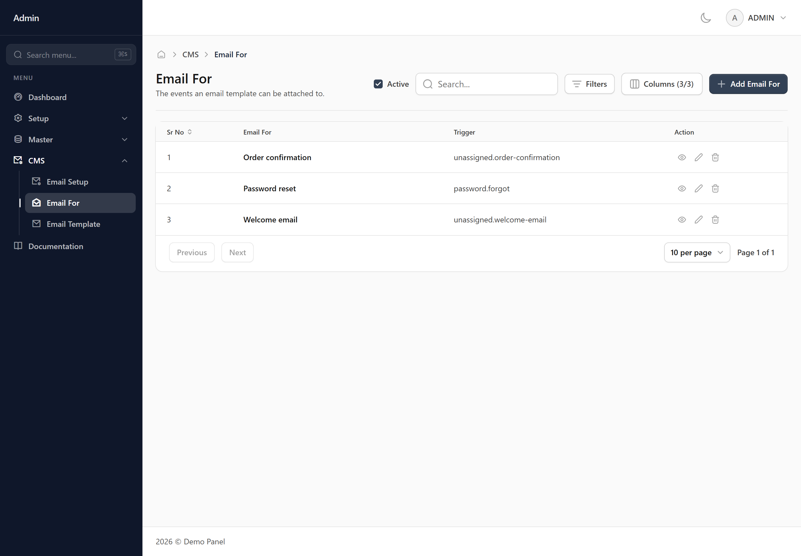
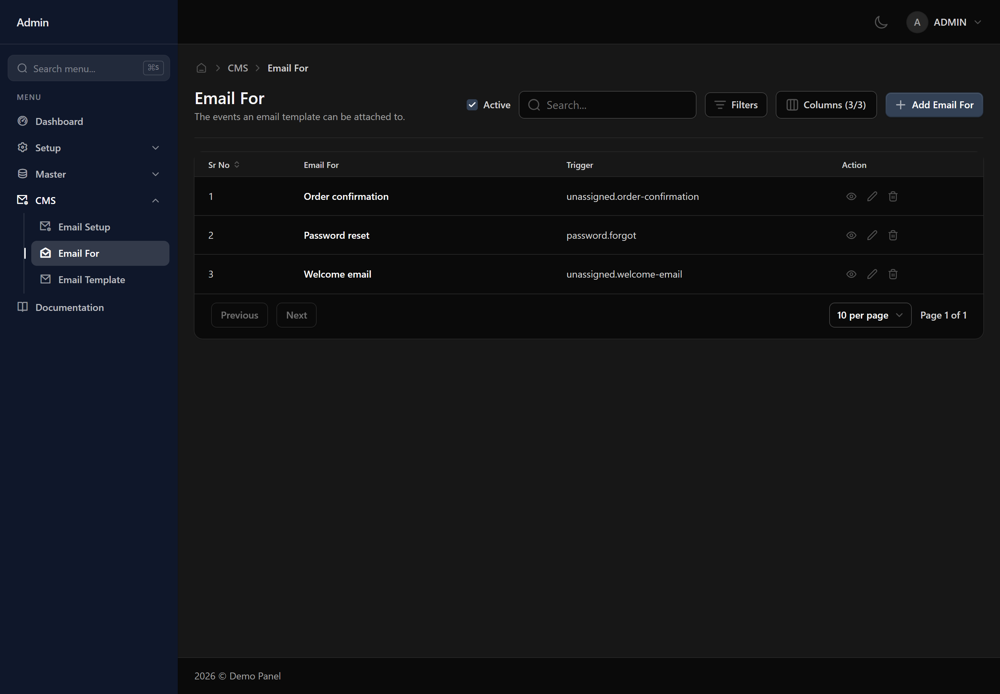
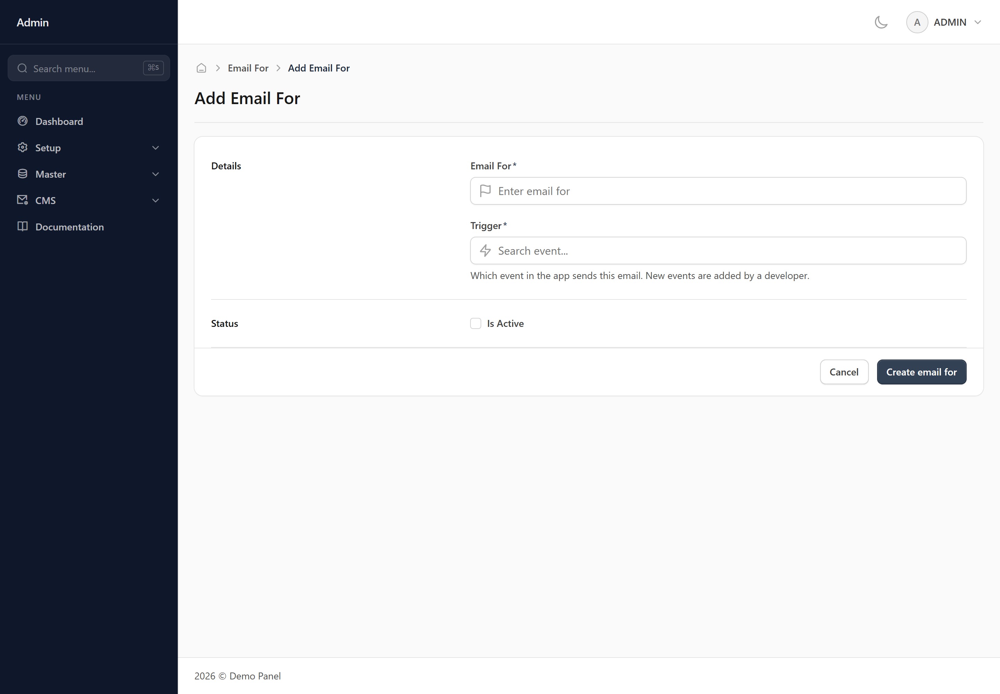
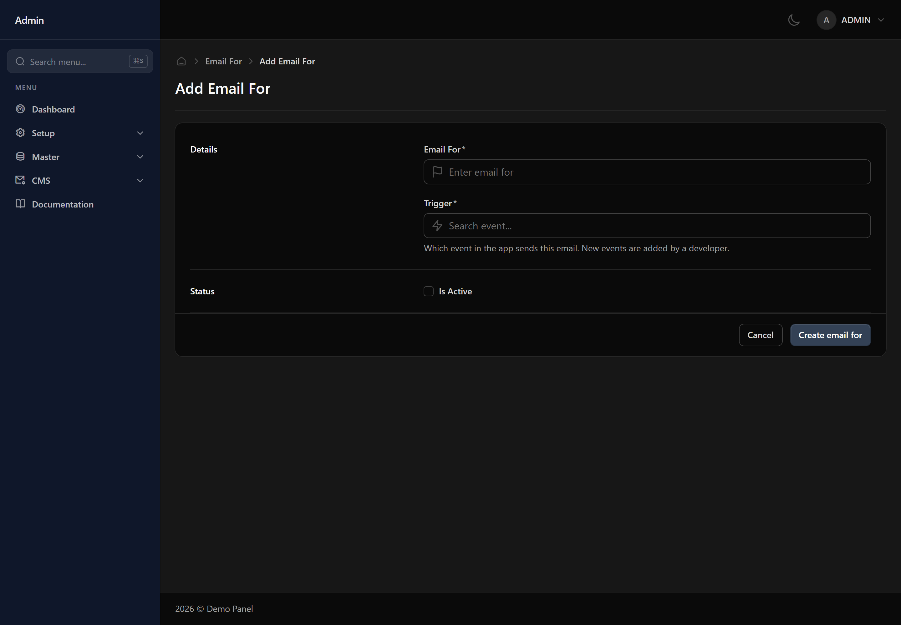
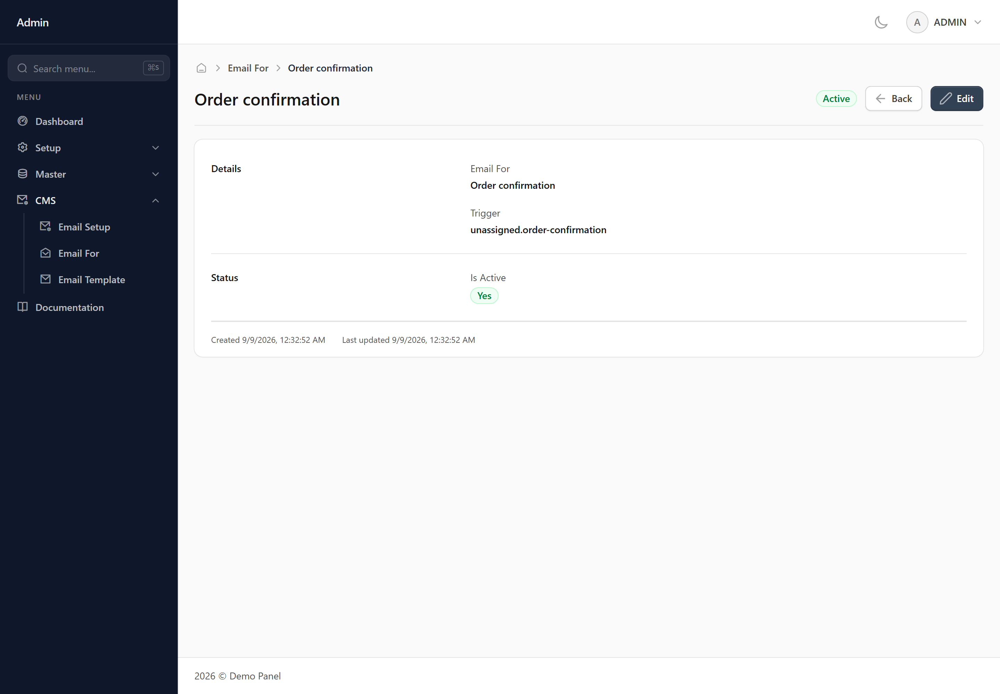
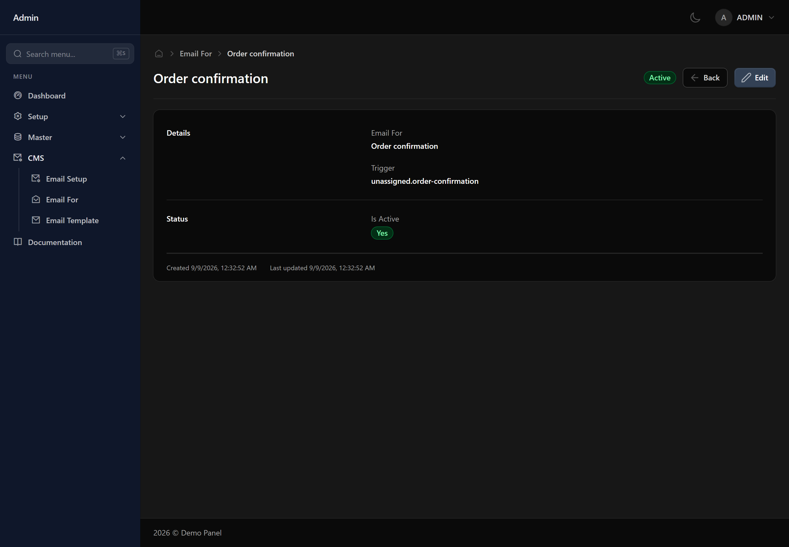
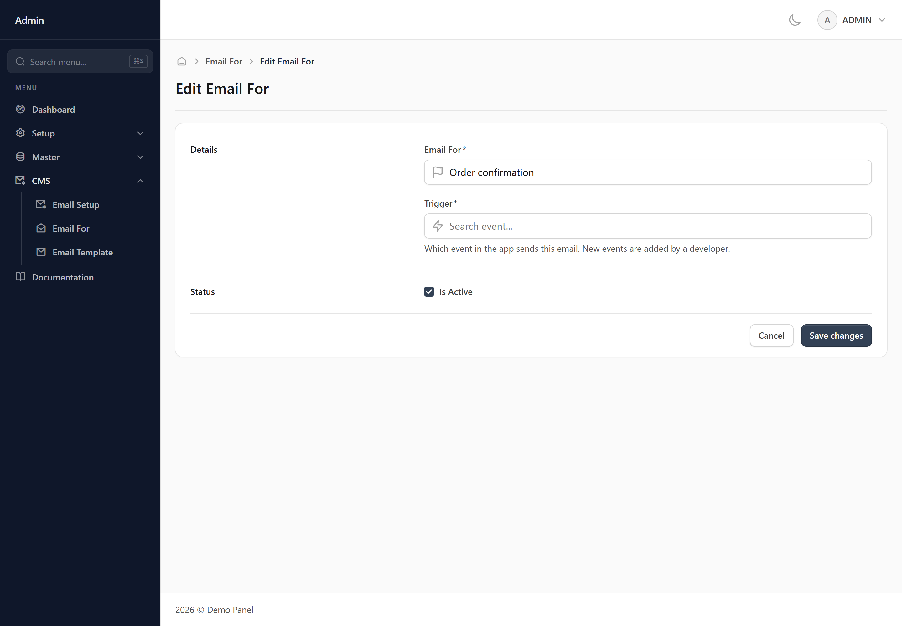
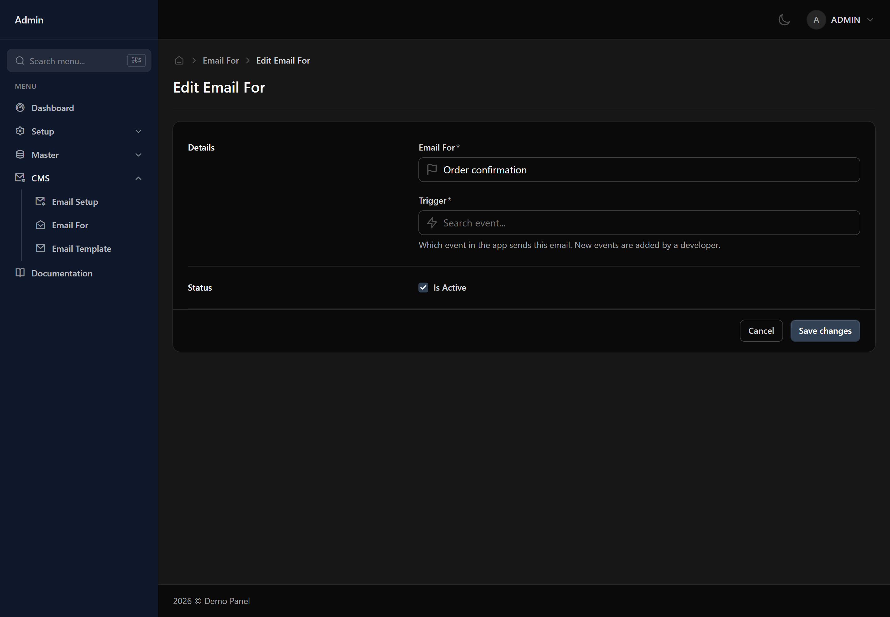

# Email For

The list of occasions an email can be sent for — a welcome message, a password reset, an order confirmation. Each template attaches to one of these.

## When you would use this

Add one when there is a new moment in the system that should trigger an email.

## What you fill in

### Details

- **Email For** *(required)*
- **Trigger** *(required, chosen from a list)* — Which event in the app sends this email. New events are added by a developer.

### Status

- **Is Active** *(a yes/no tick box)* — Inactive records stay in the system and keep their history, but stop being offered in dropdowns on other screens.

## Finding a record

Use the search box for a quick look-up, or open the filter panel to narrow the list by:

- Email For
- Trigger
- Active
- Created

Your filters and column layout are remembered, so the list looks the same next time you open it.

## Adding an Email For

Press **Add Email For** at the top right of the list. That opens a blank form.

1. Fill in the fields described above. Required ones are marked with an asterisk.
2. Press **Create email for** at the bottom of the form.

Anything missing or invalid is flagged underneath the field it belongs to, and nothing is saved until every one of those is cleared. Once it saves you are returned to the list with the new record in it.

**Cancel** leaves without saving. Nothing is kept, so a half-filled form is not waiting for you when you come back.

*Needs the **write** permission — without it the button is not shown.*

## Viewing an Email For

Press the view icon on a row to open the record on its own screen. It shows the same fields in the same order as the form, but read-only, with related records shown by name rather than as a reference.

At the bottom you get when the record was created and when it was last changed, and a badge at the top shows whether it is active. **Edit** takes you straight into changing it.

**Back** returns to the list. Passwords are never shown here, on any record.

*Needs the **read** permission — without it the button is not shown.*

## Editing an Email For

Press the edit icon on a row, or **Edit** while viewing a record. The form opens with the current values already in it.

Change what you need and press **Save changes**. The same checks as adding apply, and you are returned to the list once it saves.

Every change is recorded — who made it, when, and what each value was before. You can read that back on the **Audit Log** screen.

*Needs the **edit** permission — without it the button is not shown.*

## Deleting an Email For

Press the delete icon on a row. You are asked to confirm first, and nothing is removed until you do.

If something else in the system still refers to this email for, the deletion is refused and you are told what is using it. Clear or reassign those first, then try again.

Deleting hides the record rather than destroying it, so history and past reports stay intact. If you only want it out of the dropdowns on other screens, untick **Is Active** instead — that keeps it available to look up.

*Needs the **delete** permission — without it the button is not shown.*

## Things worth knowing

> [!WARNING] Worth knowing
> The Trigger dropdown only offers events that don't already have one of these set up, so it can go empty. If the event you want isn't listed, either someone has already set it up (check the list below, or reuse that row instead of creating a new one), or it genuinely doesn't exist yet — new events have to be added by a developer before they show up here.

> [!WARNING] Worth knowing
> If a row's Trigger column shows something starting with "unassigned.", it was created before it had a proper event attached. Editing one of these is not safe right now — the Trigger field will appear empty, and saving will either be blocked or, worse, attach it to a different real event than the one it was already quietly doing. Leave these rows alone and ask your development team to sort them out.

## What your role controls

Each of these is granted separately for this screen on the **User Roles** screen:

- **read** — see this screen at all
- **write** — add new records
- **delete** — remove records
- **edit** — change existing records
- **print** — print or export
- **mail** — send email from this screen

> [!NOTE] Missing a button?
> A button you cannot see is a permission your role has not been granted. Ask whoever manages roles to grant it on the User Roles screen.
