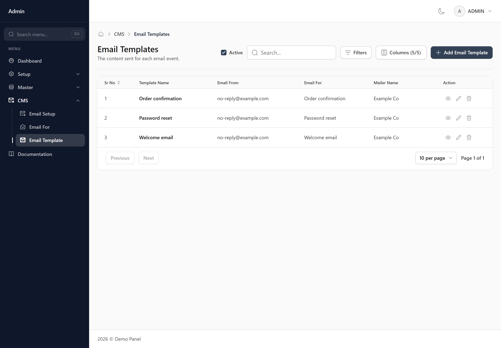
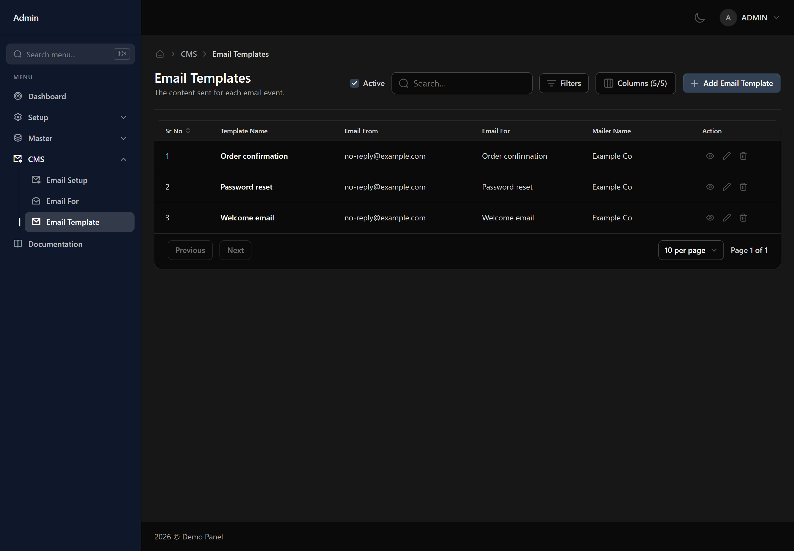
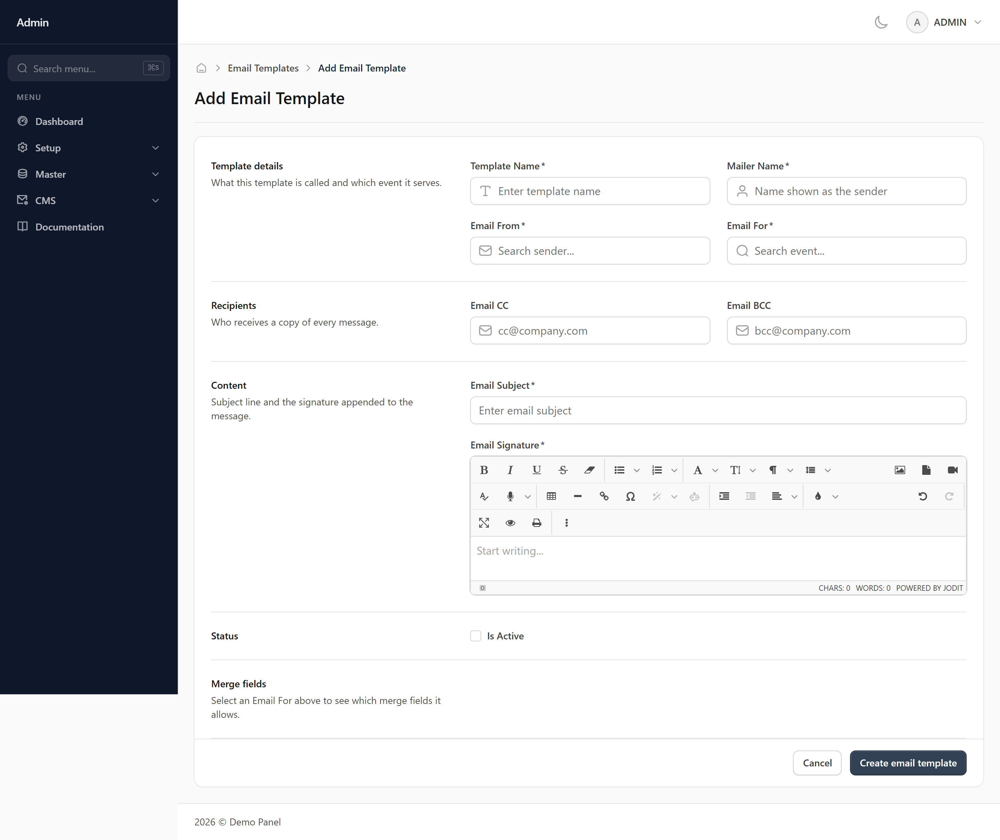
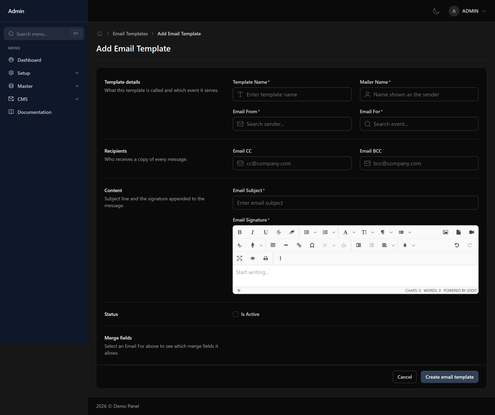
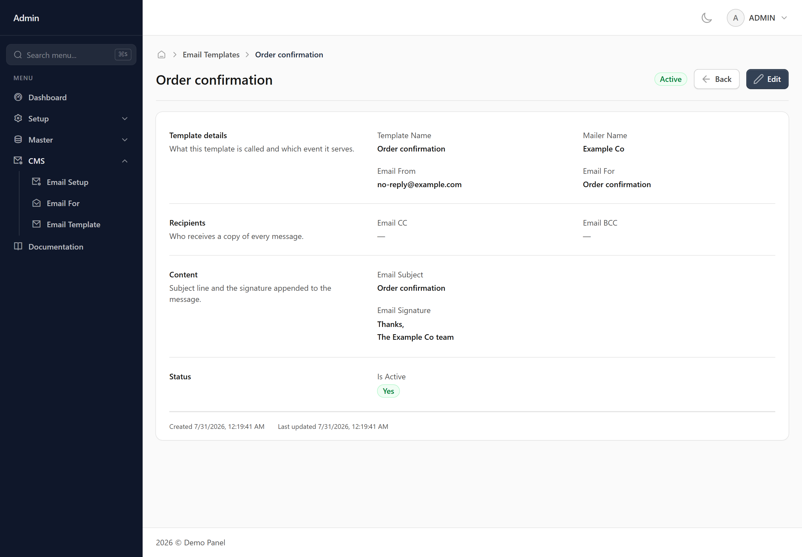
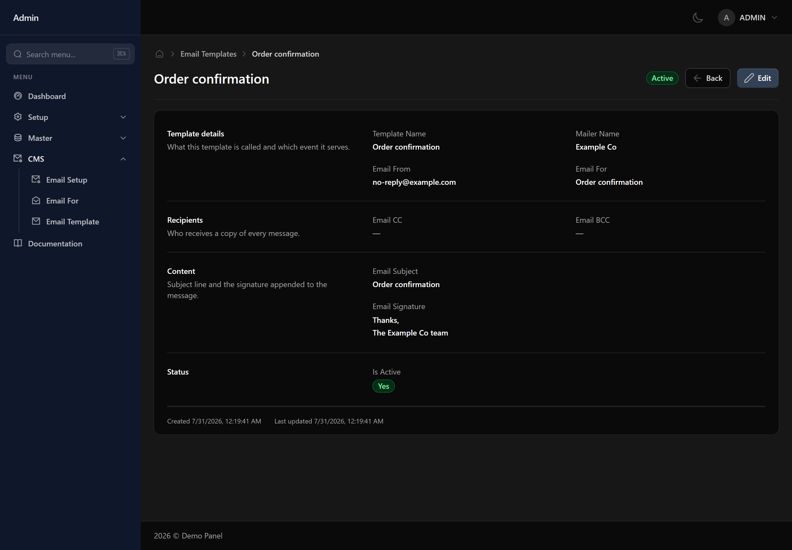
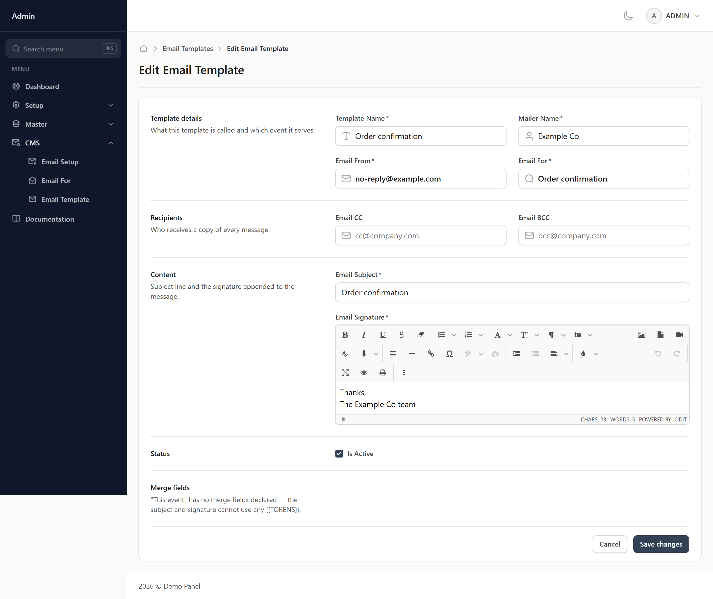
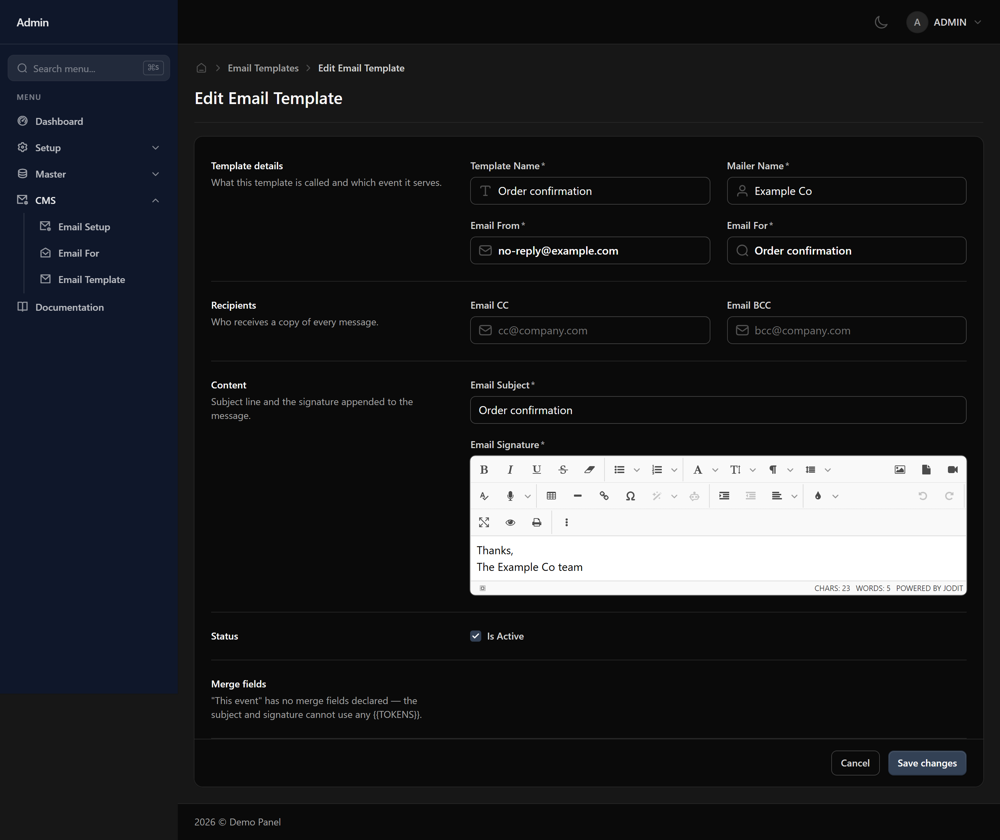

# Email Templates

The actual wording of each automated email — the subject, the signature, and who it comes from.

## When you would use this

Edit a template when the wording of an automated email needs to change.

## What you fill in

### Template details

What this template is called and which event it serves.

- **Template Name** *(required)*
- **Mailer Name** *(required)*
- **Email From** *(required, chosen from a list)*
- **Email For** *(required, chosen from a list)*

### Recipients

Who receives a copy of every message.

- **Email CC**
- **Email BCC**

### Content

Subject line and the signature appended to the message.

- **Email Subject** *(required)*
- **Email Signature** *(required)*

### Status

- **Is Active** *(a yes/no tick box)* — Inactive records stay in the system and keep their history, but stop being offered in dropdowns on other screens.

## Finding a record

Use the search box for a quick look-up, or open the filter panel to narrow the list by:

- Template Name
- Mailer Name
- Email Subject
- Email CC
- Email BCC
- Active
- Created

Your filters and column layout are remembered, so the list looks the same next time you open it.

## Adding an Email Template

Press **Add Email Template** at the top right of the list. That opens a blank form.

1. Fill in the fields described above. Required ones are marked with an asterisk.
2. Press **Create email template** at the bottom of the form.

Anything missing or invalid is flagged underneath the field it belongs to, and nothing is saved until every one of those is cleared. Once it saves you are returned to the list with the new record in it.

**Cancel** leaves without saving. Nothing is kept, so a half-filled form is not waiting for you when you come back.

*Needs the **write** permission — without it the button is not shown.*

## Viewing an Email Template

Press the view icon on a row to open the record on its own screen. It shows the same fields in the same order as the form, but read-only, with related records shown by name rather than as a reference.

At the bottom you get when the record was created and when it was last changed, and a badge at the top shows whether it is active. **Edit** takes you straight into changing it.

**Back** returns to the list. Passwords are never shown here, on any record.

*Needs the **read** permission — without it the button is not shown.*

## Editing an Email Template

Press the edit icon on a row, or **Edit** while viewing a record. The form opens with the current values already in it.

Change what you need and press **Save changes**. The same checks as adding apply, and you are returned to the list once it saves.

Every change is recorded — who made it, when, and what each value was before. You can read that back on the **Audit Log** screen.

*Needs the **edit** permission — without it the button is not shown.*

## Deleting an Email Template

Press the delete icon on a row. You are asked to confirm first, and nothing is removed until you do.

If something else in the system still refers to this email template, the deletion is refused and you are told what is using it. Clear or reassign those first, then try again.

Deleting hides the record rather than destroying it, so history and past reports stay intact. If you only want it out of the dropdowns on other screens, untick **Is Active** instead — that keeps it available to look up.

*Needs the **delete** permission — without it the button is not shown.*

## Things worth knowing

> [!WARNING] Worth knowing
> A template needs both a mailbox to send from and an occasion to send for; create those first.

> [!WARNING] Worth knowing
> Once you pick the occasion, the form shows which {{PLACEHOLDER}} tokens that occasion allows — for example {{USERNAME}} or {{OTP_CODE}} — and what each one fills in with. Only those tokens work in the subject and signature; typing anything else in curly braces will be rejected when you save.

> [!WARNING] Worth knowing
> Only one template can be active for a given occasion at a time. Saving a second active one for the same occasion is blocked — either deactivate the existing one first, or save the new one as inactive until you're ready to switch over.

## What your role controls

Each of these is granted separately for this screen on the **User Roles** screen:

- **read** — see this screen at all
- **write** — add new records
- **delete** — remove records
- **edit** — change existing records
- **print** — print or export
- **mail** — send email from this screen

> [!NOTE] Missing a button?
> A button you cannot see is a permission your role has not been granted. Ask whoever manages roles to grant it on the User Roles screen.
