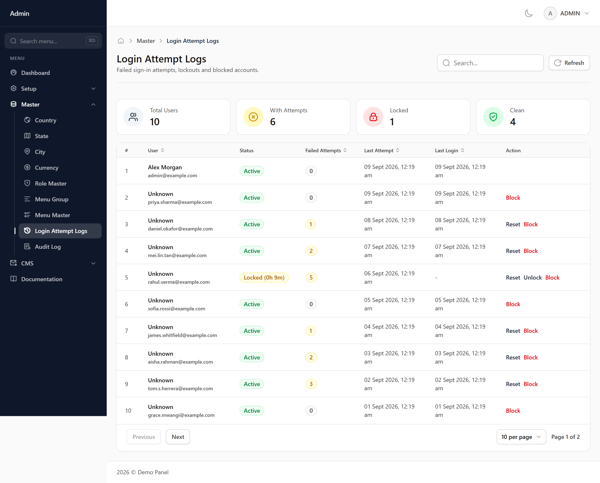
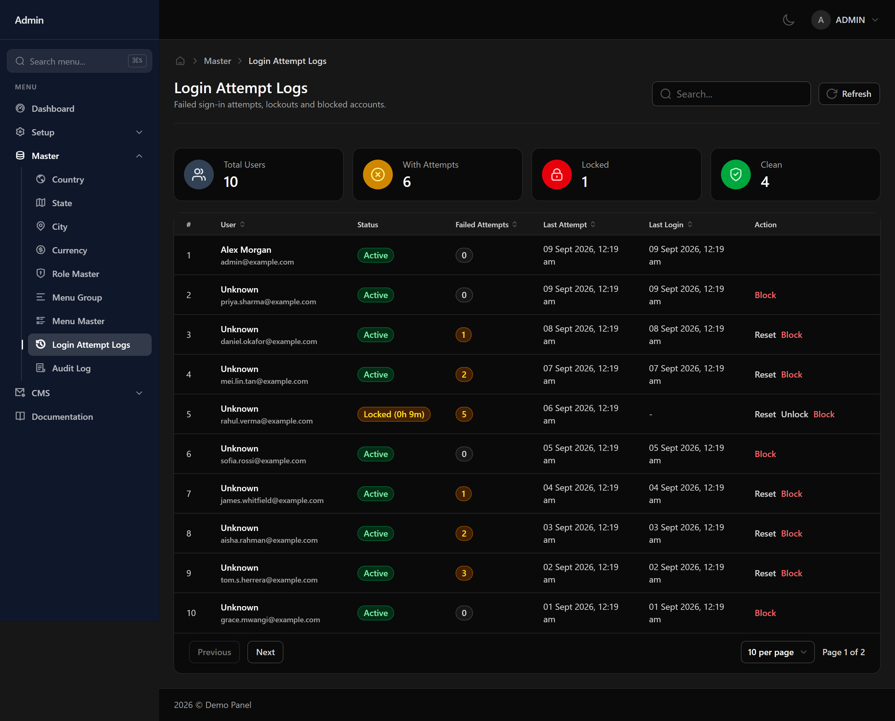

# Login Attempt Logs

Failed and successful sign-in attempts, and which accounts are currently locked.

## Why an account locks

Repeated failed sign-ins lock an account temporarily. This is what stops someone guessing passwords, and it clears on its own after a short wait.

## Helping someone locked out

Find their email in this list to confirm the lock, and check the attempt count. A handful of failures is usually a forgotten password; a large number from an unfamiliar address is worth investigating.
