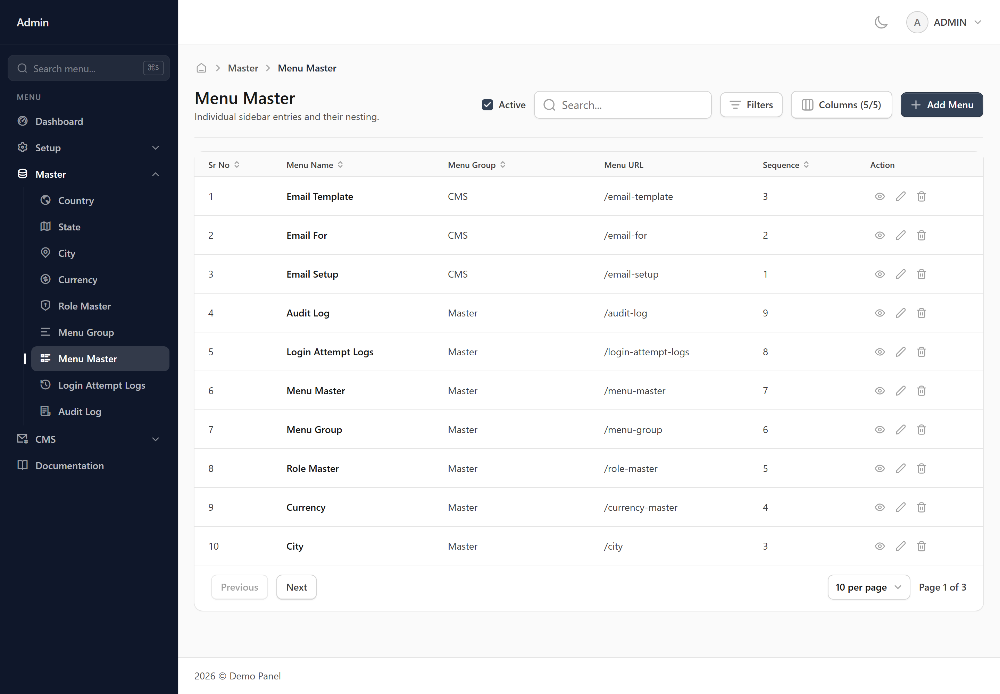
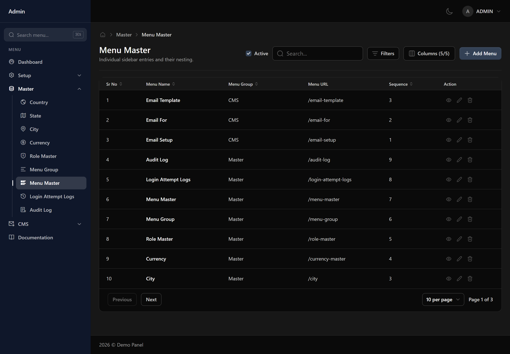
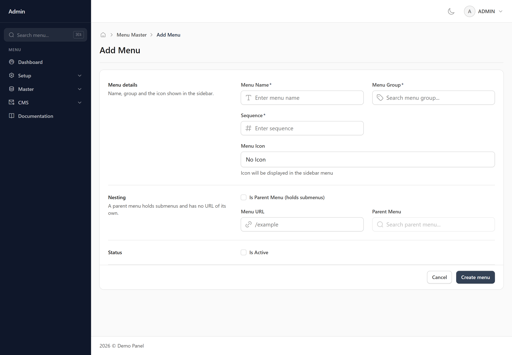
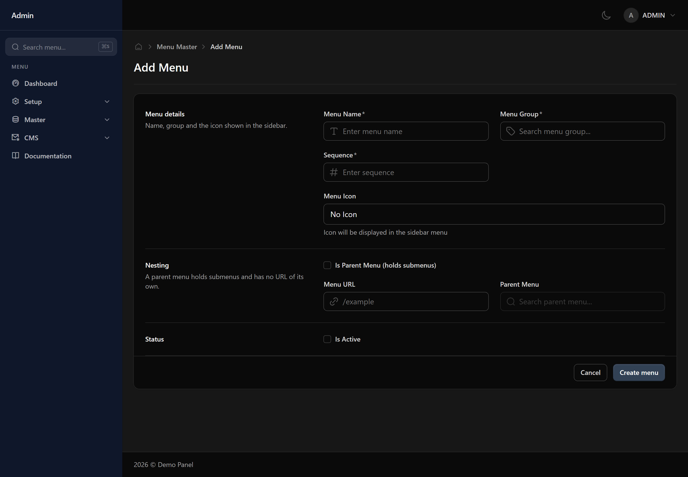
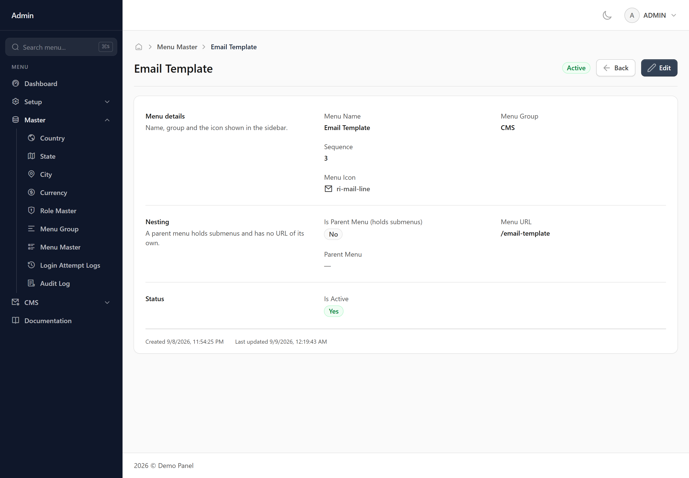
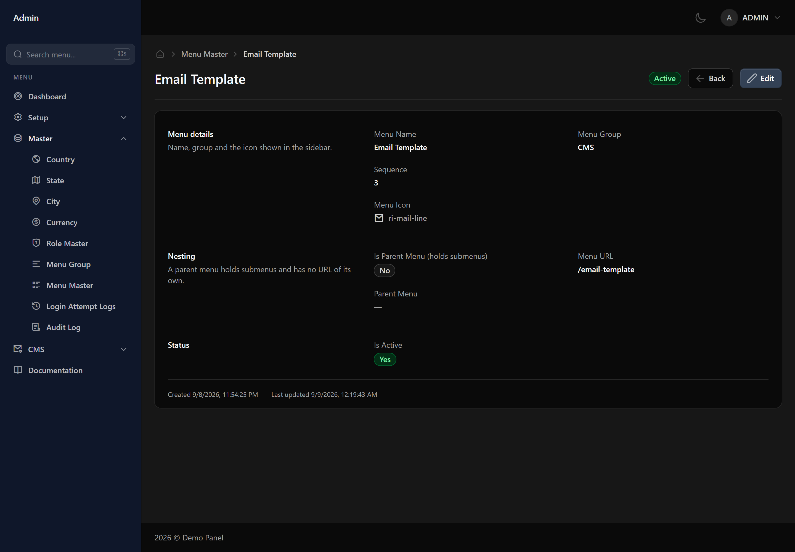
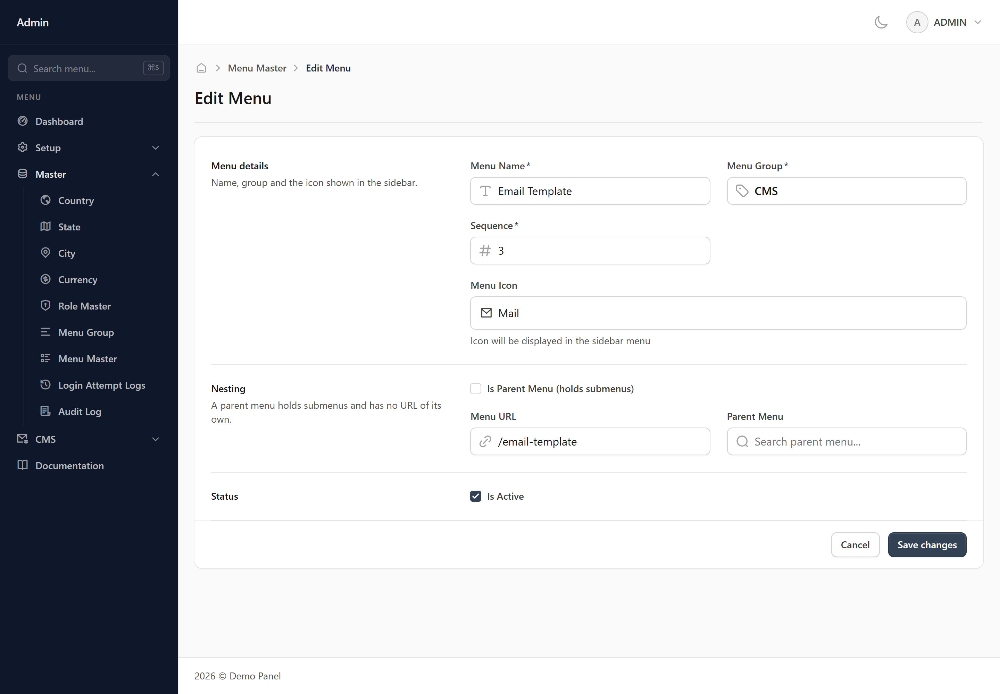
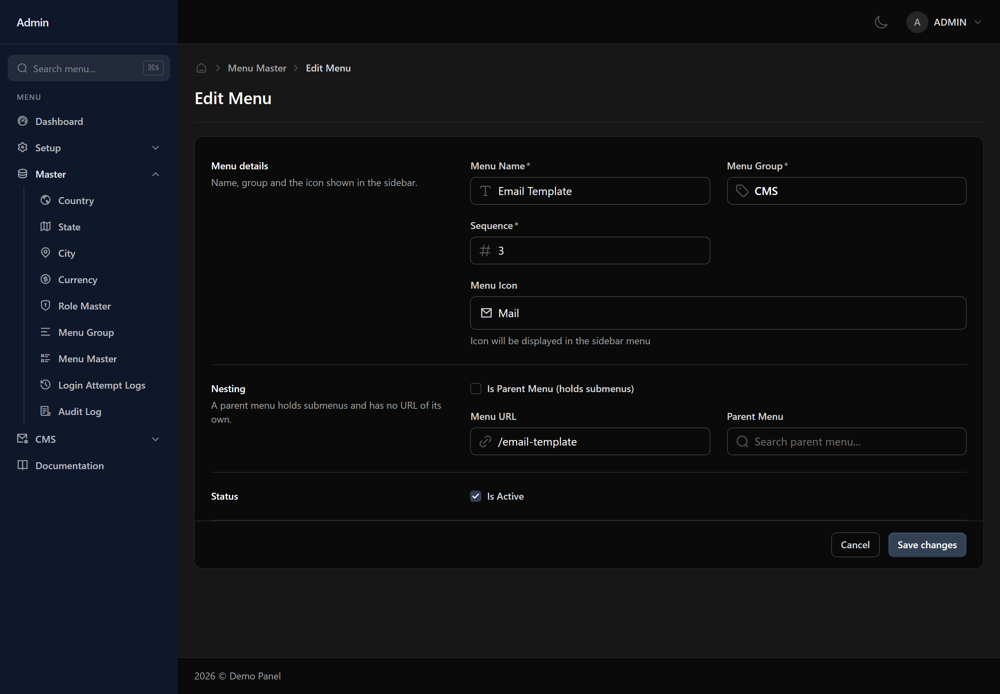

# Menu Master

The individual screens inside each sidebar group. Every screen in the panel has a row here, and that row is what permissions are granted against.

## When you would use this

You will rarely add rows by hand — new screens arrive with their own.

## What you fill in

### Menu details

Name, group and the icon shown in the sidebar.

- **Menu Name** *(required)*
- **Menu Group** *(required, chosen from a list)*
- **Sequence** *(required, a number)*
- **Menu Icon** *(an icon picker)*

### Nesting

A parent menu holds submenus and has no URL of its own.

- **Is Parent Menu (holds submenus)** *(a yes/no tick box)*
- **Menu URL**
- **Parent Menu** *(chosen from a list)*

### Status

- **Is Active** *(a yes/no tick box)* — Inactive records stay in the system and keep their history, but stop being offered in dropdowns on other screens.

## Finding a record

Use the search box for a quick look-up, or open the filter panel to narrow the list by:

- Menu Name
- Menu URL
- Sequence
- Is Parent
- Active
- Created

Your filters and column layout are remembered, so the list looks the same next time you open it.

## Adding a Menu

Press **Add Menu** at the top right of the list. That opens a blank form.

1. Fill in the fields described above. Required ones are marked with an asterisk.
2. Press **Create menu** at the bottom of the form.

Anything missing or invalid is flagged underneath the field it belongs to, and nothing is saved until every one of those is cleared. Once it saves you are returned to the list with the new record in it.

**Cancel** leaves without saving. Nothing is kept, so a half-filled form is not waiting for you when you come back.

*Needs the **write** permission — without it the button is not shown.*

## Viewing a Menu

Press the view icon on a row to open the record on its own screen. It shows the same fields in the same order as the form, but read-only, with related records shown by name rather than as a reference.

At the bottom you get when the record was created and when it was last changed, and a badge at the top shows whether it is active. **Edit** takes you straight into changing it.

**Back** returns to the list. Passwords are never shown here, on any record.

*Needs the **read** permission — without it the button is not shown.*

## Editing a Menu

Press the edit icon on a row, or **Edit** while viewing a record. The form opens with the current values already in it.

Change what you need and press **Save changes**. The same checks as adding apply, and you are returned to the list once it saves.

Every change is recorded — who made it, when, and what each value was before. You can read that back on the **Audit Log** screen.

*Needs the **edit** permission — without it the button is not shown.*

## Deleting a Menu

Press the delete icon on a row. You are asked to confirm first, and nothing is removed until you do.

If something else in the system still refers to this menu, the deletion is refused and you are told what is using it. Clear or reassign those first, then try again.

Deleting hides the record rather than destroying it, so history and past reports stay intact. If you only want it out of the dropdowns on other screens, untick **Is Active** instead — that keeps it available to look up.

*Needs the **delete** permission — without it the button is not shown.*

## Things worth knowing

> [!WARNING] Worth knowing
> A screen with no row here is invisible to everyone except administrators.

> [!WARNING] Worth knowing
> Removing a row removes the screen from the sidebar for every role at once.

## What your role controls

Each of these is granted separately for this screen on the **User Roles** screen:

- **read** — see this screen at all
- **write** — add new records
- **delete** — remove records
- **edit** — change existing records
- **print** — print or export
- **mail** — send email from this screen

> [!NOTE] Missing a button?
> A button you cannot see is a permission your role has not been granted. Ask whoever manages roles to grant it on the User Roles screen.
