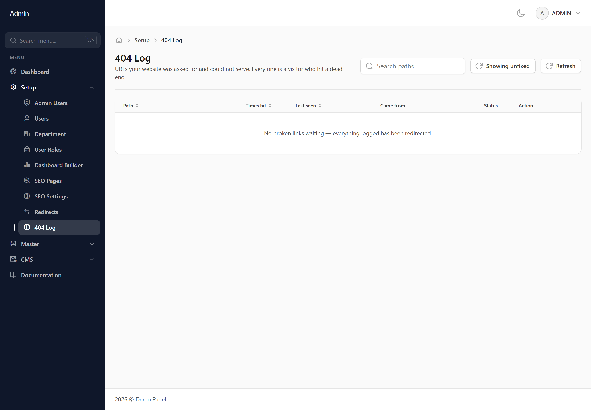
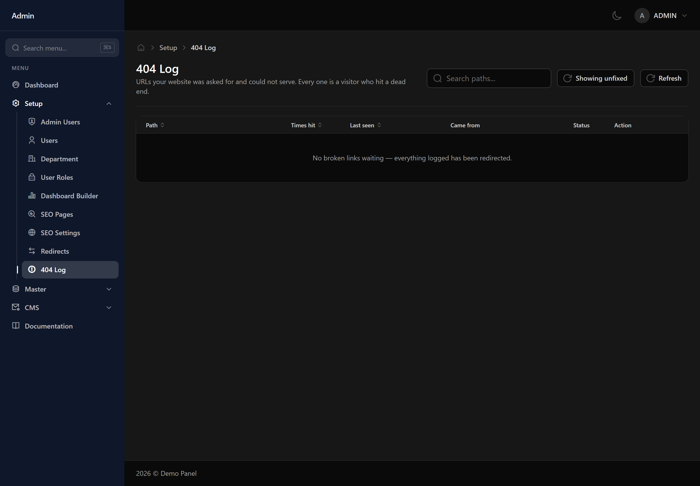

# 404 Log

Addresses visitors asked for on your website that do not exist, and how often.

## What to do with it

A frequently requested missing address usually means a page moved and something still links to the old location. Turn it into a redirect straight from this screen.

## Not everything needs fixing

Some entries are automated scanning or mistyped addresses nobody will ever visit again. Sort by how often each was requested and work down from the top.
