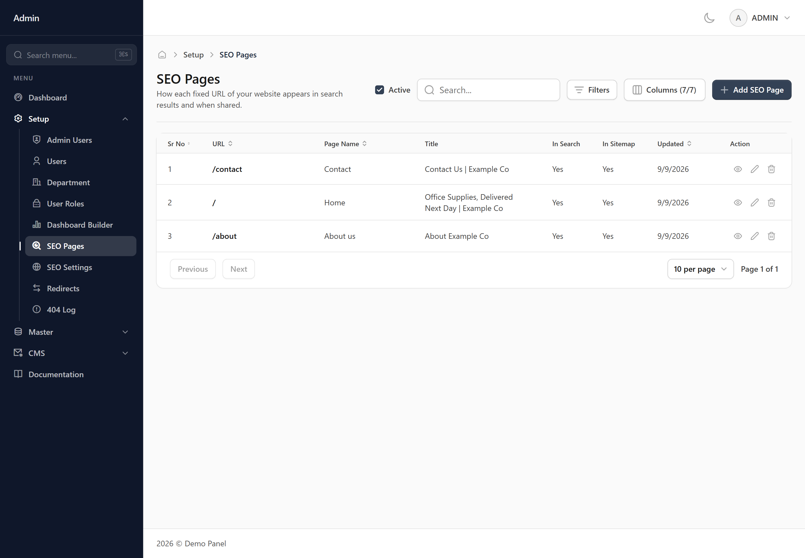
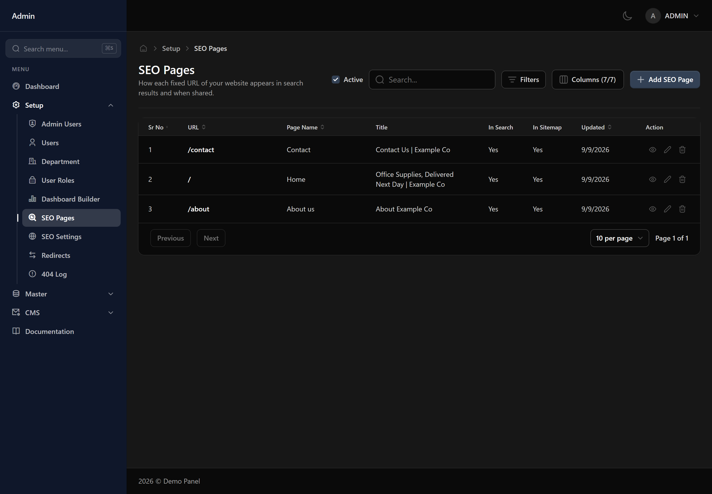

# SEO Pages

How each fixed page of your website appears in a search result and when someone shares the link. This screen lists them; opening one takes you to the editor, which previews both as you type.

## When you would use this

Review a page's entry whenever its content changes enough that the summary is now wrong.

## Finding a record

Use the search box for a quick look-up, or open the filter panel to narrow the list by:

- URL
- Page Name
- Title
- Description
- Focus Keyword
- Shown in search
- In sitemap
- Active
- Created
- Updated

Your filters and column layout are remembered, so the list looks the same next time you open it.

## Viewing an SEO Page

Press the view icon on a row to open the record on its own screen. It shows the same fields in the same order as the form, but read-only, with related records shown by name rather than as a reference.

At the bottom you get when the record was created and when it was last changed, and a badge at the top shows whether it is active.

**Back** returns to the list. Passwords are never shown here, on any record.

*Needs the **read** permission — without it the button is not shown.*

## Things worth knowing

> [!WARNING] Worth knowing
> Only pages with fixed addresses live here — the home page, About, Contact. Content with its own record carries its own settings.

> [!WARNING] Worth knowing
> A page left blank falls back to the site-wide defaults on the SEO Settings screen.

## What your role controls

Each of these is granted separately for this screen on the **User Roles** screen:

- **read** — see this screen at all
- **write** — add new records
- **delete** — remove records
- **edit** — change existing records
- **print** — print or export
- **mail** — send email from this screen

> [!NOTE] Missing a button?
> A button you cannot see is a permission your role has not been granted. Ask whoever manages roles to grant it on the User Roles screen.
