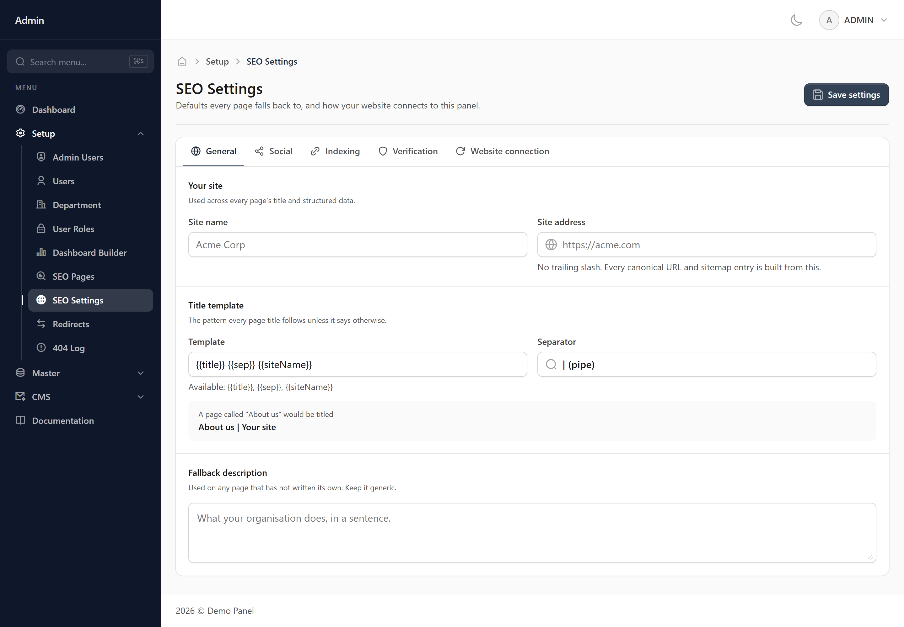
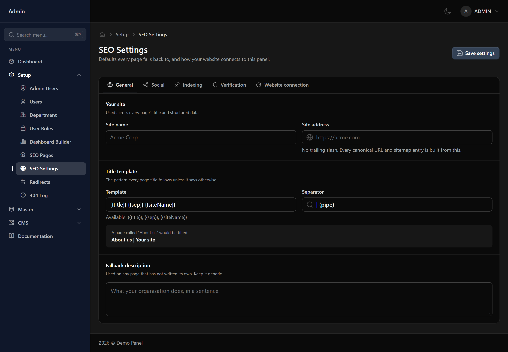

# SEO Settings

Site-wide defaults for how your website appears in search results — used by any page that does not set its own.

## Defaults, not overrides

Anything set on an individual page wins. What you put here fills the gaps, so a page nobody has written a description for still has a sensible one.

## Templates

The title template controls how page titles are assembled — typically the page name followed by your site name. Set it once here rather than repeating the site name on every page.
