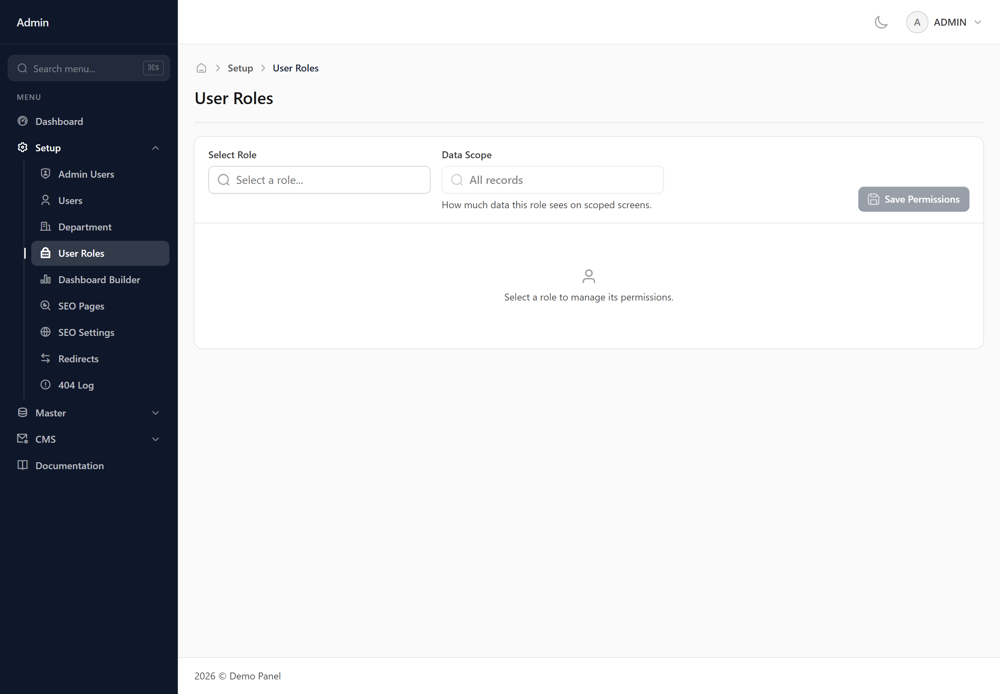
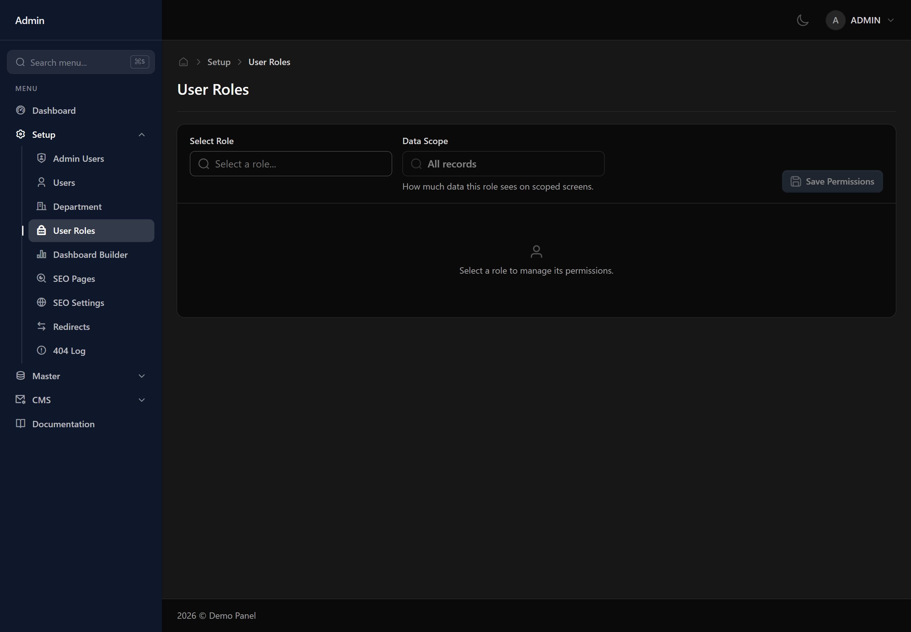

# User Roles

Where you decide what each role can do. Pick a role, then tick what it may see and change.

## How the grid works

Every screen in the panel is a row. The columns are the things you can permit: viewing the screen at all, adding records, editing them, deleting them, and so on. A role sees a screen in its sidebar only if the view permission is ticked.

## Data scope — the setting people miss

Above the grid is a data scope setting, and it is the most powerful control here. 'All records' lets the role see everything. 'Their department' limits them to records belonging to their own department. 'Only their own' narrows it further, to records they created. This applies everywhere at once — lists, searches, reports and dashboard figures.

## Changes take effect on next sign-in

Someone already signed in keeps their current permissions for up to a minute. Ask them to sign out and back in if you need a change to apply immediately.

## Administrators are not affected

Administrator accounts bypass this screen entirely. Nothing you set here limits them.
