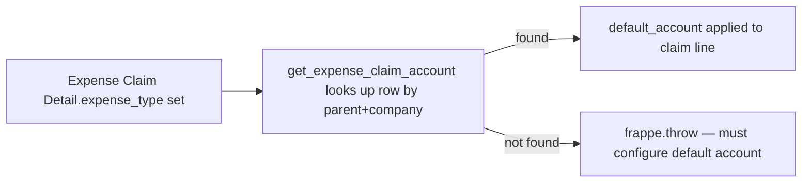

# Expense Claim Account

A child-table row on [[Expense Claim Type]] mapping one Company to its default GL account for that expense type. Exists because a multi-company HRMS instance needs a different debit account per company for the same expense category.

## Key Fields

| Field | Type | Purpose |
|---|---|---|
| `company` | Link (Company) | Which company this mapping applies to. |
| `default_account` | Link (Account), required | The GL account to debit for this expense type in this company. |

## Relationships

- [[Expense Claim Type]] — parent doctype; this table is `accounts` on it.
- [[Expense Claim]] — `get_expense_claim_account(expense_claim_type, company)` in `expense_claim.py` queries this table directly (`frappe.db.get_value("Expense Claim Account", {"parent": expense_claim_type, "company": company}, "default_account")`) to resolve each expense line's posting account.

## Logic — What Happens and Why

No controller logic of its own (`istable`, no dedicated `.py` beyond auto-generated types — inherits `pass`-only Document base). All validation happens on the parent [[Expense Claim Type]]: no duplicate company rows, and the account's company must match the row's declared company. If no matching row exists for a given company when an Expense Claim is validated, `get_expense_claim_account()` throws asking the user to configure the default account for that Expense Claim Type — this is the deliberate failure mode ensuring expenses are never silently posted to an unmapped/incorrect account.

## Roles & Permissions

Child table — no standalone `permissions` array; access follows the parent [[Expense Claim Type]] document's permissions.

## Mermaid: State/Flow

