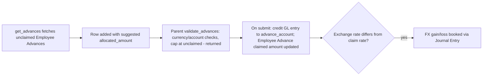

# Expense Claim Advance

A child-table row on [[Expense Claim]] recording one Employee Advance being adjusted (partially or fully) against this claim, so money the employee was pre-paid is netted off the reimbursement rather than paid out twice. Exists to reconcile advance payments against actual incurred expense.

## Key Fields

| Field | Type | Purpose |
|---|---|---|
| `employee_advance` | Link (Employee Advance), required | The advance being adjusted. |
| `advance_account` | Link (Account), hidden | GL account the advance was paid from. |
| `posting_date` / `advance_paid` / `base_advance_paid` | Date/Currency, read-only | Snapshot of the advance's own data. |
| `unclaimed_amount` / `base_unclaimed_amount` | Currency, read-only | Balance of the advance not yet claimed elsewhere, computed from Advance Payment Ledger Entries. |
| `return_amount` | Currency, read-only | Amount of the advance the employee already returned. |
| `allocated_amount` / `base_allocated_amount` | Currency | How much of the advance is being applied to this specific claim — this is the only field the user actually edits/controls. |
| `exchange_rate` / `exchange_gain_loss` | Float/Currency | FX rate at time of advance payment and any resulting gain/loss booked on submit. |
| `reference_type` / `reference_name` | Select/Dynamic Link | The Payment Entry or Journal Entry that paid the advance. |

## Relationships

- [[Expense Claim]] — parent doctype; this table is `advances` on it.
- Employee Advance — via `employee_advance`; parent's `update_claimed_amount_in_employee_advance()` calls `Employee Advance.update_claimed_amount()` on submit/cancel.
- Payment Entry / Journal Entry — via `reference_type`/`reference_name`, identifying how the advance itself was originally paid.

## Logic — What Happens and Why

No controller logic of its own (child table). Populated and validated entirely from the parent [[Expense Claim]]:
- `get_advances()` (whitelisted, parent module) queries unclaimed Employee Advances for the employee (matching currency, excluding fully Claimed/Returned ones) and calls `get_expense_claim_advances()` to compute `unclaimed_amount` (`paid_amount - claimed_amount` from Advance Payment Ledger Entry) and a suggested `allocated_amount` via `get_allocation_amount()`.
- `validate_advances()` (parent `validate()`) re-confirms each row's advance belongs to the claim's employee, validates currency/account type match (`validate_employee_advance_currency_and_account` — the advance account must be Receivable, and if already paid against, warns that the payment entry itself may need correcting), enforces `allocated_amount <= unclaimed_amount - return_amount`, and sums into the parent's `total_advance_amount`, which is then validated not to exceed `sanctioned + taxes`.
- On submit, `get_gl_entries()` posts a credit to each row's `advance_account` for `allocated_amount`, referencing the original advance voucher — this is what actually nets the advance out of what's owed to the employee.
- `create_exchange_gain_loss_je()` — if the advance's `exchange_rate` differs from the claim's own rate, the FX difference on `allocated_amount` is computed per row and stored in `exchange_gain_loss`, then booked via a Journal Entry.

## Roles & Permissions

Child table — no standalone `permissions` array; access follows the parent [[Expense Claim]] document's permissions.

## Mermaid: State/Flow

