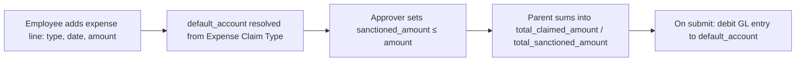

# Expense Claim Detail

A child-table row on [[Expense Claim]] representing one individual expense line: what was spent, on what date, under which expense type, and how much of it the approver has sanctioned. This is the actual itemized claim data that drives totals and GL postings.

## Key Fields

| Field | Type | Purpose |
|---|---|---|
| `expense_date` | Date | When the expense was incurred. |
| `expense_type` | Link → [[Expense Claim Type]] | Category, drives `default_account` resolution. |
| `default_account` | Link (Account), hidden/read-only | Resolved GL account for this line (set by parent's `set_expense_account()`). |
| `description` | Text Editor | Detail of the expense. |
| `amount` / `base_amount` | Currency | Amount claimed by the employee (transaction / company currency). |
| `sanctioned_amount` / `base_sanctioned_amount` | Currency | Amount actually approved for reimbursement — can be less than `amount`, never more. |
| `cost_center` / `project` | Link | Cost attribution, `allow_on_submit`. |

## Relationships

- [[Expense Claim]] — parent doctype; this table is `expenses` on it.
- [[Expense Claim Type]] — via `expense_type`.

## Logic — What Happens and Why

No controller logic of its own (child table). All enforcement lives on the parent [[Expense Claim]]:
- `validate_sanctioned_amount()` throws if `sanctioned_amount > amount` for any row.
- `calculate_total_amount()` sums each row into the parent's `total_claimed_amount`/`total_sanctioned_amount`, zeroes `sanctioned_amount` on every row if the claim's `approval_status` is Rejected, and computes each row's `base_amount`/`base_sanctioned_amount` via the parent's exchange rate.
- `set_expense_account()` fills `default_account` per row from [[Expense Claim Type]] + company.
- `validate_account_details()` throws if a row lacks `cost_center` when the parent is `is_paid`-relevant — every expensed line must be cost-center attributed to book correctly.
- On submit, each row becomes a debit GL entry to its `default_account` in `get_gl_entries()`.

## Roles & Permissions

Child table — no standalone `permissions` array; access follows the parent [[Expense Claim]] document's permissions.

## Mermaid: State/Flow

