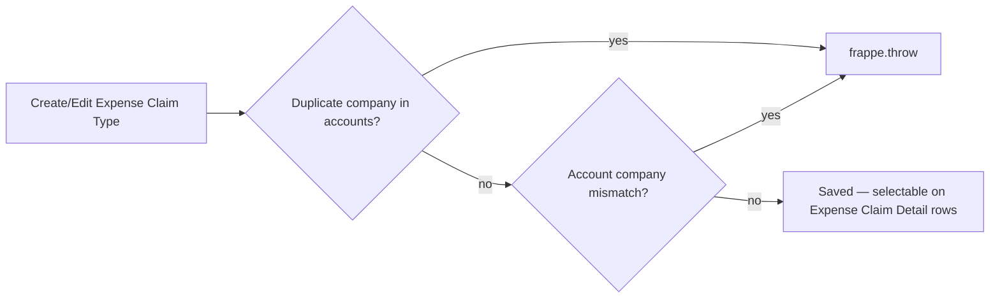

# Expense Claim Type

A master/setup doctype defining a category of expense an employee can claim (e.g. "Travel", "Meals", "Internet") along with the default GL account each row should post to, per company. Exists so [[Expense Claim]] line items know which ledger account to debit without the claimant needing accounting knowledge.

## Key Fields

| Field | Type | Purpose |
|---|---|---|
| `expense_type` | Data, unique, autoname source | The category name; also the document's name (`autoname: field:expense_type`). |
| `description` | Small Text | Explanation of what qualifies. |
| `accounts` (child) | Table → [[Expense Claim Account]] | Per-company default GL account mapping. |
| `deferred_expense_account` | Check | Flags whether this type should post to a deferred expense account (accounting treatment flag; consumed outside this doctype). |

## Relationships

- [[Expense Claim Account]] — child table `accounts`.
- [[Expense Claim Detail]] — linked from; each expense line picks an `expense_type`, and [[Expense Claim]]`.set_expense_account()` resolves the row's `default_account` from here via `get_expense_claim_account()`.

## Logic — What Happens and Why

**`validate()`**:
- `validate_repeating_companies()` — throws if the same Company appears more than once in `accounts`, since a company can only have one default account per expense type (an ambiguous duplicate would make lookup non-deterministic).
- `validate_accounts()` — throws if a row's `default_account`'s actual Company (per the Chart of Accounts) doesn't match the row's declared `company`, preventing cross-company account misconfiguration that would post expenses to the wrong company's books.

## Roles & Permissions

| Role | Can Do | Notes |
|---|---|---|
| [[HR Manager]] | create/write/read | Not submittable — no submit/cancel/amend on this doctype. |
| [[HR User]] | create/write/read | Same as HR Manager. |
| [[Employee]] | read only | Employees can see available expense types (to pick one on a claim) but not modify them. |

## Mermaid: State/Flow

