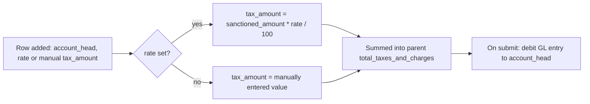

# Expense Taxes and Charges

A child-table row on [[Expense Claim]] representing one tax or charge (e.g. GST/VAT on a reimbursed expense) applied on top of the claim's sanctioned amount. Exists so statutory taxes on reimbursed expenses are tracked and posted to their own ledger accounts rather than folded into the expense account.

## Key Fields

| Field | Type | Purpose |
|---|---|---|
| `account_head` | Link (Account), required, `allow_on_submit` | GL account this tax posts to. |
| `rate` | Float | Percentage rate; if set, `tax_amount` is auto-computed from it. |
| `tax_amount` / `base_tax_amount` | Currency | The computed (or manually entered, if `rate` blank) tax amount. |
| `total` / `base_total` | Currency, read-only | Running total = `tax_amount + total_sanctioned_amount` at the time of calculation. |
| `description` | Small Text, required | What the charge is. |
| `cost_center` / `project` | Link, `allow_on_submit` | Cost attribution for the tax posting. |

## Relationships

- [[Expense Claim]] — parent doctype; this table is `taxes` on it.

## Logic — What Happens and Why

No controller logic of its own (child table, `istable`). All computation happens in the parent's `calculate_taxes()` (a whitelisted method, so it can be re-triggered from the client):
- If `rate` is set, `tax_amount = total_sanctioned_amount * rate / 100`; otherwise the manually entered `tax_amount` is used as-is (supports both percentage-based and flat/manual charges).
- `total = tax_amount + total_sanctioned_amount` per row (a running cumulative display, not a true running total across multiple rows in sequence — matches ERPNext's typical Taxes and Charges table pattern).
- Parent sums all rows into `total_taxes_and_charges`, which feeds into `grand_total = sanctioned + taxes - advances`.
- On submit, `add_tax_gl_entries()` posts a debit GL entry to each row's `account_head` for `tax_amount` — taxes are booked to their own account, separate from the underlying expense accounts, for correct tax-ledger reporting.
- Because `account_head`, `cost_center`, and `project` are `allow_on_submit`, these can be corrected post-submission; `on_update_after_submit()` on the parent detects an `account_head` change and triggers a repost of accounting entries.

## Roles & Permissions

Child table — no standalone `permissions` array; access follows the parent [[Expense Claim]] document's permissions.

## Mermaid: State/Flow

