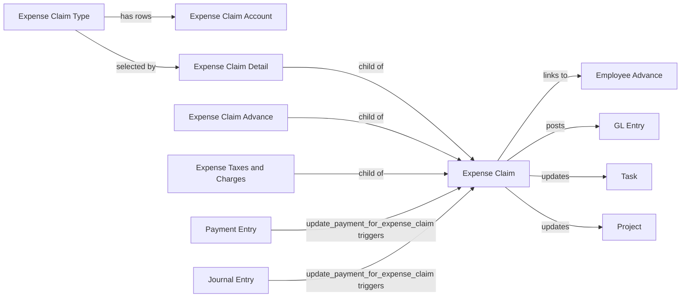

# Expenses

Covers employee out-of-pocket expense reimbursement: claim submission, approval, tax/charge computation, advance adjustment, and the resulting GL postings and payment reconciliation. Unlike most HR-only modules, [[Expense Claim]] is an `AccountsController` subclass — it is simultaneously an HR workflow document and an accounting voucher.

`hrms/expenses/` exists in the source tree only as workspace/sidebar UI configuration (`hrms/expenses/workspace/expenses/expenses.json`, `hrms/expenses/sidebar/expenses/expenses.json`) — it holds no doctypes of its own; all Expenses doctypes physically live under `hrms/hr/doctype/`.

## Doctype Map

## Why This Module Exists

An employee spending money on the company's behalf needs: (1) a way to itemize what was spent and why, (2) an approval gate so someone with authority sanctions the amount actually payable, (3) correct tax/charge handling since reimbursed expenses can carry their own statutory taxes, (4) netting against any cash advance already given so the employee isn't paid twice for the same trip/purchase, and (5) real ledger postings so Finance's books reflect the liability and its eventual payment.

[[Expense Claim Type]] + [[Expense Claim Account]] exist to keep GL account mapping centralized and per-company, so claimants never need accounting knowledge to file a claim — the system resolves the right account automatically. [[Expense Claim Advance]] exists because advances are common in expense-heavy roles (e.g. field sales, travel) and must be reconciled precisely against the Advance Payment Ledger, not just informally deducted. The bidirectional `doc_events` hook (`update_payment_for_expense_claim` on Payment Entry, Journal Entry, and Unreconcile Payment) exists because payment can be recorded from either the claim side (`is_paid`) or the general accounting side (a separate Payment Entry/Journal Entry referencing the claim) — the claim's `status` must stay correct no matter which path was used.

## Doctypes in This Module

- [[Expense Claim]] — the reimbursement request itself; an accounting voucher with an HR approval workflow layered on top.
- [[Expense Claim Type]] — master data defining an expense category and its default GL account per company.
- [[Expense Claim Account]] — per-company GL account mapping row inside an Expense Claim Type.
- [[Expense Claim Detail]] — one itemized expense line (date, type, claimed vs. sanctioned amount) inside a claim.
- [[Expense Claim Advance]] — one Employee Advance being netted against a claim.
- [[Expense Taxes and Charges]] — one tax/charge row applied on top of the claim's sanctioned amount.

## See Also

- [[Expense Claim Lifecycle]] — end-to-end flow from claim submission through approval, tax/advance adjustment, GL posting, and payment.
