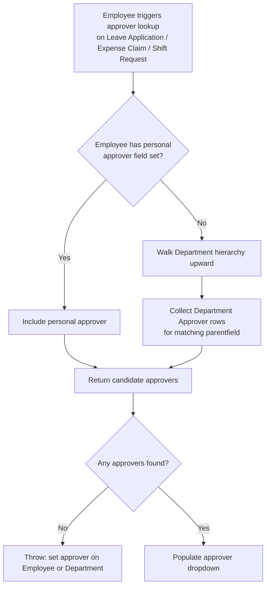

# Department Approver

Child table row designating a User as an approver (for Leave Application, Expense Claim, or Shift Request) at the [[Department]] level, used as a fallback/inherited approver source when an individual Employee doesn't have a personal approver set — approvals cascade up the department hierarchy.

## Key Fields

| Field | Type | Purpose |
|---|---|---|
| approver | Link (User) | The user empowered to approve; `ignore_user_permissions` so any enabled user can be selected regardless of record-level user permission restrictions. |

## Relationships

- [[Department]] — parent document; stored under one of several parentfields (`leave_approvers`, `expense_approvers`, `shift_request_approver`) depending on which approval type the row is for.
- [[Employee]] — indirectly: `get_approvers()` looks up the requesting employee's own department, `leave_approver`, `expense_approver`, and `shift_request_approver` fields first, before falling back to Department Approver rows.
- linked from Leave Application, Expense Claim, Shift Request — these doctypes call `get_approvers()` as a search/query function to populate their approver selection field.

## Logic — What Happens and Why

The doctype itself (`DepartmentApprover`) has no controller logic (`pass` only). The module-level whitelisted function `get_approvers(doctype, txt, searchfield, start, page_len, filters)` implements the actual approver-resolution logic, called as a custom query for approver Link fields:

1. Requires `filters.employee` — throws "Please select Employee first." if missing.
2. Resolves the employee's own department (or an explicit `filters.department` override) and, if found, walks the Department nested-set (`lft`/`rgt`) to build `department_list` — the department itself plus all its ancestor departments (`lft <= dept.lft AND rgt >= dept.rgt`, excluding disabled departments) — meaning approval authority is inherited upward through the department hierarchy.
3. First checks the Employee's own personal approver fields (`leave_approver` for Leave Application, `expense_approver` for Expense Claim, `shift_request_approver` for Shift Request) — if set and the user is enabled, that user is added to the candidate list first (personal approver takes precedence / is always offered).
4. Then queries Department Approver rows across every department in `department_list` (matching `parentfield` = `leave_approvers`/`expense_approvers`/`shift_request_approver` per doctype), filtered by the search text and `enabled = 1`, appending all matches — so approvers set at any ancestor department also become valid options.
5. If no approvers are found at all (`len(approvers) == 0`), throws an error naming the missing field (e.g. "Please set Leave Approver for the Employee: X") and, if a department chain was found, adds "or for the Employee's Department: Y" — guiding the user to fix the root cause (missing approver configuration) rather than silently failing.
6. Returns a de-duplicated set of `(name, first_name, last_name)` tuples for the UI's approver dropdown.

This is the mechanism by which department-level approver configuration becomes a real fallback for approval workflows across Leave, Expense, and Shift Request — not enforced as a hard business rule inside this doctype, but as a search/autocomplete data source consumed by those transactional doctypes.

## Roles & Permissions

No permissions are defined on this child doctype (`permissions: []`) — access is governed entirely by the parent [[Department]]'s permissions.

## Mermaid: State/Flow

No workflow states — a flat configuration row consumed by a lookup function.

