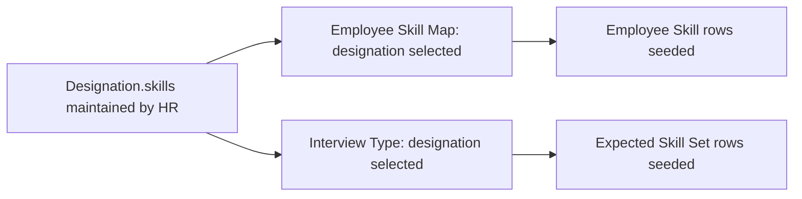

# Designation Skill

A child-table row on the (ERPNext core) Designation doctype's `skills` table, defining one skill that is expected/associated with a given job designation. It is the source data that [[Employee Skill Map]] and Interview Type read from to auto-populate skill baselines.

## Key Fields

| Field | Type | Purpose |
|---|---|---|
| `skill` | Link (Skill) | The skill associated with the designation. |

## Relationships

- Designation (ERPNext core doctype, outside this repo/module) — parent doctype (child table field `skills`).
- [[Skill]] — linked from, via `skill`.
- [[Employee Skill Map]] — read from: selecting a `designation` on Employee Skill Map fetches this Designation's `skills` rows and seeds [[Employee Skill]] rows from them (`employee_skill_map.js`).
- Interview Type (Recruitment module) — read from similarly: `interview_type.js` fetches the Designation's `skills` to seed its own `expected_skill_set` table.

## Logic — What Happens and Why

The `DesignationSkill(Document)` controller is a `pass`-only class — no validation logic. It is a pure declarative mapping row (designation → skill) with no lifecycle behavior of its own; all consuming logic (seeding Employee Skill Map, seeding Interview Type) lives in the client-side scripts of those other doctypes.

## Roles & Permissions

Child table — no own `permissions` array (empty). Access is governed entirely by the parent Designation doctype's permissions (defined in ERPNext core, outside this module's scope).

## Mermaid: State/Flow

