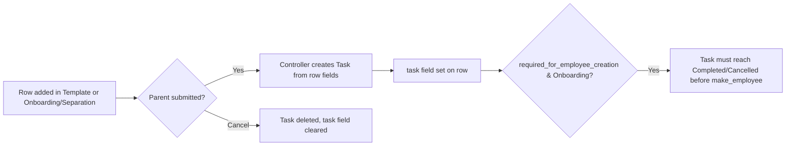

# Employee Boarding Activity

Employee Boarding Activity is the child-table row representing a single onboarding or separation checklist item — a step with a name, an owner (user or role), a schedule offset, and an optional description — used identically by both onboarding and separation templates/records to drive Task creation and assignment.

## Key Fields

| Field | Type | Purpose |
|---|---|---|
| activity_name | Data | Label for the step; becomes part of the generated Task's subject. |
| user | Link (User) | Person to assign the resulting Task to; mutually exclusive with `role` (UI `depends_on`). |
| role | Link (Role) | Assign the Task to every enabled user holding this role; mutually exclusive with `user`. |
| task | Link (Task) | Read-only; set once the parent doc's controller creates the actual Task for this row. |
| task_weight | Float | Weight passed to the created Task, feeding Project percent-complete rollup. |
| required_for_employee_creation | Check | Only meaningful on Employee Onboarding: if set, this activity's Task must be Completed/Cancelled before `make_employee` can run. |
| begin_on | Int | Days offset from the parent's `boarding_begins_on` for the Task's start date. |
| duration | Int | Days added to `begin_on` for the Task's end date. |
| description | Text Editor | Copied into the created Task's description. |

## Relationships

- [[Employee Onboarding]] — parent (child table `activities`).
- [[Employee Onboarding Template]] — parent (child table `activities`).
- [[Employee Separation]] — parent (child table `activities`).
- [[Employee Separation Template]] — parent (child table `activities`).
- Task — linked to (outside assigned doctype set), created and tracked via the `task` field.

## Logic — What Happens and Why

`EmployeeBoardingActivity(Document)` in `employee_boarding_activity.py` has no overridden methods — it is a passive data row. All processing happens in the parent controllers: `EmployeeBoardingController.create_task_and_notify_user()` (`hrms/controllers/employee_boarding_controller.py`) reads each row's `user`/`role`/`begin_on`/`duration`/`task_weight`/`description` to create a Task and assign it, then writes the created Task's name back into this row's `task` field via `activity.db_set("task", task.name)`. On cancel, the same controller clears `task` back to empty. `required_for_employee_creation` is read only by `EmployeeOnboarding.validate_employee_creation()` to gate Employee creation — not enforced for Employee Separation.

## Roles & Permissions

| Role | Can Do | Notes |
|---|---|---|
| (none — `permissions: []`) | — | Child table has no permissions of its own; access is governed entirely by the parent document's (Employee Onboarding / Employee Separation / their templates) permissions. |

## Mermaid: State/Flow

