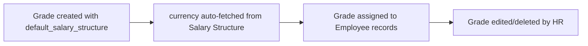

# Employee Grade

A master record defining a compensation grade/band that can be assigned to employees, carrying a default Salary Structure and default base pay so new hires or transfers at that grade can be quickly set up with a standard pay template.

## Key Fields

| Field | Type | Purpose |
|---|---|---|
| default_salary_structure | Link (Salary Structure) | The salary structure template applied by default to employees at this grade. |
| currency | Link (Currency) | Hidden, read-only; fetched from the default salary structure's currency. |
| default_base_pay | Currency | Default base pay amount for this grade, shown only when a default salary structure is set (`depends_on`); non-negative. |

## Relationships

- links to Salary Structure — via `default_salary_structure`, and its currency is fetched onto this record.
- linked from [[Employee]] — Employee records reference a grade to inherit default pay/structure (link runs from Employee's side; dashboard also shows Employee and Leave Period, Employee Onboarding/Separation Template transactions related to grade-driven flows).
- linked from Leave Period, [[Employee Onboarding Template]], [[Employee Separation Template]] — shown on this doctype's dashboard as related transactions (per `employee_grade_dashboard.py`), though there is no direct field/logic coupling in this doctype's own controller.

## Logic — What Happens and Why

Pure master/setup data — the Python controller (`EmployeeGrade`) contains no logic (`pass` only). `currency` is populated automatically via the `fetch_from` field definition (not custom code) whenever `default_salary_structure` is set. There is no validation preventing deletion of a grade in use, no default-pay calculation logic, and no automatic propagation of `default_base_pay`/`default_salary_structure` onto Employee records in this doctype's own code — any such application happens on the Employee side, not enforced in code here.

## Roles & Permissions

| Role | Can Do | Notes |
|---|---|---|
| [[System Manager]] | Read, Write, Create, Delete | Full access. |
| [[HR Manager]] | Read, Write, Create, Delete | Full access. |
| [[HR User]] | Read, Write, Create, Delete | Full access — unusually permissive for an HR User role compared to most other setup doctypes in this module. |

## Mermaid: State/Flow

No workflow states — a flat master list.

