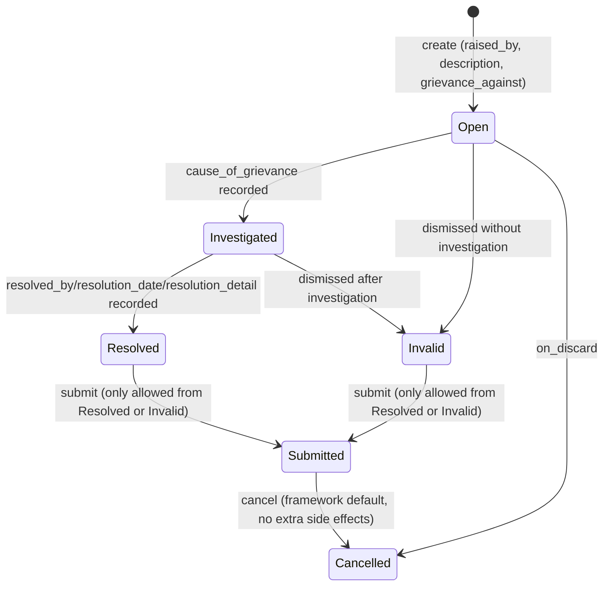

# Employee Grievance

Employee Grievance records a formal complaint raised by an employee against a party (another employee, a department, or any doctype), tracking it through investigation to resolution or rejection as invalid, with an optional link to a related document (e.g. the disciplinary matter it concerns).

## Key Fields

| Field | Type | Purpose |
|---|---|---|
| subject | Data | Short title of the grievance. |
| raised_by | Link (Employee) | The complainant; mandatory. |
| designation / reports_to | Link | Fetched from `raised_by` for context. |
| grievance_type | Link (Grievance Type) | Category of the grievance; mandatory. |
| grievance_against_party | Link (DocType) | The doctype of the party being complained against (e.g. Employee, Department). |
| grievance_against | Dynamic Link (grievance_against_party) | The specific record being complained against. |
| associated_document_type / associated_document | Link / Dynamic Link | Optional pointer to a related document. |
| description | Text | Details of the grievance; mandatory. |
| status | Select (Open/Investigated/Resolved/Invalid/Cancelled) | Drives which fields become mandatory and gates submission. |
| cause_of_grievance | Text | Mandatory once status is Investigated or Resolved. |
| resolved_by / resolution_date / resolution_detail / employee_responsible | Link/Date/Small Text/Link | Resolution record; `resolved_by`, `resolution_date`, `resolution_detail` mandatory once status is Resolved. |

## Relationships

- [[Grievance Type]] — linked to; categorizes the grievance.
- [[Employee]] — linked to via `raised_by`, `employee_responsible`, `reports_to`.
- Any DocType (via `grievance_against_party`/`grievance_against` and `associated_document_type`/`associated_document`) — dynamically linked to, not a fixed doctype.

## Logic — What Happens and Why

Controller: `EmployeeGrievance(Document)` in `employee_grievance.py`. The field-level mandatory rules (`mandatory_depends_on` in the JSON) do the bulk of the workflow enforcement rather than Python validate logic: `cause_of_grievance` becomes required once status reaches Investigated/Resolved, and `resolved_by`/`resolution_detail`/`resolution_date` become required once status is Resolved — ensuring a grievance can't be marked resolved without recording who resolved it, when, and how, and can't be marked investigated without a stated cause.

**Submit (`on_submit`)** — throws unless `status` is `"Invalid"` or `"Resolved"`, meaning a grievance can only be submitted (finalized as a closed record) once it has reached a terminal outcome — either dismissed as invalid or fully resolved with all resolution details captured. Grievances still Open or Investigated cannot be submitted, preventing premature closure of the paper trail.

**Discard (`on_discard`)** — sets `status = "Cancelled"` for grievances discarded before submission.

There is no `on_cancel` override — cancelling a submitted grievance does not trigger any additional side effects beyond the framework default (docstatus becomes 2); `status` itself is not automatically changed on cancel here (contrast with Exit Interview and Employee Referral, which explicitly `db_set` status to Cancelled on cancel).

## Roles & Permissions

| Role | Can Do | Notes |
|---|---|---|
| [[System Manager]] | Read, write, create, delete, submit, cancel, amend, select | Full control. |
| [[HR Manager]] | Read, write, create, delete, submit, cancel, amend, select | Full control. |
| [[HR User]] | Read, write, create, delete | No submit/cancel/amend. |
| [[Employee]] | Read, write, create, delete | No submit/cancel/amend — can raise/edit their own grievances but not finalize them. |

## Mermaid: State/Flow

