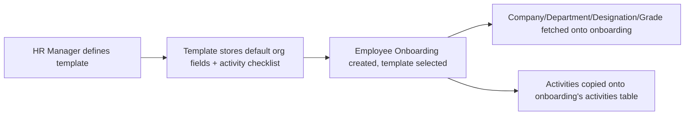

# Employee Onboarding Template

Employee Onboarding Template is a reusable checklist master — a named, reusable set of onboarding activities (with default company/department/designation/grade) that HR selects when creating an Employee Onboarding record, so onboarding steps don't need to be re-typed for every new hire.

## Key Fields

| Field | Type | Purpose |
|---|---|---|
| title | Data | Template name, used as the display title. |
| company | Link (Company) | Default company copied into Employee Onboarding via fetch. |
| department | Link (Department) | Default department. |
| designation | Link (Designation) | Default designation. |
| employee_grade | Link (Employee Grade) | Default grade. |
| activities | Table (Employee Boarding Activity) | The reusable checklist of onboarding tasks copied into each Employee Onboarding created from this template. |

## Relationships

- [[Employee Onboarding]] — linked from; supplies default field values and activity rows when an onboarding record is created against this template.
- [[Employee Boarding Activity]] — child table, one row per template activity.

## Logic — What Happens and Why

`EmployeeOnboardingTemplate(Document)` in `employee_onboarding_template.py` has no overridden lifecycle methods (`pass`) — it is a pure data master. All behavior lives on the consuming side: Employee Onboarding fields are declared with `fetch_from: employee_onboarding_template.<field>`, so saving/selecting a template on an onboarding record auto-populates company/department/designation/grade; the activities table itself is populated client-side (via the linked `employee_onboarding.js` fetching `get_onboarding_details` for the template) rather than by server fetch, since it's a child table, not a scalar fetch.

## Roles & Permissions

| Role | Can Do | Notes |
|---|---|---|
| [[System Manager]] | Read, write, create, delete | Full control. |
| [[HR Manager]] | Read, write, create, delete | Full control except sharing/export configured. |
| [[HR User]] | Read, write, create | No delete. |

## Mermaid: State/Flow

