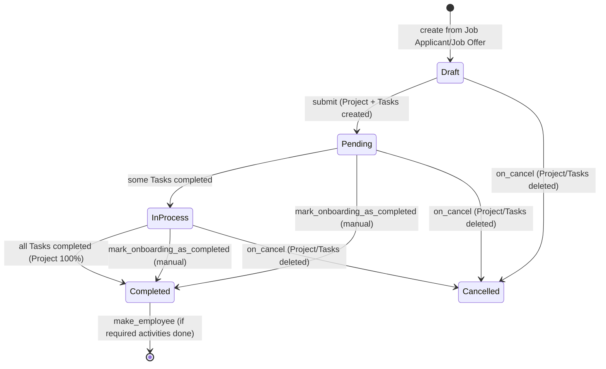

# Employee Onboarding

Employee Onboarding tracks the process of converting a hired job applicant into an active employee. It records the onboarding checklist (activities), auto-generates a Project and Tasks to execute that checklist, assigns tasks to the responsible users/roles, and gates creation of the actual Employee record until the mandatory onboarding tasks are done.

## Key Fields

| Field | Type | Purpose |
|---|---|---|
| job_applicant | Link (Job Applicant) | The hired candidate this onboarding is for; mandatory, one active onboarding per applicant. |
| job_offer | Link (Job Offer) | The accepted offer that triggered onboarding. |
| employee | Link (Employee) | Set automatically once the Employee record exists for this applicant. |
| employee_onboarding_template | Link (Employee Onboarding Template) | Source of default activities/department/designation/grade. |
| company / department / designation / employee_grade | Link | Fetched from the template; define the org context for the new hire. |
| date_of_joining | Date | Expected joining date; mandatory. |
| boarding_begins_on | Date | Anchor date from which activity start/end dates are computed. |
| holiday_list | Link (Holiday List) | Used to skip holidays when scheduling activity dates if no employee exists yet. |
| boarding_status | Select (Pending/In Process/Completed) | Rolls up completion of the linked Project's tasks. Read-only, system-maintained. |
| project | Link (Project) | Auto-created on submit; container for the onboarding Tasks. |
| activities | Table (Employee Boarding Activity) | The onboarding checklist; each row becomes a Task. |
| notify_users_by_email | Check | Whether task assignment notifies assignees by email. |

## Relationships

- [[Employee Onboarding Template]] — linked from, supplies default activities/company/department/designation/grade.
- [[Employee Boarding Activity]] — child table, one row per onboarding task.
- [[Job Applicant]], [[Job Offer]], [[Employee]], Project, Task, Holiday List — linked to (outside assigned doctype set; not documented here).

## Logic — What Happens and Why

Controller: `EmployeeOnboarding(EmployeeBoardingController)` in `employee_onboarding.py`, sharing most lifecycle logic with `EmployeeBoardingController` (`hrms/controllers/employee_boarding_controller.py`), also used by Employee Separation.

**Draft / validate** — `validate()` calls `super().validate()` (controller clears any copied `task` links on amended documents), then `set_employee()` (looks up an existing Employee linked to the `job_applicant` and fills the `employee` field if found), then `validate_duplicate_employee_onboarding()` (throws if a non-cancelled Employee Onboarding already exists for the same job applicant) — this prevents duplicate onboarding records for one hire.

**Submit** — `on_submit()` calls the shared controller `on_submit()`, which creates a **Project** named `"Employee Onboarding : <job_applicant>"` with `expected_start_date = date_of_joining`, sets `boarding_status = "Pending"`, reloads, then calls `create_task_and_notify_user()`. That method iterates `activities`, computes each activity's start/end dates via `get_task_dates()` (offset from `boarding_begins_on` by `begin_on`/`duration` days, shifted past holidays using `get_holiday_list()` — which falls back to the applicant's future Employee record's holiday list, else the doc's own `holiday_list` field, throwing `frappe.MandatoryError` if neither exists), creates a **Task** under the Project for each activity, and assigns it to the activity's `user` and/or all enabled users holding the activity's `role` (via `frappe.desk.form.assign_to`, excluding Administrator). This operationalizes the checklist as trackable, assigned work items.

**on_update_after_submit** — re-running `create_task_and_notify_user()` (e.g. if activities are edited post-submit, since the `activities` table has `allow_on_submit: 1`) creates tasks only for rows still missing a `task` link, letting HR add activities after submission without disturbing existing tasks.

**Status rollup** — a `doc_events` hook (`hooks.py`) fires `update_task` on every `Task.on_update`, which calls `update_employee_boarding_status()`; this reads the linked Project's `percent_complete` and sets `boarding_status` to Pending/In Process/Completed on the matching Employee Onboarding — so the onboarding record's status always reflects live task completion in Project/Task, without user intervention. A companion hook on `Project.validate` re-runs the same status derivation.

**Gating Employee creation** — `validate_employee_creation()` (called from the `make_employee` mapped-doc function, not from the doc's own lifecycle) requires `docstatus == 1` (must be submitted) and that every activity row flagged `required_for_employee_creation` has a linked Task with status Completed or Cancelled; otherwise it raises `IncompleteTaskError`. This enforces that mandatory onboarding steps (e.g. paperwork, IT setup) finish before HR can convert the applicant into a live Employee via `make_employee()`, which maps `job_applicant`→Employee fields, sets `personal_email` from the Job Applicant and `status = "Active"`.

**mark_onboarding_as_completed** (whitelisted) — a manual override: force-completes every linked Task, marks the Project "Completed", and sets `boarding_status = "Completed"`, for cases where the automatic Project-percent rollup does not reach 100% (e.g. cancelled tasks).

**Cancel** — `on_cancel()` calls the shared controller `on_cancel()`, which deletes all Tasks under the Project and the Project itself (force-deleted), clears the `project` field and each activity's `task` link, and shows an alert — undoing all working artifacts of an onboarding that is being retracted.

## Roles & Permissions

| Role | Can Do | Notes |
|---|---|---|
| [[System Manager]] | Read, write, create, delete, submit, cancel, amend | Full control. |
| [[HR Manager]] | Read, write, create, submit, cancel, amend | No delete. |
| [[HR User]] | Read, write, create | Cannot submit/cancel/delete — day-to-day data entry only. |

## Mermaid: State/Flow

