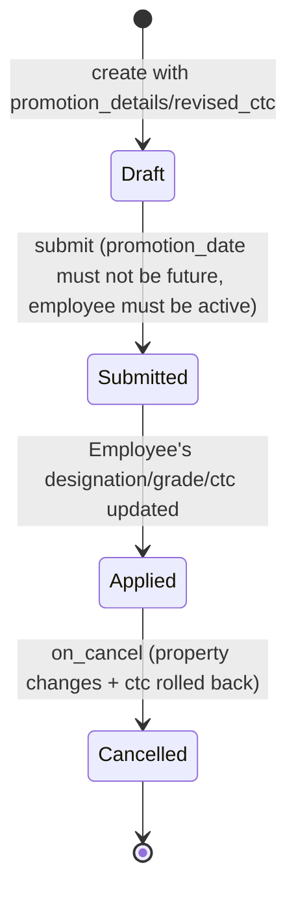

# Employee Promotion

Employee Promotion records a promotion event for an employee — a set of property changes (e.g. designation, grade) plus a revised CTC — and applies both to the Employee master on submission, with the change taking effect only after the promotion date has actually arrived.

## Key Fields

| Field | Type | Purpose |
|---|---|---|
| employee | Link (Employee) | The employee being promoted; mandatory; must be active. |
| promotion_date | Date | Effective date; cannot submit before this date. |
| promotion_details | Table (Employee Property History) | The property changes (e.g. designation, grade) being applied to the Employee. |
| current_ctc / revised_ctc | Currency | Old and new CTC; `revised_ctc` requires `current_ctc` to be set (mandatory_depends_on). |
| salary_currency | Link (Currency) | Fetched from Employee; currency for the CTC fields. |
| department / company | Link | Fetched from Employee, contextual display only. |

## Relationships

- [[Employee Transfer]] — sibling doctype sharing the same Employee Property History change-tracking pattern.
- [[Employee Property History]] — child table, holds the before/after property values.
- [[Employee]] — linked to; this doc reads and mutates the Employee's fields and `ctc`.

## Logic — What Happens and Why

Controller: `EmployeePromotion(Document)` in `employee_promotion.py`.

**Validate** — `validate_active_employee(self.employee)` (shared helper in `hrms/hr/utils.py`) ensures the target employee is currently active; a promotion cannot be recorded for an employee who has already left.

**before_submit** — throws `DocstatusTransitionError` if `promotion_date` is in the future, so a promotion can only be finalized once the effective date has arrived — mirrors Employee Transfer's rule.

**Submit (`on_submit`)** — loads the Employee, applies `promotion_details` via the shared `update_employee_work_history()` helper (dated `promotion_date`), and if `revised_ctc` is set, overwrites `employee.ctc` with it, then saves. This is the single point where a promotion's designation/grade change and compensation increase are both committed to the live Employee record.

**Cancel (`on_cancel`)** — reloads the Employee, calls `update_employee_work_history(..., cancel=True)` to roll back the property changes, and if `revised_ctc` was set, restores `employee.ctc` back to `current_ctc` — a full reversal of the promotion's effects on both career-history and pay.

## Roles & Permissions

| Role | Can Do | Notes |
|---|---|---|
| [[Employee]] | Read | View-only, presumably to see their own promotion record. |
| [[HR User]] | Read, write, create, submit | No cancel/delete/amend. |
| [[HR Manager]] | Read, write, create, submit, cancel, delete, amend | Full control. |

## Mermaid: State/Flow

