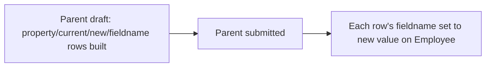

# Employee Property History

Child table row capturing a single field-level change (old value vs. new value) applied to an [[Employee]] record as part of an [[Employee Promotion]] or [[Employee Transfer]] — an explicit, auditable before/after log of what changed and why, independent of Frappe's generic change-log.

## Key Fields

| Field | Type | Purpose |
|---|---|---|
| property | Data | Human-readable label of the field that changed (e.g. "Designation", "Department"). |
| current | Data | Value before the change. |
| new | Data | Value after the change. |
| fieldname | Data | The actual Employee fieldname being changed (hidden field, used programmatically to apply the update). |

## Relationships

- [[Employee Promotion]] — parent document; each row is one field changed as part of a promotion (e.g. designation, grade, salary).
- [[Employee Transfer]] — parent document; each row is one field changed as part of a transfer (e.g. department, branch, company).
- [[Employee]] — the target record whose field named by `fieldname` is updated to `new` when the parent document is submitted.

## Logic — What Happens and Why

This doctype (`EmployeePropertyHistory`) contains no server-side logic itself (`pass` only). All logic lives in the parent doctypes:
- [[Employee Promotion]] and [[Employee Transfer]] each build a `property_history` (or equivalently named) child table listing every Employee field being changed, capturing `current` (existing Employee value) and `new` (proposed value) per row before submission, using `fieldname` to identify the actual Employee field.
- On submission of the parent document, each row's `fieldname`/`new` pair is applied to the linked Employee record, executing the promotion/transfer — this doctype is purely the structured record of *what* changed, used both to drive the update and to preserve a readable audit trail on the promotion/transfer document itself.

## Roles & Permissions

No permissions are defined on this child doctype (`permissions: []`) — access is governed entirely by the parent document's permissions ([[Employee Promotion]] or [[Employee Transfer]]).

## Mermaid: State/Flow

Purely a data row with no independent state machine.

