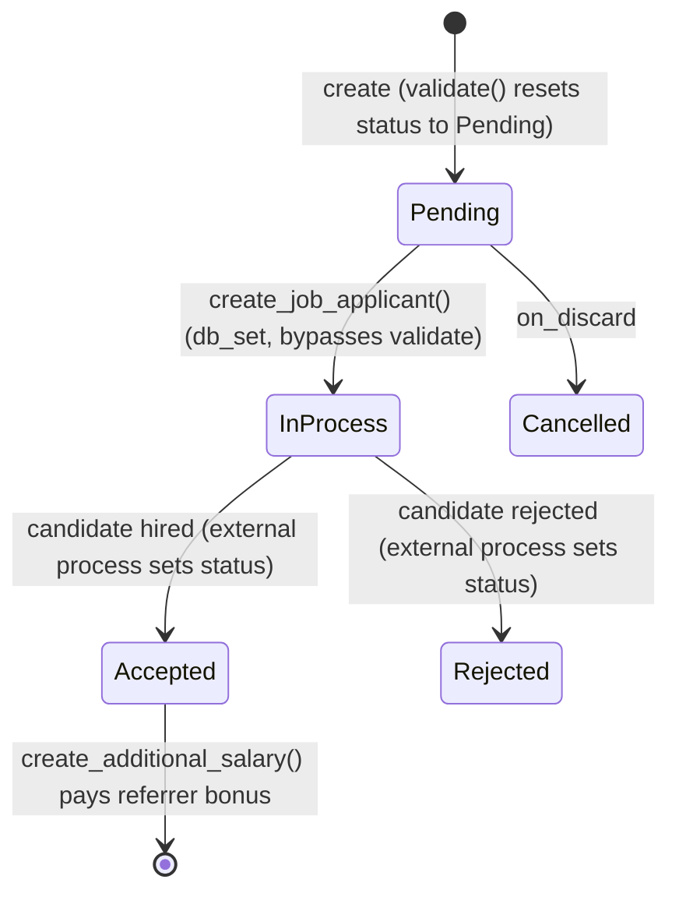

# Employee Referral

Employee Referral captures an employee-submitted candidate referral for an open position — the candidate's details, the referring employee, and a referral-bonus eligibility flag — and can convert into a Job Applicant to enter the normal recruitment pipeline, and later into an Additional Salary record to pay out the referral bonus.

## Key Fields

| Field | Type | Purpose |
|---|---|---|
| first_name / last_name / full_name | Data | Candidate's name; `full_name` is computed server-side from the other two. |
| email / contact_no | Data | Candidate contact details; `email` mandatory and used for duplicate detection. |
| for_designation | Link (Designation) | Position the candidate is being referred for; mandatory. |
| referrer | Link (Employee) | The referring employee; mandatory, must be active. |
| referrer_name | Data | Fetched from referrer's employee_name. |
| status | Select (Pending/In Process/Accepted/Rejected/Cancelled) | System-controlled (permlevel 1, read-only); reflects recruitment pipeline progress. |
| is_applicable_for_referral_bonus | Check | Whether this referral is eligible for a bonus payout; defaults true. |
| referral_payment_status | Select (Unpaid/Paid) | Tracks whether the bonus has been paid; cleared if not bonus-applicable. |
| resume / resume_link | Attach / Data | Candidate's resume file or external link. |
| department | Link (Department) | Fetched from referrer's employee record (via employee — note: fetch source uses `employee.department` though the field itself is `referrer`). |

## Relationships

- [[Job Applicant]] — linked to; created from this referral via `create_job_applicant`, carrying `employee_referral` back-reference.
- Additional Salary — linked to (outside assigned doctype set); created via `create_additional_salary` to pay the referrer their bonus.
- [[Employee]] — linked to via `referrer`.

## Logic — What Happens and Why

Controller: `EmployeeReferral(Document)` in `employee_referral.py`.

**Validate** — `validate_active_employee(self.referrer)` ensures only currently active employees can submit referrals. `validate_unique_referral()` throws `DuplicateEntryError` if another non-cancelled referral already exists for the same candidate email, preventing duplicate submissions for the same candidate. `set_full_name()` concatenates first/last name. `set_status()` unconditionally resets `status` to `"Pending"` on every save — so status is not directly user-editable through normal document saves; it changes only via server-side calls (see below). `set_referral_bonus_payment_status()` clears `referral_payment_status` if the referral isn't bonus-eligible, otherwise defaults it to `"Unpaid"` if unset.

**on_discard** — sets `status = "Cancelled"` for referrals discarded before submission (this doctype is submittable, but its own controller has no `on_submit`/`on_cancel` override — submission is largely a formality that doesn't otherwise mutate other records directly from this doc's lifecycle).

**create_job_applicant (whitelisted)** — maps the referral into a new Job Applicant: sets `source = "Employee Referral"`, links `employee_referral` back to this record, copies name/designation/email/phone/resume, and maps referral status Pending/In Process → Job Applicant status "Open". After creating the Job Applicant, it force-sets this referral's own `status` to `"In Process"` via `db_set` — bypassing `validate()`'s reset-to-Pending behavior, moving the referral into the active pipeline.

**create_additional_salary (whitelisted)** — builds (but does not insert) an Additional Salary document crediting the `referrer` employee, tagged with `ref_doctype`/`ref_docname` pointing back to this referral, guarded so it doesn't create a duplicate if one already exists for this referral — the mechanism for actually paying the referral bonus once the candidate is hired.

## Roles & Permissions

| Role | Can Do | Notes |
|---|---|---|
| [[System Manager]] | Read, write, create, delete, submit, cancel, amend | Full control. |
| [[HR Manager]] | Read, write, create, delete, submit, cancel, amend (base) + delete/write at permlevel 1 | Full control including the read-only `status` field (permlevel 1). |
| [[HR User]] | Read, write, create, delete, submit, cancel, amend (base) + delete/write at permlevel 1 | Same level of control as HR Manager for this doctype. |
| [[Employee]] | Read, create, submit, amend (base) + read at permlevel 1 | Can submit their own referrals but cannot edit the permlevel-1 `status` field. |

## Mermaid: State/Flow

