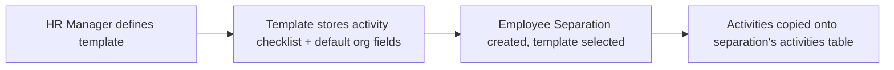

# Employee Separation Template

Employee Separation Template is a reusable offboarding checklist master — a named set of exit activities (with default company/department/designation/grade) that HR selects when creating an Employee Separation record, avoiding re-entry of standard offboarding steps for every departing employee.

## Key Fields

| Field | Type | Purpose |
|---|---|---|
| title | Data | Template name, used as display title. |
| company | Link (Company) | Default company context for separations created from this template. |
| department | Link (Department) | Default department context. |
| designation | Link (Designation) | Default designation context. |
| employee_grade | Link (Employee Grade) | Default grade context. |
| activities | Table (Employee Boarding Activity) | The reusable offboarding checklist copied into each Employee Separation created from this template. |

## Relationships

- [[Employee Separation]] — linked from; supplies the activity checklist when a separation is created against this template.
- [[Employee Boarding Activity]] — child table, one row per template activity.

## Logic — What Happens and Why

`EmployeeSeparationTemplate(Document)` in `employee_separation_template.py` has no overridden lifecycle methods (`pass`) — a pure data master, mirroring Employee Onboarding Template. Unlike Employee Onboarding, the Employee Separation doctype does not declare `fetch_from` on company/department/designation/grade against this template (those are fetched from the Employee instead), so this template's org-context fields serve mainly as filtering/defaults in the UI (`employee_separation_template.js`) rather than being propagated by server-side fetch; the `activities` checklist is what actually gets copied onto a new Employee Separation.

## Roles & Permissions

| Role | Can Do | Notes |
|---|---|---|
| [[System Manager]] | Read, write, create, delete | Full control. |
| [[HR Manager]] | Read, write, create, delete | Full control. |
| [[HR User]] | Read only | No create/write/delete — not enforced beyond read in code/permissions. |

## Mermaid: State/Flow

