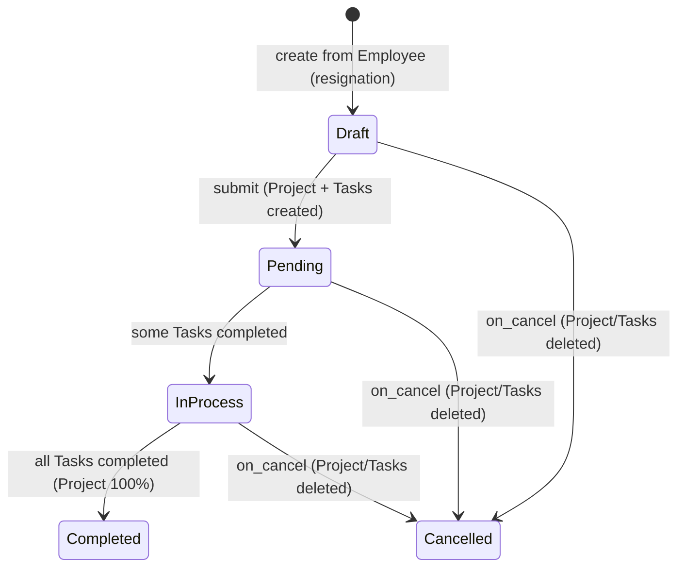

# Employee Separation

Employee Separation manages the offboarding process for a departing employee: it drives a checklist of exit activities (asset return, knowledge transfer, access revocation, etc.) through an auto-generated Project and Tasks, tracks completion status, and records the exit interview summary.

## Key Fields

| Field | Type | Purpose |
|---|---|---|
| employee | Link (Employee) | The departing employee; mandatory. |
| resignation_letter_date | Date | Fetched from Employee; read-only reference date. |
| employee_separation_template | Link (Employee Separation Template) | Source of default checklist activities. |
| company / department / designation / employee_grade | Link | Fetched from Employee for context. |
| boarding_begins_on | Date | Anchor date for computing activity start/end dates. |
| boarding_status | Select (Pending/In Process/Completed) | System-maintained status reflecting linked Project/Task completion. |
| project | Link (Project) | Auto-created on submit to hold separation Tasks. |
| activities | Table (Employee Boarding Activity) | The offboarding checklist; each row becomes a Task. |
| exit_interview | Text Editor | Free-text summary of the exit interview, stored directly on this doc. |
| notify_users_by_email | Check | Whether task assignment notifies assignees by email. |

## Relationships

- [[Employee Separation Template]] — linked from, supplies default activities.
- [[Employee Boarding Activity]] — child table, one row per offboarding task.
- [[Exit Interview]] — related process (separate doctype); not directly linked by field, but conceptually the same offboarding event; `exit_interview` field here duplicates a free-text summary independent of the Exit Interview doctype's structured record.
- [[Employee]], Project, Task, Holiday List — linked to (outside assigned doctype set, except Employee).

## Logic — What Happens and Why

Controller: `EmployeeSeparation(EmployeeBoardingController)` in `employee_separation.py`, sharing lifecycle logic with `EmployeeBoardingController` (`hrms/controllers/employee_boarding_controller.py`) — the same base class used by Employee Onboarding.

**Draft / validate** — `validate()` just calls `super().validate()`, which clears any copied `task` links when the document is an amendment (`amended_from` set), preventing a re-submitted amendment from pointing at stale Tasks belonging to the cancelled original.

**Submit** — `on_submit()` calls the shared `on_submit()`: creates a Project named `"Employee Separation : <employee>"` with `expected_start_date = resignation_letter_date`, sets `boarding_status = "Pending"`, then `create_task_and_notify_user()` builds a Task per activity row (dates computed from `boarding_begins_on` + `begin_on`/`duration`, adjusted around the employee's actual holiday list via `get_holiday_list_for_employee`), and assigns each Task to the row's `user` and/or all users holding the row's `role`. This operationalizes the offboarding checklist as trackable, assigned work.

**on_update_after_submit** — re-invokes `create_task_and_notify_user()` for any activity rows added after submission (activities table has `allow_on_submit: 1`), creating Tasks only for rows still missing one.

**Status rollup** — the same global hooks as Employee Onboarding apply: `Task.on_update` → `update_task()` → `update_employee_boarding_status()` in `employee_boarding_controller.py`, which reads the Project's `percent_complete` and writes Pending/In Process/Completed onto `boarding_status`. `required_for_employee_creation` on activity rows has no effect here — it is only checked by Employee Onboarding.

**Cancel** — `on_cancel()` calls the shared `on_cancel()`, force-deleting every Task under the Project and the Project itself, clearing `project` and each activity's `task`, with an alert — used when a separation is retracted (e.g. employee retained after all).

The `exit_interview` field is a plain text summary with no validation logic tying it to the separate [[Exit Interview]] doctype — the two are not programmatically linked in this codebase.

## Roles & Permissions

| Role | Can Do | Notes |
|---|---|---|
| [[System Manager]] | Read, write, create, delete, submit, cancel, amend | Full control. |
| [[HR Manager]] | Read, write, create | No submit/cancel/delete permission granted in this doctype's permission rows (submit/cancel only available via System Manager). |
| [[HR User]] | Read, write, create | No submit/cancel/delete. |

## Mermaid: State/Flow

