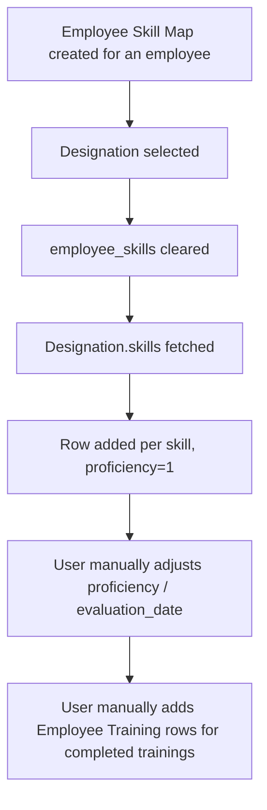

# Employee Skill Map

Employee Skill Map is the single per-employee record of that employee's current skills (with proficiency ratings) and training history — one record per employee (enforced by uniqueness on `employee`), used as the reference point for skills tracking and development planning.

## Key Fields

| Field | Type | Purpose |
|---|---|---|
| `employee` | Link (Employee, unique, autoname source) | The employee this skill map belongs to; one map per employee. |
| `employee_name` | Read Only (fetch from `employee.employee_name`) | Display convenience, also the `title_field`. |
| `designation` | Read Only (fetch from `employee.designation`) | Drives client-side auto-population of expected skills (see Logic). |
| `employee_skills` | Table (Employee Skill) | The employee's current skills and proficiency ratings. |
| `trainings` | Table (Employee Training) | The employee's training history. |

## Relationships

- [[Employee Skill]] — parent/child; each row is one skill + proficiency + evaluation date.
- [[Employee Training]] — parent/child; each row references a completed [[Training Event]].
- [[Skill]] — linked from indirectly via Employee Skill rows.
- Designation (ERPNext core doctype, outside this module) — client-side, selecting a `designation` reads that Designation's `skills` child table (Designation Skill) and seeds `employee_skills` with each skill at proficiency 1.

## Logic — What Happens and Why

Controller: `EmployeeSkillMap(Document)` in `employee_skill_map.py` is a `pass`-only class — **no server-side validation or lifecycle logic at all**. All the doctype's behavior is client-side, in `employee_skill_map.js`:

- On the `designation` field's `change` event: clears `employee_skills` (`frm.set_value("employee_skills", null)`), then if a designation is set, fetches that Designation document and, for each row in its `skills` child table (Designation Skill), adds a new Employee Skill row to `employee_skills` with `skill` set and `proficiency` defaulted to `1`. Business reason: lets HR quickly seed a new employee's skill map with the baseline skill set expected for their role, which the user then adjusts (ratings, evaluation dates) as actual competence is assessed.
- No `on_update`, `validate`, or submit behavior exists — the doctype is not submittable and has no `is_submittable` flag. Records are plain, always-editable documents.

## Roles & Permissions

| Role | Can Do | Notes |
|---|---|---|
| [[System Manager]] | Read, write, create, delete | Full control. |
| [[HR Manager]] | Read, write, create, delete | Full control (no `email`/`share` explicitly set unlike System Manager). |
| [[HR User]] | Read, write, create | Cannot delete. |

## Mermaid: State/Flow

