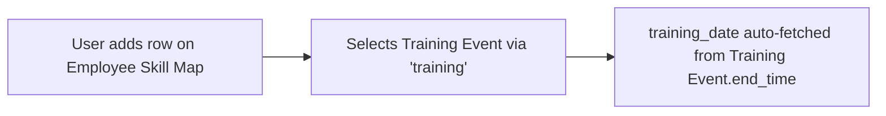

# Employee Training

A lightweight child-table row recording that a given [[Training Event]] appears on an employee's training history, as kept inside their [[Employee Skill Map]]. It is the historical "trainings attended" line item, distinct from the operational attendance tracking done on Training Event itself.

## Key Fields

| Field | Type | Purpose |
|---|---|---|
| `training` | Link (Training Event) | The training event this history entry refers to. |
| `training_date` | Date (fetch from `training.end_time`) | Denormalized date the training ended, for display/sorting in the skill map. |

## Relationships

- [[Employee Skill Map]] — parent doctype (child table field `trainings`).
- [[Training Event]] — linked from, via `training`.

## Logic — What Happens and Why

The `EmployeeTraining(Document)` controller is a `pass`-only class with no validation logic. It is purely a denormalized read/reference row — nothing writes to it automatically; population is manual (user adds a row and picks a Training Event) or via the Employee Skill Map form. `training_date` is fetched, not computed. No code elsewhere in the module pushes rows into this table when a Training Event or Training Result is completed — not enforced in code.

## Roles & Permissions

Child table — no own `permissions` array (empty). Access is governed entirely by the parent [[Employee Skill Map]] doctype's permissions (System Manager and HR Manager: full CRUD; HR User: create/read/write).

## Mermaid: State/Flow

