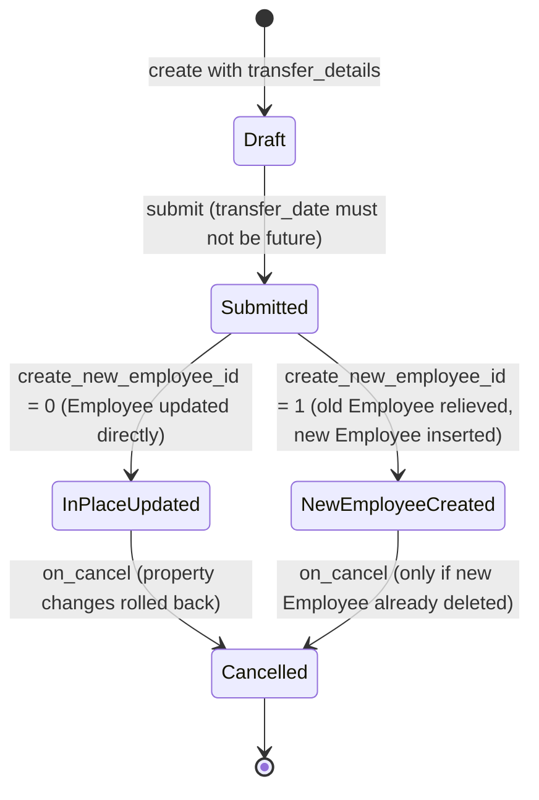

# Employee Transfer

Employee Transfer records a change in an employee's job properties (department, designation, grade, branch, company, etc.) effective on a given date, applying that change to the Employee master on submission — either by updating the existing Employee record in place, or by creating a brand-new Employee record (useful when transferring across companies) while relieving the old one.

## Key Fields

| Field | Type | Purpose |
|---|---|---|
| employee | Link (Employee) | The employee being transferred; mandatory. |
| transfer_date | Date | Effective date of the transfer; cannot submit before this date has arrived. |
| company / new_company | Link (Company) | Source and destination company; a change here can trigger a new Employee ID. |
| department | Link (Department) | Fetched from Employee for display. |
| transfer_details | Table (Employee Property History) | The list of employee fields being changed (property/current/new), mandatory. |
| create_new_employee_id | Check | If set, creates a new Employee record for the transfer instead of editing the existing one. |
| new_employee_id | Link (Employee) | Read-only; populated with the newly created Employee if `create_new_employee_id` is used. |
| reallocate_leaves | Check | Hidden field for leave re-allocation; not read anywhere in this doctype's own controller. |

## Relationships

- [[Employee Promotion]] — sibling doctype using the same Employee Property History pattern to change employee properties.
- [[Employee Property History]] — child table, holds the before/after values.
- [[Employee]] — linked to; this doc reads and mutates Employee fields directly.

## Logic — What Happens and Why

Controller: `EmployeeTransfer(Document)` in `employee_transfer.py`.

**before_submit** — throws `DocstatusTransitionError` if `transfer_date` is in the future, ensuring a transfer can only be finalized once it has actually taken effect (no submitting transfers that haven't happened yet).

**Submit (`on_submit`)** — behavior branches on `create_new_employee_id`:
- **New Employee ID path**: `frappe.copy_doc(employee)` clones the current Employee, clears `name`/`employee_number`, then `update_employee_work_history()` (shared helper in `hrms/hr/utils.py`) applies the `transfer_details` property changes to the new record dated `transfer_date`. If moving to a `new_company` different from the current company, the new employee's `internal_work_history` is reset, `date_of_joining` is set to the transfer date, and `company` updated — treating the move as effectively a new employment record. The `user_id` (login) is moved to the new employee unless `user_id` is itself one of the changed properties (checked via `validate_user_in_details()`), in which case the property-history value takes precedence; the old employee's `user_id` is cleared so only one Employee owns that login. The new employee is inserted, `new_employee_id` is stored back on this doc, and the **old** employee is relieved: `relieving_date = transfer_date`, `status = "Left"`.
- **In-place path**: `update_employee_work_history()` applies the property changes directly to the existing Employee record; if `new_company` differs, `company` and `date_of_joining` are updated on the same record and saved.
This lets a company represent both "employee moved department/designation within the same legal entity" (in-place edit, full history preserved) and "employee moved to a different company entity" (new Employee record, treated as a fresh joining) with one document type.

**Cancel (`on_cancel`)** — reverses the change:
- New-Employee-ID path: if the new Employee record still exists, throws asking the user to delete it first (can't silently cancel a transfer that spawned a live Employee); otherwise reactivates the old employee (`status = "Active"`, clears `relieving_date`).
- In-place path: calls `update_employee_work_history(..., cancel=True)` to roll back the property changes.
- In both paths, if `new_company != company`, the employee's `company` is reverted to the original.
This guarantees cancelling a transfer restores the Employee to its pre-transfer state, provided no new Employee record is still attached.

## Roles & Permissions

| Role | Can Do | Notes |
|---|---|---|
| [[Employee]] | Read | View-only, presumably to see their own transfer history. |
| [[HR User]] | Read, write, create, submit | No cancel/delete/amend. |
| [[HR Manager]] | Read, write, create, submit, cancel, delete, amend | Full control. |

## Mermaid: State/Flow

