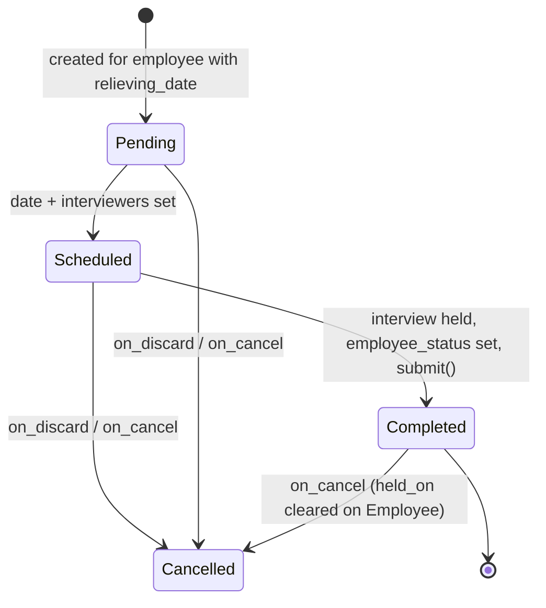

# Exit Interview

Exit Interview manages the structured exit-interview process for a departing employee: scheduling the interview with one or more interviewers, sending an exit questionnaire by email, capturing the interview summary and final decision, and recording the interview date back onto the Employee record.

## Key Fields

| Field | Type | Purpose |
|---|---|---|
| employee | Link (Employee) | The departing employee; mandatory. |
| relieving_date | Date | Fetched from Employee; must already be set on the Employee or the doc cannot be saved. |
| status | Select (Pending/Scheduled/Completed/Cancelled) | Drives mandatory-field rules and submission eligibility. |
| date | Date | Interview date; mandatory when status is Scheduled. |
| interviewers | Table MultiSelect (Interviewer) | Mandatory when status is Scheduled; recipients of the "Exit Interview Scheduled" notification. |
| ref_doctype / reference_document_name | Link / Dynamic Link | Optional pointer to a related document (e.g. a grievance or separation). |
| questionnaire_email_sent | Check | Read-only flag set once the exit questionnaire email succeeds; prevents re-sending. |
| interview_summary | Text Editor | Free-text notes captured during/after the interview. |
| employee_status | Select (Employee Retained/Exit Confirmed) | Mandatory when status is Completed; the interview's outcome. |
| email | Data | Employee's resolved email address, set server-side; used as sender/recipient reference field. |

## Relationships

- [[Employee Separation]] — related offboarding process (no direct doctype link field; both concern the same departing employee independently).
- [[Employee]] — linked to; this doc reads `relieving_date` from and writes `held_on` back onto the Employee record.
- [[HR Settings]], Email Template, [[Interviewer]] — linked to (outside assigned doctype set, except HR Settings/Interviewer); used for the exit-questionnaire email flow.

## Logic — What Happens and Why

Controller: `ExitInterview(Document)` in `exit_interview.py`.

**Validate** — `validate_relieving_date()` throws if the linked Employee has no `relieving_date` set, since an exit interview only makes sense for an employee who has a known leaving date. `validate_duplicate_interview()` throws `DuplicateEntryError` if a non-cancelled Exit Interview already exists for the same employee — one active interview record per departing employee. `set_employee_email()` resolves and stores the employee's email via `get_employee_email()` (ERPNext helper) for use as the `sender_field`/recipient.

**Submit** — `on_submit()` requires `status == "Completed"` (else throws), enforcing that only interviews that actually concluded (with the `employee_status` decision captured) can be submitted — Pending/Scheduled/Cancelled documents cannot be finalized as records of a completed process. It then calls `update_interview_date_in_employee()`, which sets the Employee's `held_on` field to the interview `date` — the authoritative record on the Employee master that the exit interview happened.

**Cancel** — `on_cancel()` calls `update_interview_date_in_employee()` again, which (since `docstatus` is now 2) clears the Employee's `held_on` back to `None`, then explicitly sets `status = "Cancelled"` via `db_set` — keeping the Employee record and this doc's own status field consistent with the cancellation.

**Discard** — `on_discard()` sets `status = "Cancelled"` for interviews discarded before ever being submitted.

**Exit questionnaire email (`send_exit_questionnaire`, whitelisted)** — bulk action over a list of interview names: for each interview not already flagged `questionnaire_email_sent`, resolves the employee's email, renders the configured Email Template (`HR Settings.exit_questionnaire_notification_template`) with the interview+employee context, sends it, and sets `questionnaire_email_sent = 1`. `validate_questionnaire_settings()` guards that both `exit_questionnaire_web_form` and `exit_questionnaire_notification_template` are configured in HR Settings before sending, failing fast with a clear message otherwise. A summary of successes/failures (missing employee email) is shown via `show_email_summary`.

**Notification** — the standard Notification "Exit Interview Scheduled" (`hrms/hr/notification/exit_interview_scheduled/exit_interview_scheduled.json`) fires one day before `date` (event: Days Before) when `status == 'Scheduled'` and `email`/`date` are set and the doc isn't cancelled, emailing all assignees and the employee, listing the interviewers — a reminder so the interview isn't missed.

## Roles & Permissions

| Role | Can Do | Notes |
|---|---|---|
| [[System Manager]] | Read, write, create, delete, submit, cancel, amend | Full control. |
| [[HR Manager]] | Read, write, create | Can email/print/export; no explicit submit/cancel/delete permission row. |
| [[HR User]] | Read only | No create/write — view-only access per permissions. |

## Mermaid: State/Flow

