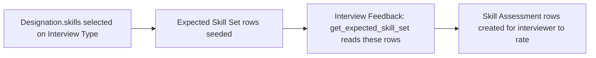

# Expected Skill Set

A child-table row defining one skill (with its description) that is expected to be assessed for a given interview configuration — used on the Interview Type doctype (Recruitment module) to define what an interviewer should evaluate, and read by Interview Feedback to build its Skill Assessment rows.

## Key Fields

| Field | Type | Purpose |
|---|---|---|
| `skill` | Link (Skill, required) | The expected skill. |
| `description` | Small Text (fetch from `skill.description`) | Denormalized skill description shown alongside the expected skill. |

## Relationships

- [[Interview Type]] (Recruitment module) — parent doctype (child table field `expected_skill_set`).
- [[Skill]] — linked from, via `skill`; also the source of the fetched `description`.
- [[Skill Assessment]] — read by: [[Interview Feedback]]'s `get_expected_skill_set` whitelisted method (in the Recruitment module's `interview.py`) uses an interview's Expected Skill Set rows to build the interview's Skill Assessment table.
- [[Designation Skill]] — populated from: `interview_type.js` seeds `expected_skill_set` rows from the selected Designation's `skills` (Designation Skill) child table.

## Logic — What Happens and Why

The `ExpectedSkillSet(Document)` controller is a `pass`-only class — no validation logic. It is a pure declarative row; `description` is a read-through fetch from Skill, not editable independently. All logic that creates or consumes these rows (seeding from Designation, feeding into Skill Assessment on Interview Feedback) lives in the Recruitment module's interview-related files, outside this documentation's scope.

## Roles & Permissions

Child table — no own `permissions` array (empty). Access is governed entirely by the parent [[Interview Type]] doctype's permissions (defined in the Recruitment module).

## Mermaid: State/Flow

