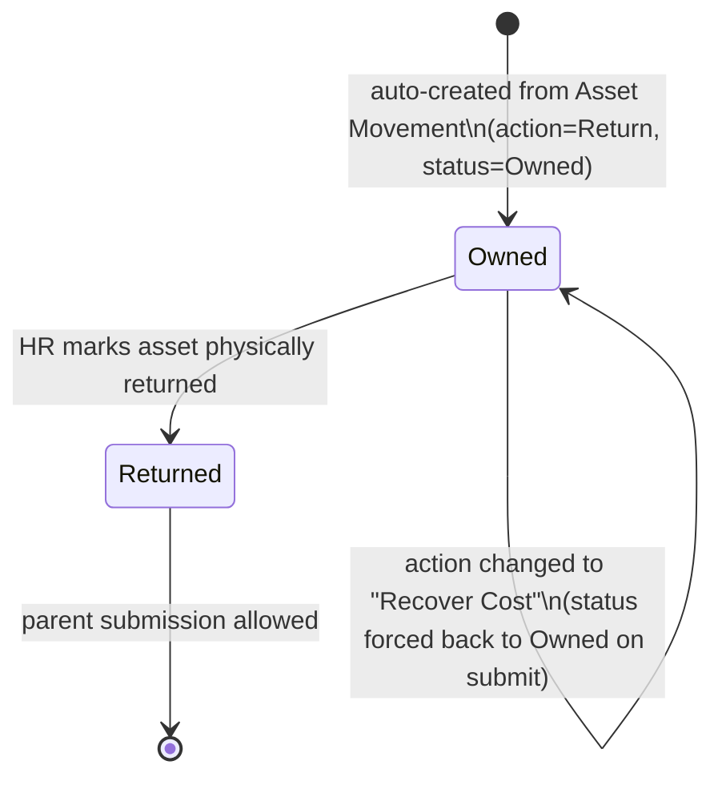

# Full and Final Asset

Child table row representing one company asset allocated to an exiting employee, tracked inside a [[Full and Final Statement]] so HR can confirm the asset is either physically returned or its cost is recovered from the employee before the exit settlement is finalized.

## Key Fields

| Field | Type | Purpose |
|---|---|---|
| reference | Link (Asset Movement) | The Asset Movement document that moved this asset to/from the employee; source of the row. |
| asset_name | Data | Read-only display name of the asset. |
| date | Datetime | Date of the referenced asset movement. |
| actual_cost | Currency | Read-only original cost of the asset (from Asset). |
| cost | Currency | Amount to recover from the employee; mandatory and editable only when `action = "Recover Cost"`. |
| account | Link (Account) | GL account credited when cost is recovered via Journal Entry. |
| action | Select (Return/Recover Cost) | Determines whether the asset must be physically returned or its cost billed to the employee. |
| status | Select (Owned/Returned) | Tracks whether the asset has actually been returned; blocks parent submission if still "Owned" for a Return-action row. |
| description | Small Text | Free-text note; auto-filled by the parent with a recovery-cost description if left blank. |

## Relationships

- [[Full and Final Statement]] — parent document (child table `assets_allocated`).
- linked to Asset Movement / Asset Movement Item (via `reference`) — the parent's `get_assets_movement()` derives these rows from submitted Asset Movement Items where the employee is the from/to party.
- linked to Asset — `actual_cost`/`cost` originate from `Asset.total_asset_cost`.

## Logic — What Happens and Why

The doctype itself (`FullandFinalAsset`) carries no server-side logic (`pass` only) — all behavior lives in the parent [[Full and Final Statement]]:
- Rows are generated automatically by the parent's `get_assets_movement()` when assets are still net-inward to the employee (more inward than outward movements), defaulted to `action = "Return"`, `status = "Owned"`.
- On parent `validate`, `set_total_asset_recovery_cost()` sums `cost` across rows where `action = "Recover Cost"` and auto-fills `description` if blank (e.g. "Asset Recovery Cost for {movement}: {asset}").
- On parent `before_submit`, `validate_assets()` enforces: any row with `action = "Return"` must have `status = "Returned"` (not "Owned") or submission is blocked; rows with `action = "Recover Cost"` are force-set to `status = "Owned"` (recovery doesn't require the asset to be physically returned).
- On `create_journal_entry`, rows with `action = "Recover Cost"` generate a credit line (party = Employee) against `account` for `cost`, billing the employee for the unreturned asset.

## Roles & Permissions

No permissions are defined on this child doctype (`permissions: []`) — access is governed entirely by the parent [[Full and Final Statement]]'s permissions (System Manager, HR User, HR Manager).

## Mermaid: State/Flow

