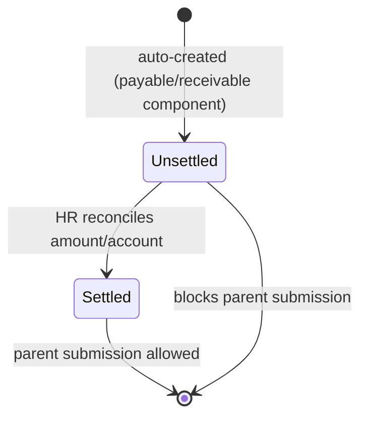

# Full and Final Outstanding Statement

Child table row representing a single payable or receivable financial component (e.g. Gratuity, Leave Encashment, Loan, Employee Advance) in a [[Full and Final Statement]], used twice on the parent — once for `payables` and once for `receivables` — to track what must be settled before an exit settlement can be finalized.

## Key Fields

| Field | Type | Purpose |
|---|---|---|
| component | Data | Name of the settlement component (e.g. "Gratuity", "Expense Claim", "Bonus", "Leave Encashment", "Employee Advance", "Loan", "Salary Slip"). |
| reference_document_type | Link (DocType) | The doctype backing this component, used as the Dynamic Link target for `reference_document`. |
| reference_document | Dynamic Link | The specific source document (e.g. a specific Gratuity or Loan record) this row settles. |
| account | Link (Account) | GL account used when this row is posted into a Journal Entry. |
| amount | Currency | Amount owed for this component; non-negative. |
| status | Select (Settled/Unsettled) | Must be "Settled" for every row before the parent statement can be submitted. |
| paid_via_salary_slip | Check | Marks payable rows already covered by a withheld Salary Slip's net pay, so they're excluded from the Journal Entry debit. |
| remark | Small Text | Free-text note carried onto the Journal Entry line as `user_remark`. |

## Relationships

- [[Full and Final Statement]] — parent document, used as both the `payables` and `receivables` child tables.
- linked to Gratuity, Expense Claim, Leave Encashment, Employee Advance, Salary Slip, Loan — via the Dynamic Link `reference_document`/`reference_document_type` pair, depending on `component`.
- linked from Journal Entry — parent's `create_journal_entry()` turns unsettled/settled rows with a non-zero amount into debit (payables) or credit (receivables) Journal Entry Account lines.

## Logic — What Happens and Why

The doctype itself (`FullandFinalOutstandingStatement`) has no server-side logic (`pass` only); all behavior is driven by the parent [[Full and Final Statement]]:
- Rows are auto-generated by the parent's `get_outstanding_statements()`/`create_component_row()`/`add_withheld_salary_slips()` at document creation, each starting at `status = "Unsettled"`.
- The account and amount for each row are resolved client-side by calling the parent's whitelisted `get_account_and_amount()`, which looks up the correct payable/receivable account and outstanding amount per `reference_document_type` (Salary Slip's payroll payable account and net pay; Gratuity's payable account and amount; Expense Claim's unreimbursed balance; Loan's outstanding payment; Employee Advance's unclaimed balance; Leave Encashment's amount against the company's default payroll payable account).
- The parent's `before_submit` (`validate_settlement`) blocks submission if any row here is still "Unsettled" — the business rule being that every payable/receivable must be explicitly reconciled before the exit settlement can be finalized.
- `paid_via_salary_slip` rows are excluded from the Journal Entry debit lines in `create_journal_entry()` since that amount is already paid out through payroll, not through this settlement's bank entry.
- After the parent's status becomes "Paid" (via the linked Journal Entry), `update_linked_payable_documents()` on the parent updates `paid_amount`/status on any row referencing Gratuity or Leave Encashment.

## Roles & Permissions

No permissions are defined on this child doctype (`permissions: []`) — access is governed entirely by the parent [[Full and Final Statement]]'s permissions (System Manager, HR User, HR Manager).

## Mermaid: State/Flow

