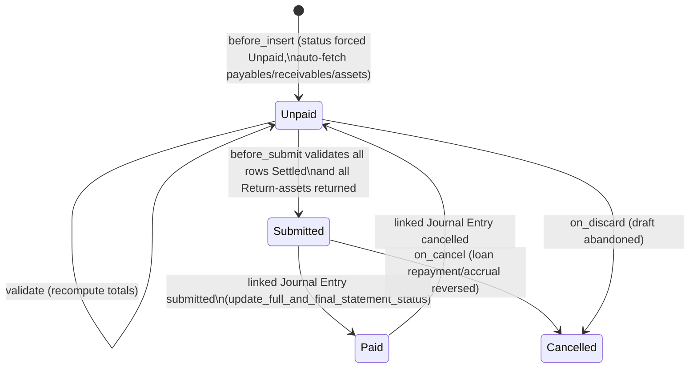

# Full and Final Statement

Records the final financial settlement between the company and an employee who is leaving — netting everything owed to the employee (receivables the company must recover, e.g. loans/advances) against everything owed by the company (payables, e.g. withheld salary, gratuity, leave encashment) and reconciling any company assets still in the employee's possession, before the exit is closed out financially.

## Key Fields

| Field | Type | Purpose |
|---|---|---|
| employee | Link (Employee) | The exiting employee this settlement is for. |
| transaction_date | Date | Date the settlement is processed/posted. |
| status | Select (Paid/Unpaid/Cancelled) | Read-only settlement status, driven by linked Journal Entry, not user-editable. |
| date_of_joining / relieving_date | Date (fetched) | Pulled from Employee; relieving_date is mandatory before the statement can be built or submitted. |
| designation / department / company | Link (fetched) | Fetched from Employee for reporting context. |
| payables | Table (Full and Final Outstanding Statement) | Amounts the company owes the employee (Gratuity, Expense Claim, Bonus/Additional Salary, Leave Encashment, withheld Salary Slips). |
| receivables | Table (Full and Final Outstanding Statement) | Amounts the employee owes the company (Employee Advance, Loan if `lending` app installed). |
| assets_allocated | Table (Full and Final Asset) | Company assets currently or previously allocated to the employee, auto-populated from Asset Movement records. |
| total_asset_recovery_cost | Currency | Sum of asset costs marked "Recover Cost", added into receivables total. |
| total_payable_amount / total_receivable_amount | Currency | Computed totals across the payables/receivables tables. |
| amended_from | Link | Standard amendment trail for a submittable doctype. |

## Relationships

- [[Employee]] — the settlement subject; several fields are fetched from it (department, designation, dates).
- [[Full and Final Asset]] — child table, one row per allocated asset to be returned or cost-recovered.
- [[Full and Final Outstanding Statement]] — child table (used twice: `payables` and `receivables`).
- linked from Journal Entry — `create_journal_entry` builds a Bank Entry Journal Entry from the payables/receivables/asset rows; submitting/cancelling that Journal Entry drives this doctype's `status` via a hook.
- triggers Loan Repayment / Loan Interest Accrual (via the `lending` app, if installed) — `on_submit` runs `process_loan_accrual`, `on_cancel` runs `cancel_loan_repayment`.
- reads Gratuity, Expense Claim, Leave Encashment, Employee Advance, Salary Slip — as payable/receivable component references (Dynamic Link `reference_document_type`/`reference_document`).
- reads Asset Movement / Asset Movement Item — to discover assets currently held by the employee.

## Logic — What Happens and Why

**Create (`before_insert`)**: `status` is forced to "Unpaid" and `get_outstanding_statements()` runs immediately, auto-populating the payables/receivables tables so the HR user doesn't have to manually enumerate every settlement component.

- `get_outstanding_statements()`: requires `relieving_date` to be set on the Employee (throws otherwise). If `payables` is empty, it first calls `add_withheld_salary_slips()` (any Salary Slip for the employee with `status = "Withheld"` and not cancelled becomes a payable row flagged `paid_via_salary_slip`), then adds one placeholder row per component from `get_payable_component()` — Gratuity, Expense Claim, Bonus (mapped to reference doctype "Additional Salary"), Leave Encashment. If `receivables` is empty, adds rows for `get_receivable_component()` — Employee Advance, plus Loan only if the `lending` app is installed. Each row starts `status = "Unsettled"` — the actual document, account and amount are resolved later client-side via `get_account_and_amount()` (looked up per reference doctype: Salary Slip's payroll payable account, Gratuity's payable account, Expense Claim's net reimbursable, Loan's outstanding payment, Employee Advance's unclaimed balance, Leave Encashment's amount against the company's default payroll payable account).
- `get_assets_statements()` also runs, populating `assets_allocated` via `get_assets_movement()`: it scans submitted Asset Movement Items where the employee is either the `from_employee` or `to_employee`, and for any asset where inward movements to the employee outnumber outward movements, adds a row defaulted to action "Return", status "Owned" — i.e., assets still effectively with the employee.

**Draft editing (`validate`)**: re-validates `relieving_date` is set (`validate_relieving_date`), re-derives asset rows only if empty (`get_assets_statements`, idempotent), recomputes `total_asset_recovery_cost` via `set_total_asset_recovery_cost()` (sums `cost` for rows with `action = "Recover Cost"`, auto-filling a description if blank), and recomputes `total_payable_amount`/`total_receivable_amount` via `set_totals()` (receivables total includes the asset recovery cost, so recovered-asset cost is billed to the employee as a receivable).

**Submit (`before_submit` / `on_submit`)**: `validate_settlement()` is run against both `payables` and `receivables` — throws "Settle all Payables and Receivables before submission" if any row is still `status = "Unsettled"`, forcing HR to resolve every component first. `validate_assets()` walks `assets_allocated`: any row with `action = "Return"` still in status "Owned" blocks submission (must physically return the asset first); rows with `action = "Recover Cost"` are force-set to status "Owned" (cost recovery doesn't require physical return). On successful submit, `on_submit` calls `process_loan_accrual` (lending app only) — for each Loan receivable it accrues any outstanding interest and creates+submits a Loan Repayment entry dated `transaction_date` for the settlement amount, closing the loan out of this settlement.

**Journal Entry (`create_journal_entry`, whitelisted)**: builds an unsaved Bank Entry Journal Entry — debits accounts for unpaid payables (excluding ones already paid via Salary Slip), credits accounts for receivables, credits asset-recovery-cost accounts (party = Employee on payables settled by Expense Claim/Gratuity/Leave Encashment, and on receivables via Employee Advance and asset recovery), and adds a balancing line referencing this Full and Final Statement for the net difference. This is a user-triggered action, not an automatic side effect.

**Journal Entry submit/cancel → status sync (`update_full_and_final_statement_status`, hooked externally)**: not called from this doctype's own lifecycle — it's wired via a Journal Entry doc_event hook. When a Journal Entry referencing this statement is submitted, status is set to "Paid"; on cancellation, back to "Unpaid". After updating status it calls `update_linked_payable_documents()`, which for any payable row referencing a Gratuity or Leave Encashment sets that document's `paid_amount` (the settlement amount if Paid, else 0) and refreshes its status — keeping Gratuity/Leave Encashment payment state in sync with the actual bank entry.

**Cancel (`on_cancel`)**: ignores linked GL Entry checks (so cancellation isn't blocked by GL Entries created off a linked Journal Entry) and calls `cancel_loan_repayment` — cancels the matching Loan Repayment(s) and any Loan Interest Accrual(s) dated to `transaction_date` for the loans in this statement's receivables, reversing the loan-side effects of submission.

**Discard (`on_discard`)**: sets `status` to "Cancelled" directly via `db_set` (discard happens before submission, so this just marks the abandoned draft).

## Roles & Permissions

| Role | Can Do | Notes |
|---|---|---|
| [[System Manager]] | Read, Write, Create, Delete | Full access, no submit/cancel rights explicitly granted. |
| [[HR User]] | Read, Write, Create, Delete | Same as System Manager — no submit right. |
| [[HR Manager]] | Read, Write, Create, Delete, Submit, Cancel | Only role that can submit/cancel — enforces that final settlement finalization is an HR Manager action. |

## Mermaid: State/Flow

