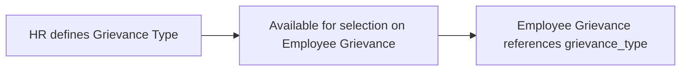

# Grievance Type

Grievance Type is a simple master list categorizing the kinds of grievances an employee can raise (e.g. Harassment, Discrimination, Policy Violation), used to classify Employee Grievance records.

## Key Fields

| Field | Type | Purpose |
|---|---|---|
| (name) | Data (Prompt-named) | The category name; user sets it directly on creation (autoname: Prompt). |
| description | Text | Optional explanation of what the category covers. |

## Relationships

- [[Employee Grievance]] — linked from, via the `grievance_type` field; every grievance must reference one category.

## Logic — What Happens and Why

`GrievanceType(Document)` in `grievance_type.py` has no overridden logic (`pass`) — a pure lookup/master doctype with no validation or side effects beyond standard Frappe document behavior.

## Roles & Permissions

| Role | Can Do | Notes |
|---|---|---|
| [[System Manager]] | Read, write, create, delete | Full control. |
| [[HR Manager]] | Read, write, create, delete | Full control. |
| [[HR User]] | Read, write, create, delete | Full control. |
| [[Employee]] | Read | View-only, to select a category when raising a grievance. |

## Mermaid: State/Flow

