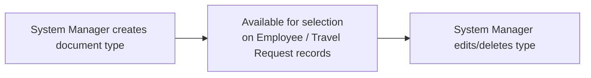

# Identification Document Type

A simple master list of identification document types (e.g. Passport, National ID, Driving License) that can be selected when recording an employee's or applicant's identification documents.

## Key Fields

| Field | Type | Purpose |
|---|---|---|
| identification_document_type | Data | The name of the ID document type; unique, used as the document's autoname. |

## Relationships

- [[Employee]] — selected as the type when recording an employee's identification document (link runs from the referencing doctype's side, not from this doctype's own code).
- [[Travel Request]] — referenced as an identification document type option (confirmed via cross-reference in `travel_request.json`, outside this doctype's own logic).

## Logic — What Happens and Why

Pure master/setup data — the Python controller (`IdentificationDocumentType`) contains no logic (`pass` only). No validation, workflow, or side effects; uniqueness of `identification_document_type` is enforced at the field level. Not enforced in code beyond that.

## Roles & Permissions

| Role | Can Do | Notes |
|---|---|---|
| [[System Manager]] | Read, Write, Create, Delete | Only role with explicit permissions defined — no HR Manager/HR User rows are present in this doctype's permission list, so day-to-day HR roles rely on System Manager-configured entries or role-based permission inheritance elsewhere in the system. |

## Mermaid: State/Flow

No workflow states — a flat master list.

