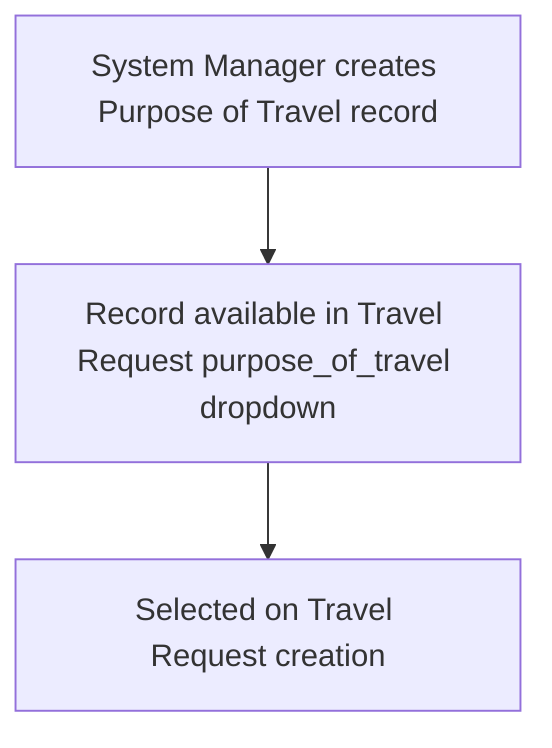

# Purpose of Travel

A simple master list of reasons an employee can travel for work (e.g., conference, client visit, training), used to standardize and constrain the `purpose_of_travel` field on the Travel Request so reporting and approval can categorize trips consistently.

## Key Fields

| Field | Type | Purpose |
|---|---|---|
| `purpose_of_travel` | Data (unique) | The name of the purpose; also the document's autoname (`autoname: field:purpose_of_travel`), so each value must be unique and serves as the record's ID. |

## Relationships

- [[Travel Request]] — linked from; Travel Request's `purpose_of_travel` field is a required Link to this doctype.

## Logic — What Happens and Why

No custom logic at all: the `.py` file is an empty `Document` subclass (`pass`). This is a pure master/lookup doctype — its only behavior is the framework-enforced uniqueness on `purpose_of_travel` (via `unique: 1` and `autoname: field:purpose_of_travel`), which prevents duplicate purpose entries and guarantees each purpose name doubles as a stable reference key for Travel Request.

## Roles & Permissions

| Role | Can Do | Notes |
|---|---|---|
| [[System Manager]] | Read, Write, Create, Delete, Email, Print, Export, Report, Share | Only role defined in the doctype's own permissions; maintaining this master (adding new travel purposes) is restricted to System Manager. |

## Mermaid: State/Flow

