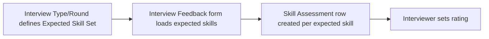

# Skill Assessment

A child-table row recording a rating given to a specific [[Skill]] during an interview assessment — used on the [[Interview Feedback]] doctype (Recruitment module) to score a candidate against expected skills.

## Key Fields

| Field | Type | Purpose |
|---|---|---|
| `skill` | Link (Skill, required, read-only) | The skill being rated; read-only because it is normally pre-populated from the interview's expected skill set rather than typed in freely. |
| `rating` | Rating (required) | Interviewer's star rating for the candidate on this skill. |

## Relationships

- [[Skill]] — linked from, via `skill`.
- [[Interview Feedback]] (Recruitment module) — parent doctype; the `skill_assessment` table field there uses this child doctype.
- [[Interview]] / [[Interview Type]] / Interview Round (Recruitment module) — indirectly related: the interview's `expected_skill_set` seeds which skills appear here (via `get_expected_skill_set`).

## Logic — What Happens and Why

The `SkillAssessment(Document)` controller is a `pass`-only class with no validation. It is purely a data-holding child row; the `skill` field being read-only signals that rows are meant to be created programmatically (by copying the interview's Expected Skill Set) rather than free-typed by the interviewer, though the row-creation logic itself lives in the Recruitment module's `interview.py`/`interview_feedback.js`, outside this documentation's scope.

## Roles & Permissions

Child table — no own `permissions` array (empty). Access is governed entirely by its parent doctype's permissions ([[Interview Feedback]], in the Recruitment module).

## Mermaid: State/Flow

