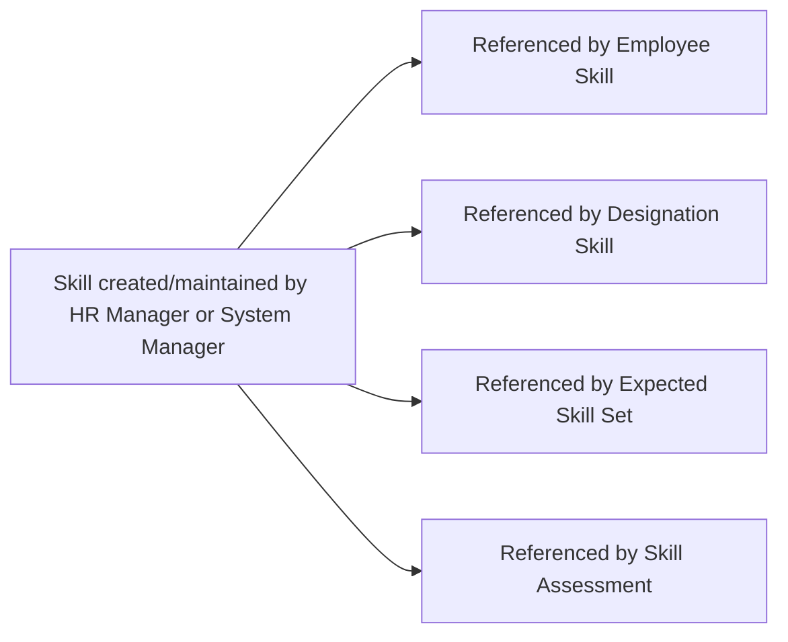

# Skill

Skill is the master list of named competencies (e.g. "Python", "Negotiation") used across the module — as the option source for employee skill tracking, designation requirements, and interview assessments.

## Key Fields

| Field | Type | Purpose |
|---|---|---|
| `skill_name` | Data (unique, autoname source, quick-entry) | The skill's name; used as `name`. |
| `description` | Text (quick-entry) | Free-text description of the skill. |

## Relationships

- [[Employee Skill]] — linked from, via its `skill` field.
- [[Designation Skill]] — linked from, via its `skill` field (child table on the ERPNext core "Designation" doctype, outside this module).
- [[Expected Skill Set]] — linked from, via its `skill` field; also fetches `description` from this doctype.
- [[Skill Assessment]] — linked from, via its `skill` field (used on Interview Feedback, outside this module's scope).

## Logic — What Happens and Why

The `Skill(Document)` controller is a `pass`-only class — no validation logic. It is a pure master/reference doctype; uniqueness of `skill_name` (via autoname) prevents duplicate skill entries. All meaningful behavior (seeding, rating, assessment) happens in the doctypes that link to Skill.

## Roles & Permissions

| Role | Can Do | Notes |
|---|---|---|
| [[System Manager]] | Read, write, create, delete | Full control of the skill master. |
| [[HR Manager]] | Read, write, create, delete | Full control of the skill master. |
| [[HR User]] | Read | Read-only. |

## Mermaid: State/Flow

