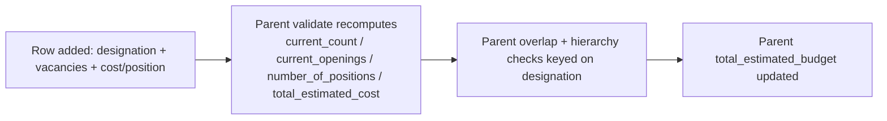

# Staffing Plan Detail

Child table row specifying the hiring budget and vacancy target for one designation within a [[Staffing Plan]] — the atomic unit that all the plan's overlap and parent/subsidiary budget validations are checked against.

## Key Fields

| Field | Type | Purpose |
|---|---|---|
| designation | Link (Designation) | The role this row plans for; required. |
| vacancies | Int | Number of open positions to fill; non-negative. |
| estimated_cost_per_position | Currency | Budgeted cost per hire; combined with `vacancies` to compute total cost. |
| total_estimated_cost | Currency | Read-only, computed as `vacancies * estimated_cost_per_position`. |
| current_count | Int | Read-only, live count of Active Employees in this designation (within company + subsidiaries) at time of save. |
| current_openings | Int | Read-only, live count of Open Job Openings in this designation. |
| number_of_positions | Int | Read-only, `vacancies + current_count` — the target total headcount after hiring. |

## Relationships

- [[Staffing Plan]] — parent document (child table `staffing_details`).
- reads Employee — `current_count` sourced from active employee counts per designation/company.
- reads Job Opening — `current_openings` sourced from open job counts per designation/company.
- reads [[Job Requisition]] — rows can be bulk-populated from requisitions via the parent's `set_job_requisitions`.

## Logic — What Happens and Why

The doctype itself (`StaffingPlanDetail`) carries no server-side logic (`pass` only) — all computation happens in the parent [[Staffing Plan]]'s `set_total_estimated_budget()`, which runs on every parent `validate`:
- Recomputes `current_count`/`current_openings` live via `get_designation_counts()` (so the numbers reflect current hiring state, not what they were when the plan was drafted).
- Computes `number_of_positions = vacancies + current_count`.
- Computes `total_estimated_cost = vacancies * estimated_cost_per_position` only if `vacancies` and `estimated_cost_per_position` are both set and `number_of_positions > 0`.
- These per-row values feed into the parent's overlap/parent-plan/subsidiary-plan budget checks (`validate_overlap`, `validate_with_parent_plan`, `validate_with_subsidiary_plans`), each keyed by `designation`.

## Roles & Permissions

No permissions are defined on this child doctype (`permissions: []`) — access is governed entirely by the parent [[Staffing Plan]]'s permissions (HR Manager, HR User).

## Mermaid: State/Flow

Purely a data row with no independent state machine; its values are recalculated every time the parent [[Staffing Plan]] is validated.

