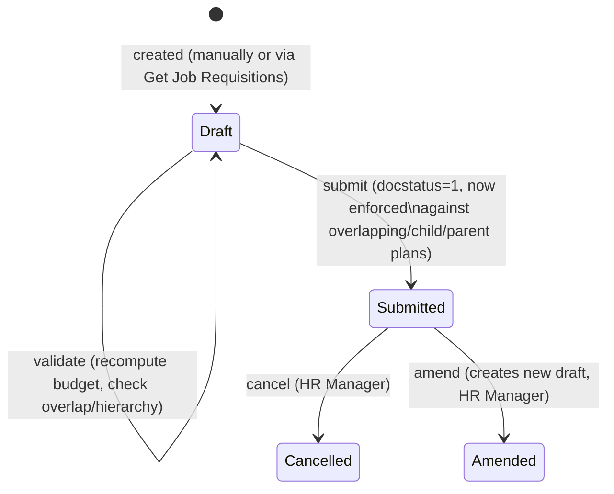

# Staffing Plan

Defines the approved hiring budget and headcount targets for a company (optionally scoped to a department) over a date range — how many vacancies are allowed per designation and how much can be spent — and enforces that plan hierarchically across parent/subsidiary companies so subordinate entities can't over-hire or over-spend beyond what head office has approved.

## Key Fields

| Field | Type | Purpose |
|---|---|---|
| company | Link (Company) | Company this plan governs; used for hierarchy validation against parent/subsidiary companies. |
| department | Link (Department) | Optional scoping of the plan to a specific department. |
| from_date / to_date | Date | Validity window of the plan; must not overlap another submitted plan for the same designation/company. |
| staffing_details | Table (Staffing Plan Detail) | Per-designation vacancy/budget rows; mandatory. |
| total_estimated_budget | Currency | Read-only sum of `total_estimated_cost` across all detail rows. |
| get_job_requisitions | Button | Triggers `set_job_requisitions` to pull rows in from approved Job Requisitions. |
| amended_from | Link | Standard amendment trail for a submittable doctype. |

## Relationships

- [[Staffing Plan Detail]] — child table, one row per designation with vacancy count and budget.
- links to Job Opening — dashboard shows related Job Opening transactions; `set_job_requisitions` populates staffing details from [[Job Requisition]] records.
- reads [[Job Requisition]] — `set_job_requisitions` fetches designation, `no_of_positions`, `expected_compensation` from selected requisitions.
- reads Employee, Job Opening — `get_designation_counts()` counts active Employees and open Job Openings per designation/company to compute `current_count`/`current_openings`.
- reads/validates against other Staffing Plan records for parent/child Company hierarchy (`validate_with_parent_plan`, `validate_with_subsidiary_plans`) and for date-range overlap (`validate_overlap`).
- linked from Company (via `parent_company`/`lft`/`rgt` nested-set fields) — used to walk the company hierarchy.

## Logic — What Happens and Why

**Validate (on every save, draft or submit)**:
- `validate_period()` — throws if `from_date > to_date`.
- `validate_details()`, per detail row:
  - `validate_overlap()` — throws if any other **submitted** Staffing Plan already covers the same designation, company, and an overlapping date range (`to_date >= from_date` and `from_date <= to_date`), preventing duplicate/conflicting plans for the same role and period.
  - `validate_with_parent_plan()` — if the company has a `parent_company`, looks up the parent's active staffing plan (walking up the hierarchy recursively via `get_active_staffing_plan_details`) for the same designation/date window. If none exists, skips. If it exists, throws `ParentCompanyError` when this plan's vacancies or budget exceed the parent's allotment for that designation. It then also sums vacancies/budget already consumed by *all* companies under that same parent (siblings/nested-set range) and throws if this plan plus already-consumed sibling amounts would exceed the parent's cap — enforcing that subsidiaries collectively can't over-allocate beyond what the parent approved.
  - `validate_with_subsidiary_plans()` — sums vacancies/budget already planned by direct child companies (`company.parent_company == self.company`) for the same designation/window, and throws `SubsidiaryCompanyError` if this (parent-level) plan allocates *less* than what its subsidiaries have already committed — a parent plan must be at least as generous as what it has already delegated downward.
- `set_total_estimated_budget()` — for each detail row, recomputes `current_count`/`current_openings` via `get_designation_counts()` (live count of Active Employees and Open Job Openings for that designation/company, including subsidiary companies via `get_descendants_of`), sets `number_of_positions = vacancies + current_count` via `set_number_of_positions()`, computes `total_estimated_cost = vacancies * estimated_cost_per_position`, and sums all rows into `total_estimated_budget`.

**Pull from Job Requisitions (`set_job_requisitions`, whitelisted)**: given a list of Job Requisition names, replaces `staffing_details` wholesale with one row per requisition (designation, vacancies = `no_of_positions`, cost = `expected_compensation`, number_of_positions = current employee count + requested positions) — lets HR turn approved headcount requests directly into a formal, budget-validated staffing plan.

**Submit/Cancel**: no explicit `before_submit`/`on_submit`/`on_cancel` overrides exist — submission simply locks the document via standard Frappe docstatus behavior; only submitted (`docstatus = 1`) plans are considered "active" and enforced against by the overlap/parent/subsidiary validations above, so a draft plan exerts no constraint on others until submitted.

## Roles & Permissions

| Role | Can Do | Notes |
|---|---|---|
| [[HR Manager]] | Read, Write, Create, Delete, Submit, Cancel, Amend | Full lifecycle control. |
| [[HR User]] | Read, Write, Create, Submit | Can create and submit but not delete or amend — cancellation/deletion is an HR Manager-only action. |

## Mermaid: State/Flow

