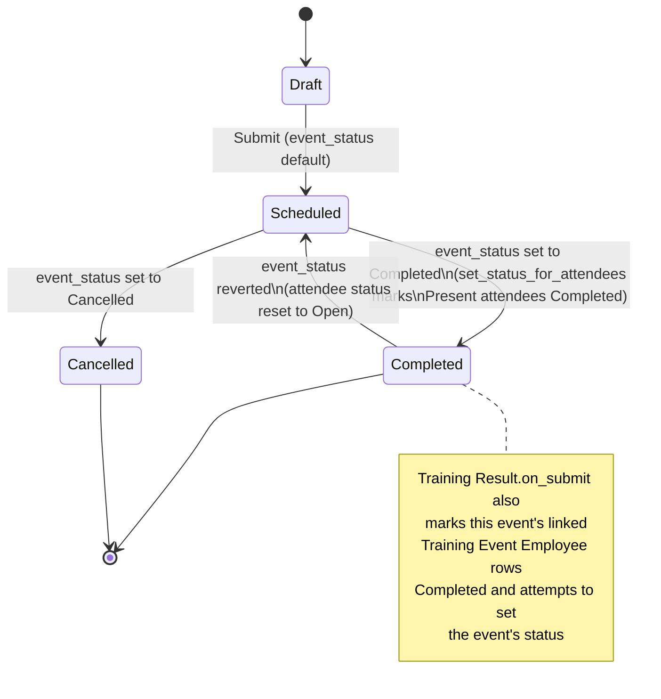

# Training Event

A Training Event is a single scheduled occurrence of training (a seminar, workshop, exam, self-study block, etc.) with a fixed time window, location, and a roster of invited employees. It is the operational record that drives attendance tracking, feedback collection, and completion status for every attendee.

## Key Fields

| Field | Type | Purpose |
|---|---|---|
| `event_name` | Data (unique, autoname source) | Event title; used as `name`. |
| `training_program` | Link (Training Program) | Optional parent curriculum this event delivers. |
| `event_status` | Select (Scheduled/Completed/Cancelled, required, allowed on submit) | Drives attendee status propagation via `set_status_for_attendees`. |
| `has_certificate` | Check | Shown only for Seminar/Workshop/Conference/Exam types. |
| `type` | Select (Seminar/Theory/Workshop/Conference/Exam/Internet/Self-Study) | Training format. |
| `level` | Select (Beginner/Intermediate/Advance) | Difficulty, shown for Seminar/Workshop/Exam. |
| `company` | Link (Company) | Owning company. |
| `location`, `start_time`, `end_time` | Data / Datetime (required) | Scheduling details; `end_time` must be after `start_time`. |
| `introduction` | Text Editor (required) | Event description sent in the "Training Scheduled" notification. |
| `employees` | Table (Training Event Employee, allowed on submit) | Attendee roster — the child table driving attendance/status/feedback. |
| `employee_emails` | Small Text (hidden) | Auto-populated comma-joined attendee email list, used for notification recipients. |
| `amended_from` | Link (Training Event) | Standard amendment trail. |

## Relationships

- [[Training Event Employee]] — parent/child; each row is one invited employee with attendance/status.
- [[Training Program]] — linked from, via `training_program` (optional curriculum reference).
- [[Training Result]] — links to this Training Event (`training_event`, required+unique); on submit of a Training Result, this event's status and its attendees' child-row status are updated directly.
- [[Training Feedback]] — links to this Training Event (`training_event`); validates the event is submitted and the employee attended; on submit/cancel toggles the corresponding Training Event Employee row's `status` between "Feedback Submitted" and "Completed".
- [[Employee Training]] — linked from; this child table (used inside [[Employee Skill Map]]) references a Training Event via its `training` field and fetches `end_time` as `training_date`.
- Triggers the "Training Scheduled" Notification (`hrms/hr/notification/training_scheduled`) on Submit, emailed to `employee_emails`.

## Logic — What Happens and Why

Controller: `TrainingEvent(Document)` in `training_event.py`.

- **`validate()`** runs on every save (draft and submitted-in-place edits go through `on_update_after_submit`, not `validate`, once submitted):
  - `set_employee_emails()` — rebuilds `employee_emails` from `get_employee_emails()` over all `employees` rows, keeping the hidden email list in sync with the roster so the "Training Scheduled" notification always reaches current attendees.
  - `validate_period()` — throws `"End time cannot be before start time"` if `time_diff_in_seconds(end_time, start_time) <= 0`. Business reason: prevents nonsensical/zero-length sessions.
- **`on_update_after_submit()`** fires when a submitted event is edited (since `event_status` and `employees` are `allow_on_submit`):
  - Calls `set_status_for_attendees()`:
    - If `event_status == "Completed"`: for every attendee whose `attendance == "Present"` and whose `status != "Feedback Submitted"`, sets `status = "Completed"`. Business reason: marking the event complete should reflect on every present attendee's individual state, but must not clobber someone who already submitted feedback.
    - If `event_status == "Scheduled"` (e.g. reverted): resets every attendee's `status` back to `"Open"`. This effectively re-opens the roster if a Completed event is walked back to Scheduled.
    - Writes changes directly via `self.db_update_all()` rather than a full `save()`.
- Downstream side effects on other doctypes:
  - [[Training Result]].`on_submit` explicitly sets the linked Training Event's `status = "Completed"` and, for each employee present in the Training Result's employee table, sets the matching Training Event Employee row's `status = "Completed"`, then calls `training_event.save()`. **Note**: Training Event has no `status` field (only `event_status`) — this appears to set an ad hoc, non-persisted attribute rather than the real `event_status` field; the per-attendee child-row `status` update, however, does persist correctly since Training Event Employee genuinely has a `status` field.
  - [[Training Feedback]].`on_submit` sets the matching Training Event Employee row's `status` to `"Feedback Submitted"` directly via `frappe.db.set_value`; `on_cancel` reverts it to `"Completed"`.
- No `before_insert`, `on_cancel`, whitelisted methods, or scheduled tasks are defined on this doctype itself, beyond the module-level `get_employees` whitelisted method living in `training_result.py`.

## Roles & Permissions

| Role | Can Do | Notes |
|---|---|---|
| [[HR Manager]] | Read, write, create, delete, submit, cancel, amend | Full lifecycle control. |
| [[HR User]] | Read, write | Cannot create, submit, or delete. |

## Mermaid: State/Flow

