# Training Feedback

Training Feedback captures one attendee's written feedback about a specific [[Training Event]] they attended — it is the self-service closing step of the training lifecycle, submitted by (or on behalf of) the employee after the event and after attendance has been confirmed.

## Key Fields

| Field | Type | Purpose |
|---|---|---|
| `employee` | Link (Employee, required) | The employee giving feedback. |
| `employee_name` | Read Only (fetch from `employee.employee_name`) | Display convenience, in global search. |
| `department` | Link (Department, fetch from `employee.department`, read-only) | Reporting convenience. |
| `course` | Data (fetch from `training_event.course`, read-only) | Denormalized course name. |
| `training_event` | Link (Training Event, required) | The event being reviewed; must be submitted. |
| `event_name` | Data (fetch from `training_event.event_name`, read-only) | Denormalized event title. |
| `trainer_name` | Data (fetch from `training_event.trainer_name`, read-only) | Denormalized trainer name. |
| `feedback` | Text (required) | The free-text feedback content. |
| `amended_from` | Link (Training Feedback) | Standard amendment trail. |

## Relationships

- [[Training Event]] — links to; the linked event must have `docstatus == 1` (submitted) before feedback can be validated, and the employee must appear in that event's [[Training Event Employee]] roster with `attendance != "Absent"`.
- [[Training Event Employee]] — indirectly updated: on submit/cancel of this Training Feedback, the matching row's `status` is set to `"Feedback Submitted"` / reverted to `"Completed"`.
- Triggered by the "Training Feedback" Notification (`hrms/hr/notification/training_feedback`), which fires on Submit of a [[Training Result]] and asks attendees to fill out this doctype.

## Logic — What Happens and Why

Controller: `TrainingFeedback(Document)` in `training_feedback.py`.

- **`validate()`**:
  - Loads the linked Training Event and throws `"{Training Event} must be submitted"` if `docstatus != 1`. Business reason: feedback is only meaningful once the session actually happened and was formally closed.
  - Looks up the Training Event Employee row for `(parent=training_event, employee=self.employee)`. If none exists, throws `"Employee {name} not found in Training Event Participants."` — prevents feedback from someone who was never invited.
  - If that row's `attendance == "Absent"`, throws `"Feedback cannot be recorded for an absent Employee."` — enforces that only attendees who were physically/virtually present can leave feedback.
- **`on_submit()`**: finds the matching Training Event Employee row and sets its `status` to `"Feedback Submitted"` via `frappe.db.set_value`, marking that attendee's training as fully closed out.
- **`on_cancel()`**: reverses the above — sets the matching Training Event Employee row's `status` back to `"Completed"`.
- No `before_insert`, `on_update`, or whitelisted methods are defined on this doctype.

## Roles & Permissions

| Role | Can Do | Notes |
|---|---|---|
| [[HR Manager]] | Read, write, create, delete, submit, cancel, amend | Full lifecycle control. |
| [[Employee]] | Read (own, via standard employee-user restrictions), write, create, submit, cancel, amend | Lets employees self-submit their own feedback; no delete. |
| [[HR User]] | Read, write | Cannot create, submit, or delete. |

## Mermaid: State/Flow

```mermaid
stateDiagram-v2
    [*] --> Draft: create (Training Event must be submitted;\nemployee must be a Present attendee)
    Draft --> Submitted: on_submit\n(Training Event Employee.status -> Feedback Submitted)
    Submitted --> Cancelled: on_cancel\n(Training Event Employee.status -> Completed)
    Cancelled --> Amended: amend
```

