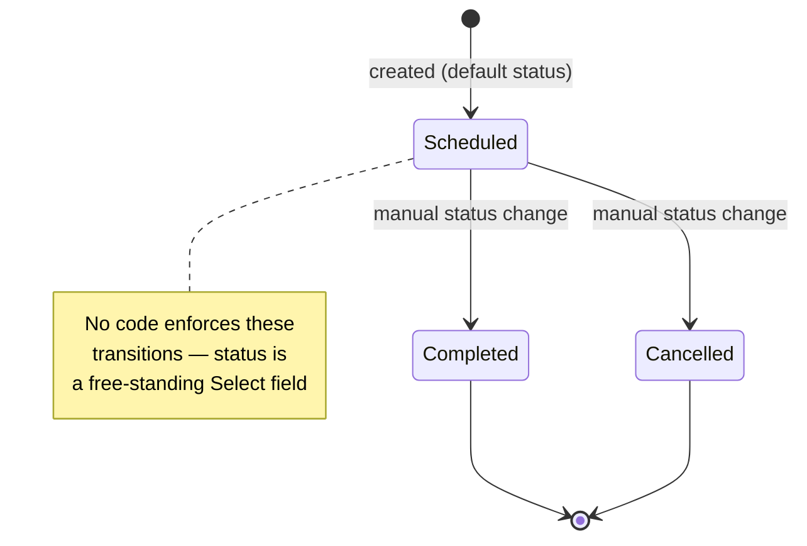

# Training Program

A Training Program is a reusable definition of a course or curriculum (internal or vendor-delivered) that an organization runs repeatedly — it records the trainer/supplier and description once so that individual scheduled occurrences can be created as [[Training Event]] records against it.

## Key Fields

| Field | Type | Purpose |
|---|---|---|
| `training_program` | Data (unique, autoname source) | Program name; used as the document's `name`. |
| `status` | Select (Scheduled/Completed/Cancelled) | Manually tracked lifecycle state of the program, defaults to "Scheduled". No code enforces transitions. |
| `company` | Link (Company, required) | Owning company. |
| `trainer_name` / `trainer_email` | Data | Internal trainer contact details. |
| `supplier` | Link (Supplier) | External training vendor, if outsourced. |
| `contact_number` | Data | Vendor/trainer contact number. |
| `description` | Text Editor (required) | Curriculum content/notes. |
| `amended_from` | Link (Training Program) | Standard amendment trail (doctype is not submittable, so this field is present but not functionally used — see Logic). |

## Relationships

- [[Training Event]] — linked from; a Training Event optionally references a Training Program via its `training_program` field to indicate which curriculum the event instance delivers.

## Logic — What Happens and Why

The `training_program.py` controller (`TrainingProgram(Document)`) contains no `validate`, `before_save`, `on_submit`, or other lifecycle hooks — it is a `pass`-only class. All logic is declarative, from the JSON:

- The doctype is **not submittable** (`is_submittable` is absent), so `status` is a plain Select field manually set by the user; there is no workflow engine or code path that moves it between Scheduled/Completed/Cancelled. Despite carrying an `amended_from` field, that field is inert since the doctype cannot be submitted/amended.
- `training_program` is both the autoname source (`autoname: field:training_program`) and marked `unique`, so program names double as the primary key — this prevents duplicate curricula with the same title.
- No cross-doctype side effects fire from this doctype; it exists purely as a reference/master record. All business logic (attendance, completion, feedback) lives on [[Training Event]] and downstream doctypes instead.

## Roles & Permissions

| Role | Can Do | Notes |
|---|---|---|
| [[HR Manager]] | Read, write, create, delete | Full control of program masters. |
| [[HR User]] | Read, write | Cannot create or delete programs. |

## Mermaid: State/Flow

