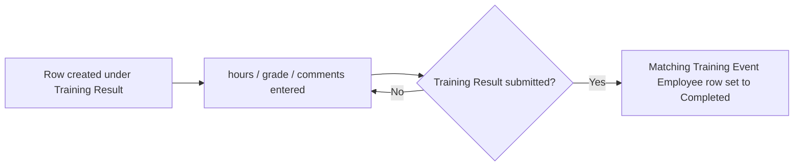

# Training Result Employee

A child table row recording one employee's outcome for a completed [[Training Result]] — the hours attended, grade achieved, and any comments.

## Key Fields

| Field | Type | Purpose |
|---|---|---|
| `employee` | Link (Employee) | The employee the outcome belongs to. |
| `employee_name` | Read Only (fetch from `employee.employee_name`) | Display convenience. |
| `department` | Link (Department, fetch from `employee.department`, read-only) | Reporting/filtering convenience. |
| `hours` | Float (non-negative, allowed on submit) | Training hours logged. |
| `grade` | Data (allowed on submit) | Free-text grade/score. |
| `comments` | Text (allowed on submit) | Free-text remarks. |

## Relationships

- [[Training Result]] — parent doctype (child table field `employees`).
- [[Training Event]] — indirectly related: `Training Result.on_submit()` cross-references this row's `employee` against the linked Training Event's attendee table to mark that employee's [[Training Event Employee]] row `Completed`.

## Logic — What Happens and Why

The `TrainingResultEmployee(Document)` controller is a `pass`-only class — no validation of its own. Its data is used by the parent `TrainingResult.on_submit()` to determine which employees to mark Completed on the source Training Event, and its `employee` field feeds `get_employee_emails()` in `TrainingResult.validate()` to build the feedback-request recipient list.

## Roles & Permissions

Child table — no own `permissions` array (empty). Access is governed entirely by the parent [[Training Result]] doctype's permissions (HR Manager: full CRUD/submit/cancel; HR User: create/read/write, no delete/submit).

## Mermaid: State/Flow

