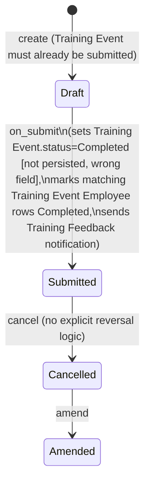

# Training Result

Training Result is the submittable record that closes out a [[Training Event]] — it captures per-employee outcomes (hours, grade, comments) via its child table and, on submission, formally marks the training event and its attendees as completed.

## Key Fields

| Field | Type | Purpose |
|---|---|---|
| `training_event` | Link (Training Event, required, unique) | The event being closed out; unique ensures only one Training Result per event. |
| `employees` | Table (Training Result Employee) | Per-employee outcome rows (hours, grade, comments). |
| `employee_emails` | Small Text (hidden) | Auto-populated comma-joined attendee email list. |
| `amended_from` | Link (Training Result) | Standard amendment trail. |

## Relationships

- [[Training Event]] — links to; must be submitted (`docstatus == 1`) before a Training Result can be validated. On `on_submit`, this doctype writes back to the Training Event: sets its status field and marks matching [[Training Event Employee]] rows `Completed`.
- [[Training Result Employee]] — parent/child; holds each employee's hours/grade/comments.
- Triggers the "Training Feedback" Notification (`hrms/hr/notification/training_feedback`) on Submit — emailed to `employee_emails`, prompting attendees for feedback.

## Logic — What Happens and Why

Controller: `TrainingResult(Document)` in `training_result.py`.

- **`validate()`**:
  - Fetches the linked Training Event and throws `"{Training Event} must be submitted"` if its `docstatus != 1`. Business reason: results can only be recorded against a finalized (submitted) training session, not a draft one.
  - Rebuilds `employee_emails` from `get_employee_emails()` over the `employees` table, keeping the feedback-request notification recipient list current.
- **`on_submit()`**:
  - Loads the linked Training Event, sets `training_event.status = "Completed"`. **Note**: Training Event's actual status field is `event_status`, not `status` — this assignment sets an attribute that has no corresponding DocField and will not persist to the database (Document allows arbitrary attributes; `save()` only writes declared fields). This looks like a latent bug in the source rather than intended behavior on `event_status`.
  - For each employee in this Training Result's `employees` table, finds the matching row in the Training Event's `employees` table (by `employee`) and sets that Training Event Employee row's `status = "Completed"`. This part does persist, since `status` is a real field on Training Event Employee.
  - Calls `training_event.save()` to persist the attendee status changes.
- **Whitelisted method** `get_employees(training_event: str)` (module-level, not a class method): checks read permission on the given Training Event via `frappe.has_permission(..., throw=True)`, then returns its `employees` table — used by the UI to pre-populate the Training Result's employee rows from the event roster.
- No `on_cancel` override is defined; cancellation follows default Frappe behavior (no explicit reversal of the Training Event/attendee status changes made on submit).

## Roles & Permissions

| Role | Can Do | Notes |
|---|---|---|
| [[HR Manager]] | Read, write, create, delete, submit, cancel, amend | Full lifecycle control. |
| [[HR User]] | Read, write, create | Cannot delete or submit. |

## Mermaid: State/Flow

